<!-- markdownlint-capture -->
<!-- markdownlint-disable -->

# Code Metrics

This file is dynamically maintained by a bot, *please do not* edit this by hand. It represents various [code metrics](https://aka.ms/dotnet/code-metrics), such as cyclomatic complexity, maintainability index, and so on.

<div id='testapp'></div>

## TestApp :warning:

The *TestApp.csproj* project file contains:

- 1 namespaces.
- 1 named types.
- 501 total lines of source code.
- Approximately 90 lines of executable code.
- The highest cyclomatic complexity is 8 :warning:.

<details>
<summary>
  <strong id="testapp">
    TestApp :warning:
  </strong>
</summary>
<br>

The `TestApp` namespace contains 1 named types.

- 1 named types.
- 501 total lines of source code.
- Approximately 90 lines of executable code.
- The highest cyclomatic complexity is 8 :warning:.

<details>
<summary>
  <strong id="program">
    Program :warning:
  </strong>
</summary>
<br>

- The `Program` contains 10 members.
- 498 total lines of source code.
- Approximately 90 lines of executable code.
- The highest cyclomatic complexity is 8 :warning:.

| Member kind | Line number | Maintainability index | Cyclomatic complexity | Depth of inheritance | Class coupling | Lines of source / executable code |
| :-: | :-: | :-: | :-: | :-: | :-: | :-: |
| Field | <a href='https://github.com/MyJetWallet/MyJetWallet.Unlimint/blob/master/src/TestApp/Program.cs#L18' title='UnlimintAuthClient Program._authClient'>18</a> | 100 | 0 :heavy_check_mark: | 0 | 1 | 1 / 0 |
| Field | <a href='https://github.com/MyJetWallet/MyJetWallet.Unlimint/blob/master/src/TestApp/Program.cs#L19' title='UnlimintClient Program._client'>19</a> | 100 | 0 :heavy_check_mark: | 0 | 1 | 1 / 0 |
| Method | <a href='https://github.com/MyJetWallet/MyJetWallet.Unlimint/blob/master/src/TestApp/Program.cs#L468' title='string Program.Base64Encode(string plainText)'>468</a> | 88 | 1 :heavy_check_mark: | 0 | 1 | 4 / 2 |
| Method | <a href='https://github.com/MyJetWallet/MyJetWallet.Unlimint/blob/master/src/TestApp/Program.cs#L21' title='Task Program.Main(string[] args)'>21</a> | 80 | 1 :heavy_check_mark: | 0 | 2 | 125 / 3 |
| Method | <a href='https://github.com/MyJetWallet/MyJetWallet.Unlimint/blob/master/src/TestApp/Program.cs#L157' title='Task Program.TestAlternativeMethod(string locale, string currency)'>157</a> | 54 | 7 :heavy_check_mark: | 0 | 8 | 71 / 15 |
| Method | <a href='https://github.com/MyJetWallet/MyJetWallet.Unlimint/blob/master/src/TestApp/Program.cs#L473' title='Task Program.TestCardBin(string locale, string currency)'>473</a> | 54 | 8 :warning: | 0 | 5 | 40 / 18 |
| Method | <a href='https://github.com/MyJetWallet/MyJetWallet.Unlimint/blob/master/src/TestApp/Program.cs#L230' title='Task Program.TestGatewayMethod(string locale, string currency)'>230</a> | 53 | 7 :heavy_check_mark: | 0 | 10 | 99 / 16 |
| Method | <a href='https://github.com/MyJetWallet/MyJetWallet.Unlimint/blob/master/src/TestApp/Program.cs#L393' title='Task Program.TestGooglepayMethod(string locale, string currency)'>393</a> | 53 | 7 :heavy_check_mark: | 0 | 7 | 74 / 17 |
| Method | <a href='https://github.com/MyJetWallet/MyJetWallet.Unlimint/blob/master/src/TestApp/Program.cs#L330' title='Task Program.TestProdBankMethod(string locale, string currency)'>330</a> | 55 | 7 :heavy_check_mark: | 0 | 6 | 61 / 17 |
| Method | <a href='https://github.com/MyJetWallet/MyJetWallet.Unlimint/blob/master/src/TestApp/Program.cs#L147' title='Task Program.TestPublicKey()'>147</a> | 86 | 1 :heavy_check_mark: | 0 | 4 | 8 / 2 |

<a href="#Program-class-diagram">:link: to `Program` class diagram</a>

<a href="#testapp">:top: back to TestApp</a>

</details>

</details>

<a href="#testapp">:top: back to TestApp</a>

<div id='bitgo'></div>

## BitGo :question:

The *BitGo.csproj* project file contains:

- 0 namespaces.
- 0 named types.
- 0 total lines of source code.
- Approximately 0 lines of executable code.
- The highest cyclomatic complexity is 0 :question:.

<a href="#bitgo">:top: back to BitGo</a>

<div id='myjetwallet-unlimint'></div>

## MyJetWallet.Unlimint :exploding_head:

The *MyJetWallet.Unlimint.csproj* project file contains:

- 6 namespaces.
- 55 named types.
- 2,626 total lines of source code.
- Approximately 753 lines of executable code.
- The highest cyclomatic complexity is 43 :exploding_head:.

<details>
<summary>
  <strong id="myjetwallet-unlimint-models-auth">
    MyJetWallet.Unlimint.Models.Auth :heavy_check_mark:
  </strong>
</summary>
<br>

The `MyJetWallet.Unlimint.Models.Auth` namespace contains 2 named types.

- 2 named types.
- 30 total lines of source code.
- Approximately 26 lines of executable code.
- The highest cyclomatic complexity is 2 :heavy_check_mark:.

<details>
<summary>
  <strong id="authtoken">
    AuthToken :heavy_check_mark:
  </strong>
</summary>
<br>

- The `AuthToken` contains 5 members.
- 18 total lines of source code.
- Approximately 20 lines of executable code.
- The highest cyclomatic complexity is 2 :heavy_check_mark:.

| Member kind | Line number | Maintainability index | Cyclomatic complexity | Depth of inheritance | Class coupling | Lines of source / executable code |
| :-: | :-: | :-: | :-: | :-: | :-: | :-: |
| Property | <a href='https://github.com/MyJetWallet/MyJetWallet.Unlimint/blob/master/src/Unlimint/Models/Auth/AuthToken.cs#L13' title='string AuthToken.AccessToken'>13</a> | 100 | 2 :heavy_check_mark: | 0 | 3 | 2 / 4 |
| Property | <a href='https://github.com/MyJetWallet/MyJetWallet.Unlimint/blob/master/src/Unlimint/Models/Auth/AuthToken.cs#L19' title='long AuthToken.ExpiresIn'>19</a> | 100 | 2 :heavy_check_mark: | 0 | 3 | 2 / 4 |
| Property | <a href='https://github.com/MyJetWallet/MyJetWallet.Unlimint/blob/master/src/Unlimint/Models/Auth/AuthToken.cs#L22' title='long AuthToken.RefreshExpiresIn'>22</a> | 100 | 2 :heavy_check_mark: | 0 | 3 | 2 / 4 |
| Property | <a href='https://github.com/MyJetWallet/MyJetWallet.Unlimint/blob/master/src/Unlimint/Models/Auth/AuthToken.cs#L16' title='string AuthToken.RefreshToken'>16</a> | 100 | 2 :heavy_check_mark: | 0 | 3 | 2 / 4 |
| Property | <a href='https://github.com/MyJetWallet/MyJetWallet.Unlimint/blob/master/src/Unlimint/Models/Auth/AuthToken.cs#L10' title='string AuthToken.TokenType'>10</a> | 100 | 2 :heavy_check_mark: | 0 | 3 | 2 / 4 |

<a href="#AuthToken-class-diagram">:link: to `AuthToken` class diagram</a>

<a href="#myjetwallet-unlimint-models-auth">:top: back to MyJetWallet.Unlimint.Models.Auth</a>

</details>

<details>
<summary>
  <strong id="createauthrequest">
    CreateAuthRequest :heavy_check_mark:
  </strong>
</summary>
<br>

- The `CreateAuthRequest` contains 3 members.
- 6 total lines of source code.
- Approximately 6 lines of executable code.
- The highest cyclomatic complexity is 2 :heavy_check_mark:.

| Member kind | Line number | Maintainability index | Cyclomatic complexity | Depth of inheritance | Class coupling | Lines of source / executable code |
| :-: | :-: | :-: | :-: | :-: | :-: | :-: |
| Property | <a href='https://github.com/MyJetWallet/MyJetWallet.Unlimint/blob/master/src/Unlimint/Models/Auth/CreateAuthRequest.cs#L7' title='string CreateAuthRequest.GrantType'>7</a> | 100 | 2 :heavy_check_mark: | 0 | 1 | 1 / 2 |
| Property | <a href='https://github.com/MyJetWallet/MyJetWallet.Unlimint/blob/master/src/Unlimint/Models/Auth/CreateAuthRequest.cs#L9' title='string CreateAuthRequest.Password'>9</a> | 100 | 2 :heavy_check_mark: | 0 | 1 | 1 / 2 |
| Property | <a href='https://github.com/MyJetWallet/MyJetWallet.Unlimint/blob/master/src/Unlimint/Models/Auth/CreateAuthRequest.cs#L8' title='string CreateAuthRequest.TerminalCode'>8</a> | 100 | 2 :heavy_check_mark: | 0 | 1 | 1 / 2 |

<a href="#CreateAuthRequest-class-diagram">:link: to `CreateAuthRequest` class diagram</a>

<a href="#myjetwallet-unlimint-models-auth">:top: back to MyJetWallet.Unlimint.Models.Auth</a>

</details>

</details>

<details>
<summary>
  <strong id="myjetwallet-unlimint-base">
    MyJetWallet.Unlimint.Base :heavy_check_mark:
  </strong>
</summary>
<br>

The `MyJetWallet.Unlimint.Base` namespace contains 1 named types.

- 1 named types.
- 67 total lines of source code.
- Approximately 20 lines of executable code.
- The highest cyclomatic complexity is 3 :heavy_check_mark:.

<details>
<summary>
  <strong id="baseconvertert">
    BaseConverter&lt;T&gt; :heavy_check_mark:
  </strong>
</summary>
<br>

- The `BaseConverter<T>` contains 9 members.
- 64 total lines of source code.
- Approximately 20 lines of executable code.
- The highest cyclomatic complexity is 3 :heavy_check_mark:.

| Member kind | Line number | Maintainability index | Cyclomatic complexity | Depth of inheritance | Class coupling | Lines of source / executable code |
| :-: | :-: | :-: | :-: | :-: | :-: | :-: |
| Field | <a href='https://github.com/MyJetWallet/MyJetWallet.Unlimint/blob/master/src/Unlimint/Base/BaseConverter.cs#L12' title='bool BaseConverter<T>._quotes'>12</a> | 100 | 0 :heavy_check_mark: | 0 | 0 | 1 / 0 |
| Method | <a href='https://github.com/MyJetWallet/MyJetWallet.Unlimint/blob/master/src/Unlimint/Base/BaseConverter.cs#L14' title='BaseConverter<T>.BaseConverter(bool useQuotes)'>14</a> | 96 | 1 :heavy_check_mark: | 0 | 0 | 4 / 1 |
| Method | <a href='https://github.com/MyJetWallet/MyJetWallet.Unlimint/blob/master/src/Unlimint/Base/BaseConverter.cs#L48' title='bool BaseConverter<T>.CanConvert(Type objectType)'>48</a> | 91 | 2 :heavy_check_mark: | 0 | 3 | 5 / 1 |
| Method | <a href='https://github.com/MyJetWallet/MyJetWallet.Unlimint/blob/master/src/Unlimint/Base/BaseConverter.cs#L54' title='bool BaseConverter<T>.GetValue(string value, out T result)'>54</a> | 70 | 2 :heavy_check_mark: | 0 | 3 | 13 / 7 |
| Method | <a href='https://github.com/MyJetWallet/MyJetWallet.Unlimint/blob/master/src/Unlimint/Base/BaseConverter.cs#L68' title='string BaseConverter<T>.GetValue(T value)'>68</a> | 87 | 1 :heavy_check_mark: | 0 | 3 | 4 / 2 |
| Property | <a href='https://github.com/MyJetWallet/MyJetWallet.Unlimint/blob/master/src/Unlimint/Base/BaseConverter.cs#L11' title='List<KeyValuePair<T, string>> BaseConverter<T>.Mapping'>11</a> | 100 | 1 :heavy_check_mark: | 0 | 2 | 1 / 0 |
| Method | <a href='https://github.com/MyJetWallet/MyJetWallet.Unlimint/blob/master/src/Unlimint/Base/BaseConverter.cs#L28' title='object BaseConverter<T>.ReadJson(JsonReader reader, Type objectType, object existingValue, JsonSerializer serializer)'>28</a> | 74 | 3 :heavy_check_mark: | 0 | 5 | 14 / 5 |
| Method | <a href='https://github.com/MyJetWallet/MyJetWallet.Unlimint/blob/master/src/Unlimint/Base/BaseConverter.cs#L43' title='T BaseConverter<T>.ReadString(string data)'>43</a> | 86 | 1 :heavy_check_mark: | 0 | 3 | 4 / 2 |
| Method | <a href='https://github.com/MyJetWallet/MyJetWallet.Unlimint/blob/master/src/Unlimint/Base/BaseConverter.cs#L19' title='void BaseConverter<T>.WriteJson(JsonWriter writer, object value, JsonSerializer serializer)'>19</a> | 83 | 2 :heavy_check_mark: | 0 | 3 | 8 / 2 |

<a href="#BaseConverter&lt;T&gt;-class-diagram">:link: to `BaseConverter&lt;T&gt;` class diagram</a>

<a href="#myjetwallet-unlimint-base">:top: back to MyJetWallet.Unlimint.Base</a>

</details>

</details>

<details>
<summary>
  <strong id="myjetwallet-unlimint-converters">
    MyJetWallet.Unlimint.Converters :heavy_check_mark:
  </strong>
</summary>
<br>

The `MyJetWallet.Unlimint.Converters` namespace contains 5 named types.

- 5 named types.
- 132 total lines of source code.
- Approximately 10 lines of executable code.
- The highest cyclomatic complexity is 2 :heavy_check_mark:.

<details>
<summary>
  <strong id="accttypeenumconverter">
    AcctTypeEnumConverter :heavy_check_mark:
  </strong>
</summary>
<br>

- The `AcctTypeEnumConverter` contains 3 members.
- 17 total lines of source code.
- Approximately 2 lines of executable code.
- The highest cyclomatic complexity is 2 :heavy_check_mark:.

| Member kind | Line number | Maintainability index | Cyclomatic complexity | Depth of inheritance | Class coupling | Lines of source / executable code |
| :-: | :-: | :-: | :-: | :-: | :-: | :-: |
| Method | <a href='https://github.com/MyJetWallet/MyJetWallet.Unlimint/blob/master/src/Unlimint/Converters/AcctTypeEnumConverter.cs#L9' title='AcctTypeEnumConverter.AcctTypeEnumConverter()'>9</a> | 100 | 1 :heavy_check_mark: | 0 | 0 | 3 / 0 |
| Method | <a href='https://github.com/MyJetWallet/MyJetWallet.Unlimint/blob/master/src/Unlimint/Converters/AcctTypeEnumConverter.cs#L13' title='AcctTypeEnumConverter.AcctTypeEnumConverter(bool quotes)'>13</a> | 100 | 1 :heavy_check_mark: | 0 | 2 | 3 / 0 |
| Property | <a href='https://github.com/MyJetWallet/MyJetWallet.Unlimint/blob/master/src/Unlimint/Converters/AcctTypeEnumConverter.cs#L17' title='List<KeyValuePair<AcctTypeEnum, string>> AcctTypeEnumConverter.Mapping'>17</a> | 92 | 2 :heavy_check_mark: | 0 | 4 | 6 / 2 |

<a href="#AcctTypeEnumConverter-class-diagram">:link: to `AcctTypeEnumConverter` class diagram</a>

<a href="#myjetwallet-unlimint-converters">:top: back to MyJetWallet.Unlimint.Converters</a>

</details>

<details>
<summary>
  <strong id="paymenterrorcodeconverter">
    PaymentErrorCodeConverter :heavy_check_mark:
  </strong>
</summary>
<br>

- The `PaymentErrorCodeConverter` contains 3 members.
- 37 total lines of source code.
- Approximately 2 lines of executable code.
- The highest cyclomatic complexity is 2 :heavy_check_mark:.

| Member kind | Line number | Maintainability index | Cyclomatic complexity | Depth of inheritance | Class coupling | Lines of source / executable code |
| :-: | :-: | :-: | :-: | :-: | :-: | :-: |
| Method | <a href='https://github.com/MyJetWallet/MyJetWallet.Unlimint/blob/master/src/Unlimint/Converters/PaymentErrorCodeConverter.cs#L9' title='PaymentErrorCodeConverter.PaymentErrorCodeConverter()'>9</a> | 100 | 1 :heavy_check_mark: | 0 | 0 | 3 / 0 |
| Method | <a href='https://github.com/MyJetWallet/MyJetWallet.Unlimint/blob/master/src/Unlimint/Converters/PaymentErrorCodeConverter.cs#L13' title='PaymentErrorCodeConverter.PaymentErrorCodeConverter(bool quotes)'>13</a> | 100 | 1 :heavy_check_mark: | 0 | 2 | 3 / 0 |
| Property | <a href='https://github.com/MyJetWallet/MyJetWallet.Unlimint/blob/master/src/Unlimint/Converters/PaymentErrorCodeConverter.cs#L17' title='List<KeyValuePair<PaymentErrorCode, string>> PaymentErrorCodeConverter.Mapping'>17</a> | 82 | 2 :heavy_check_mark: | 0 | 4 | 26 / 2 |

<a href="#PaymentErrorCodeConverter-class-diagram">:link: to `PaymentErrorCodeConverter` class diagram</a>

<a href="#myjetwallet-unlimint-converters">:top: back to MyJetWallet.Unlimint.Converters</a>

</details>

<details>
<summary>
  <strong id="paymentstatusconverter">
    PaymentStatusConverter :heavy_check_mark:
  </strong>
</summary>
<br>

- The `PaymentStatusConverter` contains 3 members.
- 24 total lines of source code.
- Approximately 2 lines of executable code.
- The highest cyclomatic complexity is 2 :heavy_check_mark:.

| Member kind | Line number | Maintainability index | Cyclomatic complexity | Depth of inheritance | Class coupling | Lines of source / executable code |
| :-: | :-: | :-: | :-: | :-: | :-: | :-: |
| Method | <a href='https://github.com/MyJetWallet/MyJetWallet.Unlimint/blob/master/src/Unlimint/Converters/PaymentStatusConverter.cs#L9' title='PaymentStatusConverter.PaymentStatusConverter()'>9</a> | 100 | 1 :heavy_check_mark: | 0 | 0 | 3 / 0 |
| Method | <a href='https://github.com/MyJetWallet/MyJetWallet.Unlimint/blob/master/src/Unlimint/Converters/PaymentStatusConverter.cs#L13' title='PaymentStatusConverter.PaymentStatusConverter(bool quotes)'>13</a> | 100 | 1 :heavy_check_mark: | 0 | 2 | 3 / 0 |
| Property | <a href='https://github.com/MyJetWallet/MyJetWallet.Unlimint/blob/master/src/Unlimint/Converters/PaymentStatusConverter.cs#L17' title='List<KeyValuePair<PaymentStatus, string>> PaymentStatusConverter.Mapping'>17</a> | 86 | 2 :heavy_check_mark: | 0 | 4 | 13 / 2 |

<a href="#PaymentStatusConverter-class-diagram">:link: to `PaymentStatusConverter` class diagram</a>

<a href="#myjetwallet-unlimint-converters">:top: back to MyJetWallet.Unlimint.Converters</a>

</details>

<details>
<summary>
  <strong id="riskevaluationtypeconverter">
    RiskEvaluationTypeConverter :heavy_check_mark:
  </strong>
</summary>
<br>

- The `RiskEvaluationTypeConverter` contains 3 members.
- 18 total lines of source code.
- Approximately 2 lines of executable code.
- The highest cyclomatic complexity is 2 :heavy_check_mark:.

| Member kind | Line number | Maintainability index | Cyclomatic complexity | Depth of inheritance | Class coupling | Lines of source / executable code |
| :-: | :-: | :-: | :-: | :-: | :-: | :-: |
| Method | <a href='https://github.com/MyJetWallet/MyJetWallet.Unlimint/blob/master/src/Unlimint/Converters/RiskEvaluationTypeConverter.cs#L9' title='RiskEvaluationTypeConverter.RiskEvaluationTypeConverter()'>9</a> | 100 | 1 :heavy_check_mark: | 0 | 0 | 3 / 0 |
| Method | <a href='https://github.com/MyJetWallet/MyJetWallet.Unlimint/blob/master/src/Unlimint/Converters/RiskEvaluationTypeConverter.cs#L13' title='RiskEvaluationTypeConverter.RiskEvaluationTypeConverter(bool quotes)'>13</a> | 100 | 1 :heavy_check_mark: | 0 | 2 | 3 / 0 |
| Property | <a href='https://github.com/MyJetWallet/MyJetWallet.Unlimint/blob/master/src/Unlimint/Converters/RiskEvaluationTypeConverter.cs#L17' title='List<KeyValuePair<RiskEvaluationType, string>> RiskEvaluationTypeConverter.Mapping'>17</a> | 92 | 2 :heavy_check_mark: | 0 | 4 | 7 / 2 |

<a href="#RiskEvaluationTypeConverter-class-diagram">:link: to `RiskEvaluationTypeConverter` class diagram</a>

<a href="#myjetwallet-unlimint-converters">:top: back to MyJetWallet.Unlimint.Converters</a>

</details>

<details>
<summary>
  <strong id="transtypeenumconverter">
    TransTypeEnumConverter :heavy_check_mark:
  </strong>
</summary>
<br>

- The `TransTypeEnumConverter` contains 3 members.
- 19 total lines of source code.
- Approximately 2 lines of executable code.
- The highest cyclomatic complexity is 2 :heavy_check_mark:.

| Member kind | Line number | Maintainability index | Cyclomatic complexity | Depth of inheritance | Class coupling | Lines of source / executable code |
| :-: | :-: | :-: | :-: | :-: | :-: | :-: |
| Method | <a href='https://github.com/MyJetWallet/MyJetWallet.Unlimint/blob/master/src/Unlimint/Converters/TransTypeEnumConverter.cs#L9' title='TransTypeEnumConverter.TransTypeEnumConverter()'>9</a> | 100 | 1 :heavy_check_mark: | 0 | 0 | 3 / 0 |
| Method | <a href='https://github.com/MyJetWallet/MyJetWallet.Unlimint/blob/master/src/Unlimint/Converters/TransTypeEnumConverter.cs#L13' title='TransTypeEnumConverter.TransTypeEnumConverter(bool quotes)'>13</a> | 100 | 1 :heavy_check_mark: | 0 | 2 | 3 / 0 |
| Property | <a href='https://github.com/MyJetWallet/MyJetWallet.Unlimint/blob/master/src/Unlimint/Converters/TransTypeEnumConverter.cs#L17' title='List<KeyValuePair<TransTypeEnum, string>> TransTypeEnumConverter.Mapping'>17</a> | 89 | 2 :heavy_check_mark: | 0 | 4 | 8 / 2 |

<a href="#TransTypeEnumConverter-class-diagram">:link: to `TransTypeEnumConverter` class diagram</a>

<a href="#myjetwallet-unlimint-converters">:top: back to MyJetWallet.Unlimint.Converters</a>

</details>

</details>

<details>
<summary>
  <strong id="myjetwallet-unlimint-models">
    MyJetWallet.Unlimint.Models :heavy_check_mark:
  </strong>
</summary>
<br>

The `MyJetWallet.Unlimint.Models` namespace contains 7 named types.

- 7 named types.
- 175 total lines of source code.
- Approximately 46 lines of executable code.
- The highest cyclomatic complexity is 4 :heavy_check_mark:.

<details>
<summary>
  <strong id="callresultt">
    CallResult&lt;T&gt; :heavy_check_mark:
  </strong>
</summary>
<br>

- The `CallResult<T>` contains 5 members.
- 30 total lines of source code.
- Approximately 5 lines of executable code.
- The highest cyclomatic complexity is 2 :heavy_check_mark:.

| Member kind | Line number | Maintainability index | Cyclomatic complexity | Depth of inheritance | Class coupling | Lines of source / executable code |
| :-: | :-: | :-: | :-: | :-: | :-: | :-: |
| Method | <a href='https://github.com/MyJetWallet/MyJetWallet.Unlimint/blob/master/src/Unlimint/Models/CallResult.cs#L30' title='CallResult<T>.CallResult(T data, int code, string message)'>30</a> | 79 | 1 :heavy_check_mark: | 0 | 0 | 6 / 3 |
| Property | <a href='https://github.com/MyJetWallet/MyJetWallet.Unlimint/blob/master/src/Unlimint/Models/CallResult.cs#L17' title='int CallResult<T>.Code'>17</a> | 100 | 2 :heavy_check_mark: | 0 | 0 | 4 / 0 |
| Property | <a href='https://github.com/MyJetWallet/MyJetWallet.Unlimint/blob/master/src/Unlimint/Models/CallResult.cs#L12' title='T CallResult<T>.Data'>12</a> | 100 | 2 :heavy_check_mark: | 0 | 0 | 4 / 0 |
| Property | <a href='https://github.com/MyJetWallet/MyJetWallet.Unlimint/blob/master/src/Unlimint/Models/CallResult.cs#L22' title='string CallResult<T>.Message'>22</a> | 100 | 2 :heavy_check_mark: | 0 | 0 | 4 / 0 |
| Property | <a href='https://github.com/MyJetWallet/MyJetWallet.Unlimint/blob/master/src/Unlimint/Models/CallResult.cs#L27' title='bool CallResult<T>.Success'>27</a> | 100 | 2 :heavy_check_mark: | 0 | 1 | 5 / 2 |

<a href="#CallResult&lt;T&gt;-class-diagram">:link: to `CallResult&lt;T&gt;` class diagram</a>

<a href="#myjetwallet-unlimint-models">:top: back to MyJetWallet.Unlimint.Models</a>

</details>

<details>
<summary>
  <strong id="metadata">
    Metadata :heavy_check_mark:
  </strong>
</summary>
<br>

- The `Metadata` contains 4 members.
- 15 total lines of source code.
- Approximately 16 lines of executable code.
- The highest cyclomatic complexity is 2 :heavy_check_mark:.

| Member kind | Line number | Maintainability index | Cyclomatic complexity | Depth of inheritance | Class coupling | Lines of source / executable code |
| :-: | :-: | :-: | :-: | :-: | :-: | :-: |
| Property | <a href='https://github.com/MyJetWallet/MyJetWallet.Unlimint/blob/master/src/Unlimint/Models/Metadata.cs#L10' title='string Metadata.Email'>10</a> | 100 | 2 :heavy_check_mark: | 0 | 3 | 2 / 4 |
| Property | <a href='https://github.com/MyJetWallet/MyJetWallet.Unlimint/blob/master/src/Unlimint/Models/Metadata.cs#L19' title='string Metadata.IpAddress'>19</a> | 100 | 2 :heavy_check_mark: | 0 | 3 | 2 / 4 |
| Property | <a href='https://github.com/MyJetWallet/MyJetWallet.Unlimint/blob/master/src/Unlimint/Models/Metadata.cs#L13' title='string Metadata.PhoneNumber'>13</a> | 100 | 2 :heavy_check_mark: | 0 | 3 | 2 / 4 |
| Property | <a href='https://github.com/MyJetWallet/MyJetWallet.Unlimint/blob/master/src/Unlimint/Models/Metadata.cs#L16' title='string Metadata.SessionId'>16</a> | 100 | 2 :heavy_check_mark: | 0 | 3 | 2 / 4 |

<a href="#Metadata-class-diagram">:link: to `Metadata` class diagram</a>

<a href="#myjetwallet-unlimint-models">:top: back to MyJetWallet.Unlimint.Models</a>

</details>

<details>
<summary>
  <strong id="paymentalternativetype">
    PaymentAlternativeType :heavy_check_mark:
  </strong>
</summary>
<br>

- The `PaymentAlternativeType` contains 41 members.
- 48 total lines of source code.
- Approximately 0 lines of executable code.
- The highest cyclomatic complexity is 0 :heavy_check_mark:.

| Member kind | Line number | Maintainability index | Cyclomatic complexity | Depth of inheritance | Class coupling | Lines of source / executable code |
| :-: | :-: | :-: | :-: | :-: | :-: | :-: |
| Field | <a href='https://github.com/MyJetWallet/MyJetWallet.Unlimint/blob/master/src/Unlimint/Models/PaymentAlternativeType.cs#L35' title='PaymentAlternativeType.Alsuper'>35</a> | 100 | 0 :heavy_check_mark: | 0 | 0 | 1 / 0 |
| Field | <a href='https://github.com/MyJetWallet/MyJetWallet.Unlimint/blob/master/src/Unlimint/Models/PaymentAlternativeType.cs#L6' title='PaymentAlternativeType.Baloto'>6</a> | 100 | 0 :heavy_check_mark: | 0 | 0 | 1 / 0 |
| Field | <a href='https://github.com/MyJetWallet/MyJetWallet.Unlimint/blob/master/src/Unlimint/Models/PaymentAlternativeType.cs#L20' title='PaymentAlternativeType.Bancomer'>20</a> | 100 | 0 :heavy_check_mark: | 0 | 0 | 1 / 0 |
| Field | <a href='https://github.com/MyJetWallet/MyJetWallet.Unlimint/blob/master/src/Unlimint/Models/PaymentAlternativeType.cs#L30' title='PaymentAlternativeType.Banorte'>30</a> | 100 | 0 :heavy_check_mark: | 0 | 0 | 1 / 0 |
| Field | <a href='https://github.com/MyJetWallet/MyJetWallet.Unlimint/blob/master/src/Unlimint/Models/PaymentAlternativeType.cs#L22' title='PaymentAlternativeType.BodegaAurrera'>22</a> | 100 | 0 :heavy_check_mark: | 0 | 0 | 1 / 0 |
| Field | <a href='https://github.com/MyJetWallet/MyJetWallet.Unlimint/blob/master/src/Unlimint/Models/PaymentAlternativeType.cs#L5' title='PaymentAlternativeType.Boleto'>5</a> | 100 | 0 :heavy_check_mark: | 0 | 0 | 1 / 0 |
| Field | <a href='https://github.com/MyJetWallet/MyJetWallet.Unlimint/blob/master/src/Unlimint/Models/PaymentAlternativeType.cs#L25' title='PaymentAlternativeType.Calimax'>25</a> | 100 | 0 :heavy_check_mark: | 0 | 0 | 1 / 0 |
| Field | <a href='https://github.com/MyJetWallet/MyJetWallet.Unlimint/blob/master/src/Unlimint/Models/PaymentAlternativeType.cs#L27' title='PaymentAlternativeType.CirculoK'>27</a> | 100 | 0 :heavy_check_mark: | 0 | 0 | 1 / 0 |
| Field | <a href='https://github.com/MyJetWallet/MyJetWallet.Unlimint/blob/master/src/Unlimint/Models/PaymentAlternativeType.cs#L16' title='PaymentAlternativeType.Codi'>16</a> | 100 | 0 :heavy_check_mark: | 0 | 0 | 1 / 0 |
| Field | <a href='https://github.com/MyJetWallet/MyJetWallet.Unlimint/blob/master/src/Unlimint/Models/PaymentAlternativeType.cs#L19' title='PaymentAlternativeType.ComercialMexicana'>19</a> | 100 | 0 :heavy_check_mark: | 0 | 0 | 1 / 0 |
| Field | <a href='https://github.com/MyJetWallet/MyJetWallet.Unlimint/blob/master/src/Unlimint/Models/PaymentAlternativeType.cs#L7' title='PaymentAlternativeType.Davivienda'>7</a> | 100 | 0 :heavy_check_mark: | 0 | 0 | 1 / 0 |
| Field | <a href='https://github.com/MyJetWallet/MyJetWallet.Unlimint/blob/master/src/Unlimint/Models/PaymentAlternativeType.cs#L12' title='PaymentAlternativeType.DepositExpressBrasil'>12</a> | 100 | 0 :heavy_check_mark: | 0 | 0 | 1 / 0 |
| Field | <a href='https://github.com/MyJetWallet/MyJetWallet.Unlimint/blob/master/src/Unlimint/Models/PaymentAlternativeType.cs#L11' title='PaymentAlternativeType.Efecty'>11</a> | 100 | 0 :heavy_check_mark: | 0 | 0 | 1 / 0 |
| Field | <a href='https://github.com/MyJetWallet/MyJetWallet.Unlimint/blob/master/src/Unlimint/Models/PaymentAlternativeType.cs#L33' title='PaymentAlternativeType.ElAsturiano'>33</a> | 100 | 0 :heavy_check_mark: | 0 | 0 | 1 / 0 |
| Field | <a href='https://github.com/MyJetWallet/MyJetWallet.Unlimint/blob/master/src/Unlimint/Models/PaymentAlternativeType.cs#L40' title='PaymentAlternativeType.Farmacias911'>40</a> | 100 | 0 :heavy_check_mark: | 0 | 0 | 1 / 0 |
| Field | <a href='https://github.com/MyJetWallet/MyJetWallet.Unlimint/blob/master/src/Unlimint/Models/PaymentAlternativeType.cs#L31' title='PaymentAlternativeType.FarmaciasBenavides'>31</a> | 100 | 0 :heavy_check_mark: | 0 | 0 | 1 / 0 |
| Field | <a href='https://github.com/MyJetWallet/MyJetWallet.Unlimint/blob/master/src/Unlimint/Models/PaymentAlternativeType.cs#L32' title='PaymentAlternativeType.FarmaciasdelAhorro'>32</a> | 100 | 0 :heavy_check_mark: | 0 | 0 | 1 / 0 |
| Field | <a href='https://github.com/MyJetWallet/MyJetWallet.Unlimint/blob/master/src/Unlimint/Models/PaymentAlternativeType.cs#L41' title='PaymentAlternativeType.FarmaciasEconomicas'>41</a> | 100 | 0 :heavy_check_mark: | 0 | 0 | 1 / 0 |
| Field | <a href='https://github.com/MyJetWallet/MyJetWallet.Unlimint/blob/master/src/Unlimint/Models/PaymentAlternativeType.cs#L38' title='PaymentAlternativeType.FarmaciasLaMasBarata'>38</a> | 100 | 0 :heavy_check_mark: | 0 | 0 | 1 / 0 |
| Field | <a href='https://github.com/MyJetWallet/MyJetWallet.Unlimint/blob/master/src/Unlimint/Models/PaymentAlternativeType.cs#L42' title='PaymentAlternativeType.FarmaciasMedicity'>42</a> | 100 | 0 :heavy_check_mark: | 0 | 0 | 1 / 0 |
| Field | <a href='https://github.com/MyJetWallet/MyJetWallet.Unlimint/blob/master/src/Unlimint/Models/PaymentAlternativeType.cs#L39' title='PaymentAlternativeType.FarmaciasRoma'>39</a> | 100 | 0 :heavy_check_mark: | 0 | 0 | 1 / 0 |
| Field | <a href='https://github.com/MyJetWallet/MyJetWallet.Unlimint/blob/master/src/Unlimint/Models/PaymentAlternativeType.cs#L37' title='PaymentAlternativeType.FarmaciasSantaMaria'>37</a> | 100 | 0 :heavy_check_mark: | 0 | 0 | 1 / 0 |
| Field | <a href='https://github.com/MyJetWallet/MyJetWallet.Unlimint/blob/master/src/Unlimint/Models/PaymentAlternativeType.cs#L36' title='PaymentAlternativeType.Kiosko'>36</a> | 100 | 0 :heavy_check_mark: | 0 | 0 | 1 / 0 |
| Field | <a href='https://github.com/MyJetWallet/MyJetWallet.Unlimint/blob/master/src/Unlimint/Models/PaymentAlternativeType.cs#L8' title='PaymentAlternativeType.Loterica'>8</a> | 100 | 0 :heavy_check_mark: | 0 | 0 | 1 / 0 |
| Field | <a href='https://github.com/MyJetWallet/MyJetWallet.Unlimint/blob/master/src/Unlimint/Models/PaymentAlternativeType.cs#L10' title='PaymentAlternativeType.Oxxo'>10</a> | 100 | 0 :heavy_check_mark: | 0 | 0 | 1 / 0 |
| Field | <a href='https://github.com/MyJetWallet/MyJetWallet.Unlimint/blob/master/src/Unlimint/Models/PaymentAlternativeType.cs#L13' title='PaymentAlternativeType.PagoEfectivo'>13</a> | 100 | 0 :heavy_check_mark: | 0 | 0 | 1 / 0 |
| Field | <a href='https://github.com/MyJetWallet/MyJetWallet.Unlimint/blob/master/src/Unlimint/Models/PaymentAlternativeType.cs#L14' title='PaymentAlternativeType.Pix'>14</a> | 100 | 0 :heavy_check_mark: | 0 | 0 | 1 / 0 |
| Field | <a href='https://github.com/MyJetWallet/MyJetWallet.Unlimint/blob/master/src/Unlimint/Models/PaymentAlternativeType.cs#L17' title='PaymentAlternativeType.Pse'>17</a> | 100 | 0 :heavy_check_mark: | 0 | 0 | 1 / 0 |
| Field | <a href='https://github.com/MyJetWallet/MyJetWallet.Unlimint/blob/master/src/Unlimint/Models/PaymentAlternativeType.cs#L15' title='PaymentAlternativeType.QqCodePicPay'>15</a> | 100 | 0 :heavy_check_mark: | 0 | 0 | 1 / 0 |
| Field | <a href='https://github.com/MyJetWallet/MyJetWallet.Unlimint/blob/master/src/Unlimint/Models/PaymentAlternativeType.cs#L43' title='PaymentAlternativeType.Rianxeira'>43</a> | 100 | 0 :heavy_check_mark: | 0 | 0 | 1 / 0 |
| Field | <a href='https://github.com/MyJetWallet/MyJetWallet.Unlimint/blob/master/src/Unlimint/Models/PaymentAlternativeType.cs#L23' title='PaymentAlternativeType.SamsClub'>23</a> | 100 | 0 :heavy_check_mark: | 0 | 0 | 1 / 0 |
| Field | <a href='https://github.com/MyJetWallet/MyJetWallet.Unlimint/blob/master/src/Unlimint/Models/PaymentAlternativeType.cs#L28' title='PaymentAlternativeType.SevenEleven'>28</a> | 100 | 0 :heavy_check_mark: | 0 | 0 | 1 / 0 |
| Field | <a href='https://github.com/MyJetWallet/MyJetWallet.Unlimint/blob/master/src/Unlimint/Models/PaymentAlternativeType.cs#L18' title='PaymentAlternativeType.Soriana'>18</a> | 100 | 0 :heavy_check_mark: | 0 | 0 | 1 / 0 |
| Field | <a href='https://github.com/MyJetWallet/MyJetWallet.Unlimint/blob/master/src/Unlimint/Models/PaymentAlternativeType.cs#L9' title='PaymentAlternativeType.Spei'>9</a> | 100 | 0 :heavy_check_mark: | 0 | 0 | 1 / 0 |
| Field | <a href='https://github.com/MyJetWallet/MyJetWallet.Unlimint/blob/master/src/Unlimint/Models/PaymentAlternativeType.cs#L24' title='PaymentAlternativeType.Superama'>24</a> | 100 | 0 :heavy_check_mark: | 0 | 0 | 1 / 0 |
| Field | <a href='https://github.com/MyJetWallet/MyJetWallet.Unlimint/blob/master/src/Unlimint/Models/PaymentAlternativeType.cs#L29' title='PaymentAlternativeType.Telecomm'>29</a> | 100 | 0 :heavy_check_mark: | 0 | 0 | 1 / 0 |
| Field | <a href='https://github.com/MyJetWallet/MyJetWallet.Unlimint/blob/master/src/Unlimint/Models/PaymentAlternativeType.cs#L26' title='PaymentAlternativeType.TiendasExtra'>26</a> | 100 | 0 :heavy_check_mark: | 0 | 0 | 1 / 0 |
| Field | <a href='https://github.com/MyJetWallet/MyJetWallet.Unlimint/blob/master/src/Unlimint/Models/PaymentAlternativeType.cs#L34' title='PaymentAlternativeType.Waldos'>34</a> | 100 | 0 :heavy_check_mark: | 0 | 0 | 1 / 0 |
| Field | <a href='https://github.com/MyJetWallet/MyJetWallet.Unlimint/blob/master/src/Unlimint/Models/PaymentAlternativeType.cs#L21' title='PaymentAlternativeType.Walmart'>21</a> | 100 | 0 :heavy_check_mark: | 0 | 0 | 1 / 0 |
| Field | <a href='https://github.com/MyJetWallet/MyJetWallet.Unlimint/blob/master/src/Unlimint/Models/PaymentAlternativeType.cs#L44' title='PaymentAlternativeType.WesternUnion'>44</a> | 100 | 0 :heavy_check_mark: | 0 | 0 | 1 / 0 |
| Field | <a href='https://github.com/MyJetWallet/MyJetWallet.Unlimint/blob/master/src/Unlimint/Models/PaymentAlternativeType.cs#L45' title='PaymentAlternativeType.ZonaPago'>45</a> | 100 | 0 :heavy_check_mark: | 0 | 0 | 1 / 0 |

<a href="#PaymentAlternativeType-class-diagram">:link: to `PaymentAlternativeType` class diagram</a>

<a href="#myjetwallet-unlimint-models">:top: back to MyJetWallet.Unlimint.Models</a>

</details>

<details>
<summary>
  <strong id="publickey">
    PublicKey :heavy_check_mark:
  </strong>
</summary>
<br>

- The `PublicKey` contains 2 members.
- 5 total lines of source code.
- Approximately 4 lines of executable code.
- The highest cyclomatic complexity is 2 :heavy_check_mark:.

| Member kind | Line number | Maintainability index | Cyclomatic complexity | Depth of inheritance | Class coupling | Lines of source / executable code |
| :-: | :-: | :-: | :-: | :-: | :-: | :-: |
| Property | <a href='https://github.com/MyJetWallet/MyJetWallet.Unlimint/blob/master/src/Unlimint/Models/PublicKey.cs#L7' title='string PublicKey.KeyId'>7</a> | 100 | 2 :heavy_check_mark: | 0 | 1 | 1 / 2 |
| Property | <a href='https://github.com/MyJetWallet/MyJetWallet.Unlimint/blob/master/src/Unlimint/Models/PublicKey.cs#L8' title='string PublicKey.RsaPublicKey'>8</a> | 100 | 2 :heavy_check_mark: | 0 | 1 | 1 / 2 |

<a href="#PublicKey-class-diagram">:link: to `PublicKey` class diagram</a>

<a href="#myjetwallet-unlimint-models">:top: back to MyJetWallet.Unlimint.Models</a>

</details>

<details>
<summary>
  <strong id="riskevaluation">
    RiskEvaluation :heavy_check_mark:
  </strong>
</summary>
<br>

- The `RiskEvaluation` contains 2 members.
- 10 total lines of source code.
- Approximately 10 lines of executable code.
- The highest cyclomatic complexity is 2 :heavy_check_mark:.

| Member kind | Line number | Maintainability index | Cyclomatic complexity | Depth of inheritance | Class coupling | Lines of source / executable code |
| :-: | :-: | :-: | :-: | :-: | :-: | :-: |
| Property | <a href='https://github.com/MyJetWallet/MyJetWallet.Unlimint/blob/master/src/Unlimint/Models/RiskEvaluation.cs#L12' title='RiskEvaluationType RiskEvaluation.Decision'>12</a> | 100 | 2 :heavy_check_mark: | 0 | 6 | 3 / 6 |
| Property | <a href='https://github.com/MyJetWallet/MyJetWallet.Unlimint/blob/master/src/Unlimint/Models/RiskEvaluation.cs#L15' title='string RiskEvaluation.Reason'>15</a> | 100 | 2 :heavy_check_mark: | 0 | 3 | 2 / 4 |

<a href="#RiskEvaluation-class-diagram">:link: to `RiskEvaluation` class diagram</a>

<a href="#myjetwallet-unlimint-models">:top: back to MyJetWallet.Unlimint.Models</a>

</details>

<details>
<summary>
  <strong id="riskevaluationtype">
    RiskEvaluationType :heavy_check_mark:
  </strong>
</summary>
<br>

- The `RiskEvaluationType` contains 3 members.
- 6 total lines of source code.
- Approximately 0 lines of executable code.
- The highest cyclomatic complexity is 0 :heavy_check_mark:.

| Member kind | Line number | Maintainability index | Cyclomatic complexity | Depth of inheritance | Class coupling | Lines of source / executable code |
| :-: | :-: | :-: | :-: | :-: | :-: | :-: |
| Field | <a href='https://github.com/MyJetWallet/MyJetWallet.Unlimint/blob/master/src/Unlimint/Models/RiskEvaluationType.cs#L5' title='RiskEvaluationType.Approved'>5</a> | 100 | 0 :heavy_check_mark: | 0 | 0 | 1 / 0 |
| Field | <a href='https://github.com/MyJetWallet/MyJetWallet.Unlimint/blob/master/src/Unlimint/Models/RiskEvaluationType.cs#L6' title='RiskEvaluationType.Denied'>6</a> | 100 | 0 :heavy_check_mark: | 0 | 0 | 1 / 0 |
| Field | <a href='https://github.com/MyJetWallet/MyJetWallet.Unlimint/blob/master/src/Unlimint/Models/RiskEvaluationType.cs#L7' title='RiskEvaluationType.Review'>7</a> | 100 | 0 :heavy_check_mark: | 0 | 0 | 1 / 0 |

<a href="#RiskEvaluationType-class-diagram">:link: to `RiskEvaluationType` class diagram</a>

<a href="#myjetwallet-unlimint-models">:top: back to MyJetWallet.Unlimint.Models</a>

</details>

<details>
<summary>
  <strong id="webcallresultt">
    WebCallResult&lt;T&gt; :heavy_check_mark:
  </strong>
</summary>
<br>

- The `WebCallResult<T>` contains 6 members.
- 45 total lines of source code.
- Approximately 11 lines of executable code.
- The highest cyclomatic complexity is 4 :heavy_check_mark:.

| Member kind | Line number | Maintainability index | Cyclomatic complexity | Depth of inheritance | Class coupling | Lines of source / executable code |
| :-: | :-: | :-: | :-: | :-: | :-: | :-: |
| Method | <a href='https://github.com/MyJetWallet/MyJetWallet.Unlimint/blob/master/src/Unlimint/Models/CallResult.cs#L47' title='WebCallResult<T>.WebCallResult(HttpResponseMessage response, T data, HttpStatusCode code, string message)'>47</a> | 71 | 4 :heavy_check_mark: | 0 | 7 | 13 / 5 |
| Method | <a href='https://github.com/MyJetWallet/MyJetWallet.Unlimint/blob/master/src/Unlimint/Models/CallResult.cs#L61' title='WebCallResult<T>.WebCallResult(HttpResponseMessage response, CallResult<T> result)'>61</a> | 74 | 2 :heavy_check_mark: | 0 | 7 | 10 / 4 |
| Method | <a href='https://github.com/MyJetWallet/MyJetWallet.Unlimint/blob/master/src/Unlimint/Models/CallResult.cs#L72' title='WebCallResult<T> WebCallResult<T>.CreateErrorResult(HttpStatusCode code, string message)'>72</a> | 92 | 1 :heavy_check_mark: | 0 | 2 | 4 / 1 |
| Method | <a href='https://github.com/MyJetWallet/MyJetWallet.Unlimint/blob/master/src/Unlimint/Models/CallResult.cs#L77' title='WebCallResult<T> WebCallResult<T>.CreateErrorResult(HttpResponseMessage response, HttpStatusCode code, string message)'>77</a> | 92 | 1 :heavy_check_mark: | 0 | 2 | 5 / 1 |
| Property | <a href='https://github.com/MyJetWallet/MyJetWallet.Unlimint/blob/master/src/Unlimint/Models/CallResult.cs#L45' title='Dictionary<string, string> WebCallResult<T>.ResponseHeaders'>45</a> | 100 | 2 :heavy_check_mark: | 0 | 1 | 1 / 0 |
| Property | <a href='https://github.com/MyJetWallet/MyJetWallet.Unlimint/blob/master/src/Unlimint/Models/CallResult.cs#L43' title='HttpStatusCode? WebCallResult<T>.ResponseStatusCode'>43</a> | 100 | 2 :heavy_check_mark: | 0 | 2 | 4 / 0 |

<a href="#WebCallResult&lt;T&gt;-class-diagram">:link: to `WebCallResult&lt;T&gt;` class diagram</a>

<a href="#myjetwallet-unlimint-models">:top: back to MyJetWallet.Unlimint.Models</a>

</details>

</details>

<details>
<summary>
  <strong id="myjetwallet-unlimint-models-payments">
    MyJetWallet.Unlimint.Models.Payments :heavy_check_mark:
  </strong>
</summary>
<br>

The `MyJetWallet.Unlimint.Models.Payments` namespace contains 33 named types.

- 33 named types.
- 627 total lines of source code.
- Approximately 430 lines of executable code.
- The highest cyclomatic complexity is 2 :heavy_check_mark:.

<details>
<summary>
  <strong id="accttypeenum">
    AcctTypeEnum :heavy_check_mark:
  </strong>
</summary>
<br>

- The `AcctTypeEnum` contains 3 members.
- 6 total lines of source code.
- Approximately 0 lines of executable code.
- The highest cyclomatic complexity is 0 :heavy_check_mark:.

| Member kind | Line number | Maintainability index | Cyclomatic complexity | Depth of inheritance | Class coupling | Lines of source / executable code |
| :-: | :-: | :-: | :-: | :-: | :-: | :-: |
| Field | <a href='https://github.com/MyJetWallet/MyJetWallet.Unlimint/blob/master/src/Unlimint/Models/Payments/AcctTypeEnum.cs#L11' title='AcctTypeEnum.Credit'>11</a> | 100 | 0 :heavy_check_mark: | 0 | 0 | 1 / 0 |
| Field | <a href='https://github.com/MyJetWallet/MyJetWallet.Unlimint/blob/master/src/Unlimint/Models/Payments/AcctTypeEnum.cs#L12' title='AcctTypeEnum.Debit'>12</a> | 100 | 0 :heavy_check_mark: | 0 | 0 | 1 / 0 |
| Field | <a href='https://github.com/MyJetWallet/MyJetWallet.Unlimint/blob/master/src/Unlimint/Models/Payments/AcctTypeEnum.cs#L10' title='AcctTypeEnum.NotApplicable'>10</a> | 100 | 0 :heavy_check_mark: | 0 | 0 | 1 / 0 |

<a href="#AcctTypeEnum-class-diagram">:link: to `AcctTypeEnum` class diagram</a>

<a href="#myjetwallet-unlimint-models-payments">:top: back to MyJetWallet.Unlimint.Models.Payments</a>

</details>

<details>
<summary>
  <strong id="billingaddress">
    BillingAddress :heavy_check_mark:
  </strong>
</summary>
<br>

- The `BillingAddress` contains 6 members.
- 15 total lines of source code.
- Approximately 12 lines of executable code.
- The highest cyclomatic complexity is 2 :heavy_check_mark:.

| Member kind | Line number | Maintainability index | Cyclomatic complexity | Depth of inheritance | Class coupling | Lines of source / executable code |
| :-: | :-: | :-: | :-: | :-: | :-: | :-: |
| Property | <a href='https://github.com/MyJetWallet/MyJetWallet.Unlimint/blob/master/src/Unlimint/Models/Payments/BillingAddress.cs#L8' title='string BillingAddress.AddrLine1'>8</a> | 100 | 2 :heavy_check_mark: | 0 | 2 | 2 / 2 |
| Property | <a href='https://github.com/MyJetWallet/MyJetWallet.Unlimint/blob/master/src/Unlimint/Models/Payments/BillingAddress.cs#L10' title='string BillingAddress.AddrLine2'>10</a> | 100 | 2 :heavy_check_mark: | 0 | 2 | 2 / 2 |
| Property | <a href='https://github.com/MyJetWallet/MyJetWallet.Unlimint/blob/master/src/Unlimint/Models/Payments/BillingAddress.cs#L12' title='string BillingAddress.City'>12</a> | 100 | 2 :heavy_check_mark: | 0 | 2 | 2 / 2 |
| Property | <a href='https://github.com/MyJetWallet/MyJetWallet.Unlimint/blob/master/src/Unlimint/Models/Payments/BillingAddress.cs#L14' title='string BillingAddress.Country'>14</a> | 100 | 2 :heavy_check_mark: | 0 | 2 | 2 / 2 |
| Property | <a href='https://github.com/MyJetWallet/MyJetWallet.Unlimint/blob/master/src/Unlimint/Models/Payments/BillingAddress.cs#L16' title='string BillingAddress.State'>16</a> | 100 | 2 :heavy_check_mark: | 0 | 2 | 2 / 2 |
| Property | <a href='https://github.com/MyJetWallet/MyJetWallet.Unlimint/blob/master/src/Unlimint/Models/Payments/BillingAddress.cs#L18' title='string BillingAddress.Zip'>18</a> | 100 | 2 :heavy_check_mark: | 0 | 2 | 2 / 2 |

<a href="#BillingAddress-class-diagram">:link: to `BillingAddress` class diagram</a>

<a href="#myjetwallet-unlimint-models-payments">:top: back to MyJetWallet.Unlimint.Models.Payments</a>

</details>

<details>
<summary>
  <strong id="cardbinrequest">
    CardBinRequest :heavy_check_mark:
  </strong>
</summary>
<br>

- The `CardBinRequest` contains 1 members.
- 5 total lines of source code.
- Approximately 2 lines of executable code.
- The highest cyclomatic complexity is 2 :heavy_check_mark:.

| Member kind | Line number | Maintainability index | Cyclomatic complexity | Depth of inheritance | Class coupling | Lines of source / executable code |
| :-: | :-: | :-: | :-: | :-: | :-: | :-: |
| Property | <a href='https://github.com/MyJetWallet/MyJetWallet.Unlimint/blob/master/src/Unlimint/Models/Payments/CardBinRequest.cs#L9' title='string CardBinRequest.Bin'>9</a> | 100 | 2 :heavy_check_mark: | 0 | 2 | 2 / 2 |

<a href="#CardBinRequest-class-diagram">:link: to `CardBinRequest` class diagram</a>

<a href="#myjetwallet-unlimint-models-payments">:top: back to MyJetWallet.Unlimint.Models.Payments</a>

</details>

<details>
<summary>
  <strong id="cardinfo">
    CardInfo :heavy_check_mark:
  </strong>
</summary>
<br>

- The `CardInfo` contains 5 members.
- 14 total lines of source code.
- Approximately 20 lines of executable code.
- The highest cyclomatic complexity is 2 :heavy_check_mark:.

| Member kind | Line number | Maintainability index | Cyclomatic complexity | Depth of inheritance | Class coupling | Lines of source / executable code |
| :-: | :-: | :-: | :-: | :-: | :-: | :-: |
| Property | <a href='https://github.com/MyJetWallet/MyJetWallet.Unlimint/blob/master/src/Unlimint/Models/Payments/CardInfo.cs#L10' title='string CardInfo.Bin'>10</a> | 100 | 2 :heavy_check_mark: | 0 | 3 | 2 / 4 |
| Property | <a href='https://github.com/MyJetWallet/MyJetWallet.Unlimint/blob/master/src/Unlimint/Models/Payments/CardInfo.cs#L12' title='string CardInfo.CardBrand'>12</a> | 100 | 2 :heavy_check_mark: | 0 | 3 | 2 / 4 |
| Property | <a href='https://github.com/MyJetWallet/MyJetWallet.Unlimint/blob/master/src/Unlimint/Models/Payments/CardInfo.cs#L14' title='string CardInfo.CardIssuer'>14</a> | 100 | 2 :heavy_check_mark: | 0 | 3 | 2 / 4 |
| Property | <a href='https://github.com/MyJetWallet/MyJetWallet.Unlimint/blob/master/src/Unlimint/Models/Payments/CardInfo.cs#L16' title='string CardInfo.CardType'>16</a> | 100 | 2 :heavy_check_mark: | 0 | 3 | 2 / 4 |
| Property | <a href='https://github.com/MyJetWallet/MyJetWallet.Unlimint/blob/master/src/Unlimint/Models/Payments/CardInfo.cs#L18' title='string CardInfo.Country'>18</a> | 100 | 2 :heavy_check_mark: | 0 | 3 | 2 / 4 |

<a href="#CardInfo-class-diagram">:link: to `CardInfo` class diagram</a>

<a href="#myjetwallet-unlimint-models-payments">:top: back to MyJetWallet.Unlimint.Models.Payments</a>

</details>

<details>
<summary>
  <strong id="flight">
    Flight :heavy_check_mark:
  </strong>
</summary>
<br>

- The `Flight` contains 7 members.
- 17 total lines of source code.
- Approximately 14 lines of executable code.
- The highest cyclomatic complexity is 2 :heavy_check_mark:.

| Member kind | Line number | Maintainability index | Cyclomatic complexity | Depth of inheritance | Class coupling | Lines of source / executable code |
| :-: | :-: | :-: | :-: | :-: | :-: | :-: |
| Property | <a href='https://github.com/MyJetWallet/MyJetWallet.Unlimint/blob/master/src/Unlimint/Models/Payments/Flight.cs#L8' title='string Flight.CarrierCode'>8</a> | 100 | 2 :heavy_check_mark: | 0 | 1 | 2 / 2 |
| Property | <a href='https://github.com/MyJetWallet/MyJetWallet.Unlimint/blob/master/src/Unlimint/Models/Payments/Flight.cs#L10' title='string Flight.DestinationCode'>10</a> | 100 | 2 :heavy_check_mark: | 0 | 1 | 2 / 2 |
| Property | <a href='https://github.com/MyJetWallet/MyJetWallet.Unlimint/blob/master/src/Unlimint/Models/Payments/Flight.cs#L12' title='string Flight.FareBasisCode'>12</a> | 100 | 2 :heavy_check_mark: | 0 | 1 | 2 / 2 |
| Property | <a href='https://github.com/MyJetWallet/MyJetWallet.Unlimint/blob/master/src/Unlimint/Models/Payments/Flight.cs#L14' title='int Flight.Index'>14</a> | 100 | 2 :heavy_check_mark: | 0 | 1 | 2 / 2 |
| Property | <a href='https://github.com/MyJetWallet/MyJetWallet.Unlimint/blob/master/src/Unlimint/Models/Payments/Flight.cs#L16' title='string Flight.Number'>16</a> | 100 | 2 :heavy_check_mark: | 0 | 1 | 2 / 2 |
| Property | <a href='https://github.com/MyJetWallet/MyJetWallet.Unlimint/blob/master/src/Unlimint/Models/Payments/Flight.cs#L18' title='int Flight.ServiceClassCode'>18</a> | 100 | 2 :heavy_check_mark: | 0 | 1 | 2 / 2 |
| Property | <a href='https://github.com/MyJetWallet/MyJetWallet.Unlimint/blob/master/src/Unlimint/Models/Payments/Flight.cs#L20' title='string Flight.StopOverCode'>20</a> | 100 | 2 :heavy_check_mark: | 0 | 1 | 2 / 2 |

<a href="#Flight-class-diagram">:link: to `Flight` class diagram</a>

<a href="#myjetwallet-unlimint-models-payments">:top: back to MyJetWallet.Unlimint.Models.Payments</a>

</details>

<details>
<summary>
  <strong id="flights">
    Flights :heavy_check_mark:
  </strong>
</summary>
<br>

- The `Flights` contains 11 members.
- 21 total lines of source code.
- Approximately 22 lines of executable code.
- The highest cyclomatic complexity is 2 :heavy_check_mark:.

| Member kind | Line number | Maintainability index | Cyclomatic complexity | Depth of inheritance | Class coupling | Lines of source / executable code |
| :-: | :-: | :-: | :-: | :-: | :-: | :-: |
| Property | <a href='https://github.com/MyJetWallet/MyJetWallet.Unlimint/blob/master/src/Unlimint/Models/Payments/Flights.cs#L11' title='string Flights.ComputerizedResSystem'>11</a> | 100 | 2 :heavy_check_mark: | 0 | 1 | 2 / 2 |
| Property | <a href='https://github.com/MyJetWallet/MyJetWallet.Unlimint/blob/master/src/Unlimint/Models/Payments/Flights.cs#L14' title='string Flights.CreditReasonIndicator'>14</a> | 100 | 2 :heavy_check_mark: | 0 | 1 | 2 / 2 |
| Property | <a href='https://github.com/MyJetWallet/MyJetWallet.Unlimint/blob/master/src/Unlimint/Models/Payments/Flights.cs#L16' title='string Flights.DepartureDate'>16</a> | 100 | 2 :heavy_check_mark: | 0 | 1 | 1 / 2 |
| Property | <a href='https://github.com/MyJetWallet/MyJetWallet.Unlimint/blob/master/src/Unlimint/Models/Payments/Flights.cs#L17' title='List<Flight> Flights.Flight'>17</a> | 100 | 2 :heavy_check_mark: | 0 | 3 | 1 / 2 |
| Property | <a href='https://github.com/MyJetWallet/MyJetWallet.Unlimint/blob/master/src/Unlimint/Models/Payments/Flights.cs#L18' title='Boolean Flights.IsRestricted'>18</a> | 100 | 2 :heavy_check_mark: | 0 | 2 | 1 / 2 |
| Property | <a href='https://github.com/MyJetWallet/MyJetWallet.Unlimint/blob/master/src/Unlimint/Models/Payments/Flights.cs#L19' title='string Flights.OriginationCode'>19</a> | 100 | 2 :heavy_check_mark: | 0 | 1 | 1 / 2 |
| Property | <a href='https://github.com/MyJetWallet/MyJetWallet.Unlimint/blob/master/src/Unlimint/Models/Payments/Flights.cs#L20' title='string Flights.PassengerName'>20</a> | 100 | 2 :heavy_check_mark: | 0 | 1 | 1 / 2 |
| Property | <a href='https://github.com/MyJetWallet/MyJetWallet.Unlimint/blob/master/src/Unlimint/Models/Payments/Flights.cs#L23' title='string Flights.TicketChangeIndicator'>23</a> | 100 | 2 :heavy_check_mark: | 0 | 1 | 2 / 2 |
| Property | <a href='https://github.com/MyJetWallet/MyJetWallet.Unlimint/blob/master/src/Unlimint/Models/Payments/Flights.cs#L25' title='string Flights.TicketNumber'>25</a> | 100 | 2 :heavy_check_mark: | 0 | 1 | 1 / 2 |
| Property | <a href='https://github.com/MyJetWallet/MyJetWallet.Unlimint/blob/master/src/Unlimint/Models/Payments/Flights.cs#L26' title='string Flights.travelAgencyCode'>26</a> | 100 | 2 :heavy_check_mark: | 0 | 1 | 1 / 2 |
| Property | <a href='https://github.com/MyJetWallet/MyJetWallet.Unlimint/blob/master/src/Unlimint/Models/Payments/Flights.cs#L27' title='string Flights.TravelAgencyName'>27</a> | 100 | 2 :heavy_check_mark: | 0 | 1 | 1 / 2 |

<a href="#Flights-class-diagram">:link: to `Flights` class diagram</a>

<a href="#myjetwallet-unlimint-models-payments">:top: back to MyJetWallet.Unlimint.Models.Payments</a>

</details>

<details>
<summary>
  <strong id="item">
    Item :heavy_check_mark:
  </strong>
</summary>
<br>

- The `Item` contains 4 members.
- 11 total lines of source code.
- Approximately 8 lines of executable code.
- The highest cyclomatic complexity is 2 :heavy_check_mark:.

| Member kind | Line number | Maintainability index | Cyclomatic complexity | Depth of inheritance | Class coupling | Lines of source / executable code |
| :-: | :-: | :-: | :-: | :-: | :-: | :-: |
| Property | <a href='https://github.com/MyJetWallet/MyJetWallet.Unlimint/blob/master/src/Unlimint/Models/Payments/Item.cs#L8' title='int Item.Count'>8</a> | 100 | 2 :heavy_check_mark: | 0 | 1 | 2 / 2 |
| Property | <a href='https://github.com/MyJetWallet/MyJetWallet.Unlimint/blob/master/src/Unlimint/Models/Payments/Item.cs#L10' title='string Item.Description'>10</a> | 100 | 2 :heavy_check_mark: | 0 | 1 | 2 / 2 |
| Property | <a href='https://github.com/MyJetWallet/MyJetWallet.Unlimint/blob/master/src/Unlimint/Models/Payments/Item.cs#L12' title='string Item.Name'>12</a> | 100 | 2 :heavy_check_mark: | 0 | 1 | 2 / 2 |
| Property | <a href='https://github.com/MyJetWallet/MyJetWallet.Unlimint/blob/master/src/Unlimint/Models/Payments/Item.cs#L14' title='decimal Item.Price'>14</a> | 100 | 2 :heavy_check_mark: | 0 | 2 | 2 / 2 |

<a href="#Item-class-diagram">:link: to `Item` class diagram</a>

<a href="#myjetwallet-unlimint-models-payments">:top: back to MyJetWallet.Unlimint.Models.Payments</a>

</details>

<details>
<summary>
  <strong id="paymentcallback">
    PaymentCallback :heavy_check_mark:
  </strong>
</summary>
<br>

- The `PaymentCallback` contains 8 members.
- 26 total lines of source code.
- Approximately 16 lines of executable code.
- The highest cyclomatic complexity is 2 :heavy_check_mark:.

| Member kind | Line number | Maintainability index | Cyclomatic complexity | Depth of inheritance | Class coupling | Lines of source / executable code |
| :-: | :-: | :-: | :-: | :-: | :-: | :-: |
| Property | <a href='https://github.com/MyJetWallet/MyJetWallet.Unlimint/blob/master/src/Unlimint/Models/Payments/PaymentCallback.cs#L8' title='string PaymentCallback.CallbackTime'>8</a> | 100 | 2 :heavy_check_mark: | 0 | 2 | 2 / 2 |
| Property | <a href='https://github.com/MyJetWallet/MyJetWallet.Unlimint/blob/master/src/Unlimint/Models/Payments/PaymentCallback.cs#L11' title='PaymentResponseCardAccount PaymentCallback.CardAccount'>11</a> | 100 | 2 :heavy_check_mark: | 0 | 3 | 2 / 2 |
| Property | <a href='https://github.com/MyJetWallet/MyJetWallet.Unlimint/blob/master/src/Unlimint/Models/Payments/PaymentCallback.cs#L14' title='PaymentResponseCryptocurrencyAccount PaymentCallback.CryptocurrencyAccount'>14</a> | 100 | 2 :heavy_check_mark: | 0 | 3 | 2 / 2 |
| Property | <a href='https://github.com/MyJetWallet/MyJetWallet.Unlimint/blob/master/src/Unlimint/Models/Payments/PaymentCallback.cs#L17' title='PaymentRequestCustomer PaymentCallback.Customer'>17</a> | 100 | 2 :heavy_check_mark: | 0 | 3 | 2 / 2 |
| Property | <a href='https://github.com/MyJetWallet/MyJetWallet.Unlimint/blob/master/src/Unlimint/Models/Payments/PaymentCallback.cs#L20' title='TransactionResponseEWalletAccount PaymentCallback.EwalletAccount'>20</a> | 100 | 2 :heavy_check_mark: | 0 | 3 | 2 / 2 |
| Property | <a href='https://github.com/MyJetWallet/MyJetWallet.Unlimint/blob/master/src/Unlimint/Models/Payments/PaymentCallback.cs#L23' title='TransactionResponseMerchantOrder PaymentCallback.MerchantOrder'>23</a> | 100 | 2 :heavy_check_mark: | 0 | 3 | 2 / 2 |
| Property | <a href='https://github.com/MyJetWallet/MyJetWallet.Unlimint/blob/master/src/Unlimint/Models/Payments/PaymentCallback.cs#L26' title='PaymentResponsePaymentData PaymentCallback.PaymentData'>26</a> | 100 | 2 :heavy_check_mark: | 0 | 3 | 2 / 2 |
| Property | <a href='https://github.com/MyJetWallet/MyJetWallet.Unlimint/blob/master/src/Unlimint/Models/Payments/PaymentCallback.cs#L29' title='string PaymentCallback.PaymentMethod'>29</a> | 100 | 2 :heavy_check_mark: | 0 | 2 | 2 / 2 |

<a href="#PaymentCallback-class-diagram">:link: to `PaymentCallback` class diagram</a>

<a href="#myjetwallet-unlimint-models-payments">:top: back to MyJetWallet.Unlimint.Models.Payments</a>

</details>

<details>
<summary>
  <strong id="paymentdataresponse">
    PaymentDataResponse :heavy_check_mark:
  </strong>
</summary>
<br>

- The `PaymentDataResponse` contains 1 members.
- 6 total lines of source code.
- Approximately 4 lines of executable code.
- The highest cyclomatic complexity is 2 :heavy_check_mark:.

| Member kind | Line number | Maintainability index | Cyclomatic complexity | Depth of inheritance | Class coupling | Lines of source / executable code |
| :-: | :-: | :-: | :-: | :-: | :-: | :-: |
| Property | <a href='https://github.com/MyJetWallet/MyJetWallet.Unlimint/blob/master/src/Unlimint/Models/Payments/PaymentDataResponse.cs#L10' title='PaymentResponse[] PaymentDataResponse.Payments'>10</a> | 100 | 2 :heavy_check_mark: | 0 | 4 | 2 / 4 |

<a href="#PaymentDataResponse-class-diagram">:link: to `PaymentDataResponse` class diagram</a>

<a href="#myjetwallet-unlimint-models-payments">:top: back to MyJetWallet.Unlimint.Models.Payments</a>

</details>

<details>
<summary>
  <strong id="paymenterrorcode">
    PaymentErrorCode :heavy_check_mark:
  </strong>
</summary>
<br>

- The `PaymentErrorCode` contains 23 members.
- 50 total lines of source code.
- Approximately 2 lines of executable code.
- The highest cyclomatic complexity is 0 :heavy_check_mark:.

| Member kind | Line number | Maintainability index | Cyclomatic complexity | Depth of inheritance | Class coupling | Lines of source / executable code |
| :-: | :-: | :-: | :-: | :-: | :-: | :-: |
| Field | <a href='https://github.com/MyJetWallet/MyJetWallet.Unlimint/blob/master/src/Unlimint/Models/Payments/PaymentErrorCode.cs#L35' title='PaymentErrorCode.Availability3DSecureUnknown'>35</a> | 93 | 0 :heavy_check_mark: | 0 | 0 | 1 / 1 |
| Field | <a href='https://github.com/MyJetWallet/MyJetWallet.Unlimint/blob/master/src/Unlimint/Models/Payments/PaymentErrorCode.cs#L45' title='PaymentErrorCode.BankMalfunction'>45</a> | 93 | 0 :heavy_check_mark: | 0 | 0 | 1 / 1 |
| Field | <a href='https://github.com/MyJetWallet/MyJetWallet.Unlimint/blob/master/src/Unlimint/Models/Payments/PaymentErrorCode.cs#L50' title='PaymentErrorCode.BitcoinConfirmationsPaymentTimeout'>50</a> | 93 | 0 :heavy_check_mark: | 0 | 0 | 1 / 1 |
| Field | <a href='https://github.com/MyJetWallet/MyJetWallet.Unlimint/blob/master/src/Unlimint/Models/Payments/PaymentErrorCode.cs#L48' title='PaymentErrorCode.BitcoinNoPaymentReceived'>48</a> | 93 | 0 :heavy_check_mark: | 0 | 0 | 1 / 1 |
| Field | <a href='https://github.com/MyJetWallet/MyJetWallet.Unlimint/blob/master/src/Unlimint/Models/Payments/PaymentErrorCode.cs#L49' title='PaymentErrorCode.BitcoinWrongPaymentReceived'>49</a> | 93 | 0 :heavy_check_mark: | 0 | 0 | 1 / 1 |
| Field | <a href='https://github.com/MyJetWallet/MyJetWallet.Unlimint/blob/master/src/Unlimint/Models/Payments/PaymentErrorCode.cs#L31' title='PaymentErrorCode.CancelledByCustomer'>31</a> | 93 | 0 :heavy_check_mark: | 0 | 0 | 1 / 1 |
| Field | <a href='https://github.com/MyJetWallet/MyJetWallet.Unlimint/blob/master/src/Unlimint/Models/Payments/PaymentErrorCode.cs#L42' title='PaymentErrorCode.CardLimitReached'>42</a> | 93 | 0 :heavy_check_mark: | 0 | 0 | 1 / 1 |
| Field | <a href='https://github.com/MyJetWallet/MyJetWallet.Unlimint/blob/master/src/Unlimint/Models/Payments/PaymentErrorCode.cs#L39' title='PaymentErrorCode.CommonDeclineByBank'>39</a> | 93 | 0 :heavy_check_mark: | 0 | 0 | 1 / 1 |
| Field | <a href='https://github.com/MyJetWallet/MyJetWallet.Unlimint/blob/master/src/Unlimint/Models/Payments/PaymentErrorCode.cs#L46' title='PaymentErrorCode.ConnectionProblem'>46</a> | 93 | 0 :heavy_check_mark: | 0 | 0 | 1 / 1 |
| Field | <a href='https://github.com/MyJetWallet/MyJetWallet.Unlimint/blob/master/src/Unlimint/Models/Payments/PaymentErrorCode.cs#L33' title='PaymentErrorCode.DeclinedBy3DSecure'>33</a> | 93 | 0 :heavy_check_mark: | 0 | 0 | 1 / 1 |
| Field | <a href='https://github.com/MyJetWallet/MyJetWallet.Unlimint/blob/master/src/Unlimint/Models/Payments/PaymentErrorCode.cs#L32' title='PaymentErrorCode.DeclinedByAntifraud'>32</a> | 93 | 0 :heavy_check_mark: | 0 | 0 | 1 / 1 |
| Field | <a href='https://github.com/MyJetWallet/MyJetWallet.Unlimint/blob/master/src/Unlimint/Models/Payments/PaymentErrorCode.cs#L38' title='PaymentErrorCode.DeclinedByBank'>38</a> | 93 | 0 :heavy_check_mark: | 0 | 0 | 1 / 1 |
| Field | <a href='https://github.com/MyJetWallet/MyJetWallet.Unlimint/blob/master/src/Unlimint/Models/Payments/PaymentErrorCode.cs#L44' title='PaymentErrorCode.DeclinedByBankAntifraud'>44</a> | 93 | 0 :heavy_check_mark: | 0 | 0 | 1 / 1 |
| Field | <a href='https://github.com/MyJetWallet/MyJetWallet.Unlimint/blob/master/src/Unlimint/Models/Payments/PaymentErrorCode.cs#L43' title='PaymentErrorCode.IncorrectCardData'>43</a> | 93 | 0 :heavy_check_mark: | 0 | 0 | 1 / 1 |
| Field | <a href='https://github.com/MyJetWallet/MyJetWallet.Unlimint/blob/master/src/Unlimint/Models/Payments/PaymentErrorCode.cs#L47' title='PaymentErrorCode.IncorrectPaymentData'>47</a> | 93 | 0 :heavy_check_mark: | 0 | 0 | 1 / 1 |
| Field | <a href='https://github.com/MyJetWallet/MyJetWallet.Unlimint/blob/master/src/Unlimint/Models/Payments/PaymentErrorCode.cs#L41' title='PaymentErrorCode.InsufficientFunds'>41</a> | 93 | 0 :heavy_check_mark: | 0 | 0 | 1 / 1 |
| Field | <a href='https://github.com/MyJetWallet/MyJetWallet.Unlimint/blob/master/src/Unlimint/Models/Payments/PaymentErrorCode.cs#L36' title='PaymentErrorCode.LimitReached'>36</a> | 93 | 0 :heavy_check_mark: | 0 | 0 | 1 / 1 |
| Field | <a href='https://github.com/MyJetWallet/MyJetWallet.Unlimint/blob/master/src/Unlimint/Models/Payments/PaymentErrorCode.cs#L51' title='PaymentErrorCode.MaximumAmountLimitExceeded'>51</a> | 93 | 0 :heavy_check_mark: | 0 | 0 | 1 / 1 |
| Field | <a href='https://github.com/MyJetWallet/MyJetWallet.Unlimint/blob/master/src/Unlimint/Models/Payments/PaymentErrorCode.cs#L29' title='PaymentErrorCode.Ok'>29</a> | 93 | 0 :heavy_check_mark: | 0 | 0 | 1 / 1 |
| Field | <a href='https://github.com/MyJetWallet/MyJetWallet.Unlimint/blob/master/src/Unlimint/Models/Payments/PaymentErrorCode.cs#L34' title='PaymentErrorCode.Only3DSecureTransactionsAllowed'>34</a> | 93 | 0 :heavy_check_mark: | 0 | 0 | 1 / 1 |
| Field | <a href='https://github.com/MyJetWallet/MyJetWallet.Unlimint/blob/master/src/Unlimint/Models/Payments/PaymentErrorCode.cs#L37' title='PaymentErrorCode.RequestedOperationNotSupported'>37</a> | 93 | 0 :heavy_check_mark: | 0 | 0 | 1 / 1 |
| Field | <a href='https://github.com/MyJetWallet/MyJetWallet.Unlimint/blob/master/src/Unlimint/Models/Payments/PaymentErrorCode.cs#L40' title='PaymentErrorCode.SoftDecline'>40</a> | 93 | 0 :heavy_check_mark: | 0 | 0 | 1 / 1 |
| Field | <a href='https://github.com/MyJetWallet/MyJetWallet.Unlimint/blob/master/src/Unlimint/Models/Payments/PaymentErrorCode.cs#L30' title='PaymentErrorCode.SystemMalfunction'>30</a> | 93 | 0 :heavy_check_mark: | 0 | 0 | 1 / 1 |

<a href="#PaymentErrorCode-class-diagram">:link: to `PaymentErrorCode` class diagram</a>

<a href="#myjetwallet-unlimint-models-payments">:top: back to MyJetWallet.Unlimint.Models.Payments</a>

</details>

<details>
<summary>
  <strong id="paymentgatewaycreationresponse">
    PaymentGatewayCreationResponse :heavy_check_mark:
  </strong>
</summary>
<br>

- The `PaymentGatewayCreationResponse` contains 2 members.
- 9 total lines of source code.
- Approximately 8 lines of executable code.
- The highest cyclomatic complexity is 2 :heavy_check_mark:.

| Member kind | Line number | Maintainability index | Cyclomatic complexity | Depth of inheritance | Class coupling | Lines of source / executable code |
| :-: | :-: | :-: | :-: | :-: | :-: | :-: |
| Property | <a href='https://github.com/MyJetWallet/MyJetWallet.Unlimint/blob/master/src/Unlimint/Models/Payments/PaymentGatewayCreationResponse.cs#L13' title='PaymentGatewayResponsePaymentData PaymentGatewayCreationResponse.PaymentData'>13</a> | 100 | 2 :heavy_check_mark: | 0 | 4 | 2 / 4 |
| Property | <a href='https://github.com/MyJetWallet/MyJetWallet.Unlimint/blob/master/src/Unlimint/Models/Payments/PaymentGatewayCreationResponse.cs#L10' title='string PaymentGatewayCreationResponse.RedirectUrl'>10</a> | 100 | 2 :heavy_check_mark: | 0 | 3 | 2 / 4 |

<a href="#PaymentGatewayCreationResponse-class-diagram">:link: to `PaymentGatewayCreationResponse` class diagram</a>

<a href="#myjetwallet-unlimint-models-payments">:top: back to MyJetWallet.Unlimint.Models.Payments</a>

</details>

<details>
<summary>
  <strong id="paymentgatewayresponsepaymentdata">
    PaymentGatewayResponsePaymentData :heavy_check_mark:
  </strong>
</summary>
<br>

- The `PaymentGatewayResponsePaymentData` contains 2 members.
- 9 total lines of source code.
- Approximately 8 lines of executable code.
- The highest cyclomatic complexity is 2 :heavy_check_mark:.

| Member kind | Line number | Maintainability index | Cyclomatic complexity | Depth of inheritance | Class coupling | Lines of source / executable code |
| :-: | :-: | :-: | :-: | :-: | :-: | :-: |
| Property | <a href='https://github.com/MyJetWallet/MyJetWallet.Unlimint/blob/master/src/Unlimint/Models/Payments/PaymentGatewayResponsePaymentData.cs#L10' title='string PaymentGatewayResponsePaymentData.Id'>10</a> | 100 | 2 :heavy_check_mark: | 0 | 3 | 2 / 4 |
| Property | <a href='https://github.com/MyJetWallet/MyJetWallet.Unlimint/blob/master/src/Unlimint/Models/Payments/PaymentGatewayResponsePaymentData.cs#L13' title='bool PaymentGatewayResponsePaymentData.SeparateAuth'>13</a> | 100 | 2 :heavy_check_mark: | 0 | 3 | 2 / 4 |

<a href="#PaymentGatewayResponsePaymentData-class-diagram">:link: to `PaymentGatewayResponsePaymentData` class diagram</a>

<a href="#myjetwallet-unlimint-models-payments">:top: back to MyJetWallet.Unlimint.Models.Payments</a>

</details>

<details>
<summary>
  <strong id="paymentrequest">
    PaymentRequest :heavy_check_mark:
  </strong>
</summary>
<br>

- The `PaymentRequest` contains 10 members.
- 32 total lines of source code.
- Approximately 20 lines of executable code.
- The highest cyclomatic complexity is 2 :heavy_check_mark:.

| Member kind | Line number | Maintainability index | Cyclomatic complexity | Depth of inheritance | Class coupling | Lines of source / executable code |
| :-: | :-: | :-: | :-: | :-: | :-: | :-: |
| Property | <a href='https://github.com/MyJetWallet/MyJetWallet.Unlimint/blob/master/src/Unlimint/Models/Payments/PaymentRequest.cs#L12' title='PaymentRequestCardAccount PaymentRequest.CardAccount'>12</a> | 100 | 2 :heavy_check_mark: | 0 | 3 | 2 / 2 |
| Property | <a href='https://github.com/MyJetWallet/MyJetWallet.Unlimint/blob/master/src/Unlimint/Models/Payments/PaymentRequest.cs#L15' title='PaymentRequestCryptocurrencyAccount PaymentRequest.CryptocurrencyAccount'>15</a> | 100 | 2 :heavy_check_mark: | 0 | 3 | 2 / 2 |
| Property | <a href='https://github.com/MyJetWallet/MyJetWallet.Unlimint/blob/master/src/Unlimint/Models/Payments/PaymentRequest.cs#L18' title='PaymentRequestCustomer PaymentRequest.Customer'>18</a> | 100 | 2 :heavy_check_mark: | 0 | 2 | 2 / 2 |
| Property | <a href='https://github.com/MyJetWallet/MyJetWallet.Unlimint/blob/master/src/Unlimint/Models/Payments/PaymentRequest.cs#L21' title='PaymentRequestEWalletAccount PaymentRequest.EwalletAccount'>21</a> | 100 | 2 :heavy_check_mark: | 0 | 3 | 2 / 2 |
| Property | <a href='https://github.com/MyJetWallet/MyJetWallet.Unlimint/blob/master/src/Unlimint/Models/Payments/PaymentRequest.cs#L24' title='PaymentRequestMerchantOrder PaymentRequest.MerchantOrder'>24</a> | 100 | 2 :heavy_check_mark: | 0 | 2 | 2 / 2 |
| Property | <a href='https://github.com/MyJetWallet/MyJetWallet.Unlimint/blob/master/src/Unlimint/Models/Payments/PaymentRequest.cs#L27' title='PaymentRequestPaymentData PaymentRequest.PaymentData'>27</a> | 100 | 2 :heavy_check_mark: | 0 | 2 | 2 / 2 |
| Property | <a href='https://github.com/MyJetWallet/MyJetWallet.Unlimint/blob/master/src/Unlimint/Models/Payments/PaymentRequest.cs#L30' title='string PaymentRequest.PaymentMethod'>30</a> | 100 | 2 :heavy_check_mark: | 0 | 1 | 2 / 2 |
| Property | <a href='https://github.com/MyJetWallet/MyJetWallet.Unlimint/blob/master/src/Unlimint/Models/Payments/PaymentRequest.cs#L33' title='List<string> PaymentRequest.PaymentMethods'>33</a> | 100 | 2 :heavy_check_mark: | 0 | 3 | 2 / 2 |
| Property | <a href='https://github.com/MyJetWallet/MyJetWallet.Unlimint/blob/master/src/Unlimint/Models/Payments/PaymentRequest.cs#L9' title='Request PaymentRequest.Request'>9</a> | 100 | 2 :heavy_check_mark: | 0 | 2 | 2 / 2 |
| Property | <a href='https://github.com/MyJetWallet/MyJetWallet.Unlimint/blob/master/src/Unlimint/Models/Payments/PaymentRequest.cs#L36' title='ReturnUrls PaymentRequest.ReturnUrls'>36</a> | 100 | 2 :heavy_check_mark: | 0 | 3 | 2 / 2 |

<a href="#PaymentRequest-class-diagram">:link: to `PaymentRequest` class diagram</a>

<a href="#myjetwallet-unlimint-models-payments">:top: back to MyJetWallet.Unlimint.Models.Payments</a>

</details>

<details>
<summary>
  <strong id="paymentrequestcard">
    PaymentRequestCard :heavy_check_mark:
  </strong>
</summary>
<br>

- The `PaymentRequestCard` contains 8 members.
- 39 total lines of source code.
- Approximately 28 lines of executable code.
- The highest cyclomatic complexity is 2 :heavy_check_mark:.

| Member kind | Line number | Maintainability index | Cyclomatic complexity | Depth of inheritance | Class coupling | Lines of source / executable code |
| :-: | :-: | :-: | :-: | :-: | :-: | :-: |
| Method | <a href='https://github.com/MyJetWallet/MyJetWallet.Unlimint/blob/master/src/Unlimint/Models/Payments/PaymentRequestCard.cs#L31' title='PaymentRequestCard.PaymentRequestCard()'>31</a> | 100 | 1 :heavy_check_mark: | 0 | 0 | 3 / 0 |
| Method | <a href='https://github.com/MyJetWallet/MyJetWallet.Unlimint/blob/master/src/Unlimint/Models/Payments/PaymentRequestCard.cs#L35' title='PaymentRequestCard.PaymentRequestCard(PaymentRequestCard card)'>35</a> | 69 | 1 :heavy_check_mark: | 0 | 1 | 9 / 6 |
| Property | <a href='https://github.com/MyJetWallet/MyJetWallet.Unlimint/blob/master/src/Unlimint/Models/Payments/PaymentRequestCard.cs#L10' title='AcctTypeEnum PaymentRequestCard.AcctType'>10</a> | 100 | 2 :heavy_check_mark: | 0 | 5 | 3 / 4 |
| Property | <a href='https://github.com/MyJetWallet/MyJetWallet.Unlimint/blob/master/src/Unlimint/Models/Payments/PaymentRequestCard.cs#L13' title='string PaymentRequestCard.Expiration'>13</a> | 100 | 2 :heavy_check_mark: | 0 | 2 | 2 / 2 |
| Property | <a href='https://github.com/MyJetWallet/MyJetWallet.Unlimint/blob/master/src/Unlimint/Models/Payments/PaymentRequestCard.cs#L17' title='string PaymentRequestCard.Holder'>17</a> | 100 | 2 :heavy_check_mark: | 0 | 3 | 3 / 4 |
| Property | <a href='https://github.com/MyJetWallet/MyJetWallet.Unlimint/blob/master/src/Unlimint/Models/Payments/PaymentRequestCard.cs#L21' title='string PaymentRequestCard.Pan'>21</a> | 100 | 2 :heavy_check_mark: | 0 | 3 | 3 / 4 |
| Property | <a href='https://github.com/MyJetWallet/MyJetWallet.Unlimint/blob/master/src/Unlimint/Models/Payments/PaymentRequestCard.cs#L25' title='string PaymentRequestCard.PinCode'>25</a> | 100 | 2 :heavy_check_mark: | 0 | 3 | 3 / 4 |
| Property | <a href='https://github.com/MyJetWallet/MyJetWallet.Unlimint/blob/master/src/Unlimint/Models/Payments/PaymentRequestCard.cs#L29' title='string PaymentRequestCard.SecurityCode'>29</a> | 100 | 2 :heavy_check_mark: | 0 | 3 | 3 / 4 |

<a href="#PaymentRequestCard-class-diagram">:link: to `PaymentRequestCard` class diagram</a>

<a href="#myjetwallet-unlimint-models-payments">:top: back to MyJetWallet.Unlimint.Models.Payments</a>

</details>

<details>
<summary>
  <strong id="paymentrequestcardaccount">
    PaymentRequestCardAccount :heavy_check_mark:
  </strong>
</summary>
<br>

- The `PaymentRequestCardAccount` contains 4 members.
- 14 total lines of source code.
- Approximately 8 lines of executable code.
- The highest cyclomatic complexity is 2 :heavy_check_mark:.

| Member kind | Line number | Maintainability index | Cyclomatic complexity | Depth of inheritance | Class coupling | Lines of source / executable code |
| :-: | :-: | :-: | :-: | :-: | :-: | :-: |
| Property | <a href='https://github.com/MyJetWallet/MyJetWallet.Unlimint/blob/master/src/Unlimint/Models/Payments/PaymentRequestCardAccount.cs#L8' title='BillingAddress PaymentRequestCardAccount.BillingAddress'>8</a> | 100 | 2 :heavy_check_mark: | 0 | 3 | 2 / 2 |
| Property | <a href='https://github.com/MyJetWallet/MyJetWallet.Unlimint/blob/master/src/Unlimint/Models/Payments/PaymentRequestCardAccount.cs#L11' title='PaymentRequestCard PaymentRequestCardAccount.Card'>11</a> | 100 | 2 :heavy_check_mark: | 0 | 3 | 2 / 2 |
| Property | <a href='https://github.com/MyJetWallet/MyJetWallet.Unlimint/blob/master/src/Unlimint/Models/Payments/PaymentRequestCardAccount.cs#L14' title='string PaymentRequestCardAccount.EncryptedCardData'>14</a> | 100 | 2 :heavy_check_mark: | 0 | 2 | 2 / 2 |
| Property | <a href='https://github.com/MyJetWallet/MyJetWallet.Unlimint/blob/master/src/Unlimint/Models/Payments/PaymentRequestCardAccount.cs#L17' title='string PaymentRequestCardAccount.Token'>17</a> | 100 | 2 :heavy_check_mark: | 0 | 2 | 2 / 2 |

<a href="#PaymentRequestCardAccount-class-diagram">:link: to `PaymentRequestCardAccount` class diagram</a>

<a href="#myjetwallet-unlimint-models-payments">:top: back to MyJetWallet.Unlimint.Models.Payments</a>

</details>

<details>
<summary>
  <strong id="paymentrequestcryptocurrencyaccount">
    PaymentRequestCryptocurrencyAccount :heavy_check_mark:
  </strong>
</summary>
<br>

- The `PaymentRequestCryptocurrencyAccount` contains 1 members.
- 4 total lines of source code.
- Approximately 2 lines of executable code.
- The highest cyclomatic complexity is 2 :heavy_check_mark:.

| Member kind | Line number | Maintainability index | Cyclomatic complexity | Depth of inheritance | Class coupling | Lines of source / executable code |
| :-: | :-: | :-: | :-: | :-: | :-: | :-: |
| Property | <a href='https://github.com/MyJetWallet/MyJetWallet.Unlimint/blob/master/src/Unlimint/Models/Payments/PaymentRequestCryptocurrencyAccount.cs#L7' title='string PaymentRequestCryptocurrencyAccount.RollbackAddress'>7</a> | 100 | 2 :heavy_check_mark: | 0 | 1 | 1 / 2 |

<a href="#PaymentRequestCryptocurrencyAccount-class-diagram">:link: to `PaymentRequestCryptocurrencyAccount` class diagram</a>

<a href="#myjetwallet-unlimint-models-payments">:top: back to MyJetWallet.Unlimint.Models.Payments</a>

</details>

<details>
<summary>
  <strong id="paymentrequestcustomer">
    PaymentRequestCustomer :heavy_check_mark:
  </strong>
</summary>
<br>

- The `PaymentRequestCustomer` contains 14 members.
- 24 total lines of source code.
- Approximately 38 lines of executable code.
- The highest cyclomatic complexity is 2 :heavy_check_mark:.

| Member kind | Line number | Maintainability index | Cyclomatic complexity | Depth of inheritance | Class coupling | Lines of source / executable code |
| :-: | :-: | :-: | :-: | :-: | :-: | :-: |
| Property | <a href='https://github.com/MyJetWallet/MyJetWallet.Unlimint/blob/master/src/Unlimint/Models/Payments/PaymentRequestCustomer.cs#L8' title='string PaymentRequestCustomer.BirthDate'>8</a> | 100 | 2 :heavy_check_mark: | 0 | 2 | 1 / 2 |
| Property | <a href='https://github.com/MyJetWallet/MyJetWallet.Unlimint/blob/master/src/Unlimint/Models/Payments/PaymentRequestCustomer.cs#L9' title='string PaymentRequestCustomer.DocumentType'>9</a> | 100 | 2 :heavy_check_mark: | 0 | 2 | 1 / 2 |
| Property | <a href='https://github.com/MyJetWallet/MyJetWallet.Unlimint/blob/master/src/Unlimint/Models/Payments/PaymentRequestCustomer.cs#L10' title='string PaymentRequestCustomer.Email'>10</a> | 100 | 2 :heavy_check_mark: | 0 | 2 | 1 / 2 |
| Property | <a href='https://github.com/MyJetWallet/MyJetWallet.Unlimint/blob/master/src/Unlimint/Models/Payments/PaymentRequestCustomer.cs#L13' title='string PaymentRequestCustomer.FirstName'>13</a> | 100 | 2 :heavy_check_mark: | 0 | 3 | 2 / 4 |
| Property | <a href='https://github.com/MyJetWallet/MyJetWallet.Unlimint/blob/master/src/Unlimint/Models/Payments/PaymentRequestCustomer.cs#L16' title='string PaymentRequestCustomer.FullName'>16</a> | 100 | 2 :heavy_check_mark: | 0 | 3 | 2 / 4 |
| Property | <a href='https://github.com/MyJetWallet/MyJetWallet.Unlimint/blob/master/src/Unlimint/Models/Payments/PaymentRequestCustomer.cs#L17' title='string PaymentRequestCustomer.HomePhone'>17</a> | 100 | 2 :heavy_check_mark: | 0 | 2 | 1 / 2 |
| Property | <a href='https://github.com/MyJetWallet/MyJetWallet.Unlimint/blob/master/src/Unlimint/Models/Payments/PaymentRequestCustomer.cs#L18' title='string PaymentRequestCustomer.Id'>18</a> | 100 | 2 :heavy_check_mark: | 0 | 2 | 1 / 2 |
| Property | <a href='https://github.com/MyJetWallet/MyJetWallet.Unlimint/blob/master/src/Unlimint/Models/Payments/PaymentRequestCustomer.cs#L19' title='string PaymentRequestCustomer.Identity'>19</a> | 100 | 2 :heavy_check_mark: | 0 | 2 | 1 / 2 |
| Property | <a href='https://github.com/MyJetWallet/MyJetWallet.Unlimint/blob/master/src/Unlimint/Models/Payments/PaymentRequestCustomer.cs#L28' title='string PaymentRequestCustomer.Ip'>28</a> | 100 | 2 :heavy_check_mark: | 0 | 2 | 1 / 2 |
| Property | <a href='https://github.com/MyJetWallet/MyJetWallet.Unlimint/blob/master/src/Unlimint/Models/Payments/PaymentRequestCustomer.cs#L21' title='string PaymentRequestCustomer.LastName'>21</a> | 100 | 2 :heavy_check_mark: | 0 | 3 | 2 / 4 |
| Property | <a href='https://github.com/MyJetWallet/MyJetWallet.Unlimint/blob/master/src/Unlimint/Models/Payments/PaymentRequestCustomer.cs#L22' title='PaymentRequestLivingAddress PaymentRequestCustomer.LivingAddress'>22</a> | 100 | 2 :heavy_check_mark: | 0 | 3 | 1 / 2 |
| Property | <a href='https://github.com/MyJetWallet/MyJetWallet.Unlimint/blob/master/src/Unlimint/Models/Payments/PaymentRequestCustomer.cs#L23' title='string PaymentRequestCustomer.Locale'>23</a> | 100 | 2 :heavy_check_mark: | 0 | 2 | 1 / 2 |
| Property | <a href='https://github.com/MyJetWallet/MyJetWallet.Unlimint/blob/master/src/Unlimint/Models/Payments/PaymentRequestCustomer.cs#L25' title='string PaymentRequestCustomer.Phone'>25</a> | 100 | 2 :heavy_check_mark: | 0 | 3 | 2 / 4 |
| Property | <a href='https://github.com/MyJetWallet/MyJetWallet.Unlimint/blob/master/src/Unlimint/Models/Payments/PaymentRequestCustomer.cs#L27' title='string PaymentRequestCustomer.WorkPhone'>27</a> | 100 | 2 :heavy_check_mark: | 0 | 3 | 2 / 4 |

<a href="#PaymentRequestCustomer-class-diagram">:link: to `PaymentRequestCustomer` class diagram</a>

<a href="#myjetwallet-unlimint-models-payments">:top: back to MyJetWallet.Unlimint.Models.Payments</a>

</details>

<details>
<summary>
  <strong id="paymentrequestewalletaccount">
    PaymentRequestEWalletAccount :heavy_check_mark:
  </strong>
</summary>
<br>

- The `PaymentRequestEWalletAccount` contains 5 members.
- 8 total lines of source code.
- Approximately 10 lines of executable code.
- The highest cyclomatic complexity is 2 :heavy_check_mark:.

| Member kind | Line number | Maintainability index | Cyclomatic complexity | Depth of inheritance | Class coupling | Lines of source / executable code |
| :-: | :-: | :-: | :-: | :-: | :-: | :-: |
| Property | <a href='https://github.com/MyJetWallet/MyJetWallet.Unlimint/blob/master/src/Unlimint/Models/Payments/PaymentRequestEWalletAccount.cs#L7' title='string PaymentRequestEWalletAccount.BankCode'>7</a> | 100 | 2 :heavy_check_mark: | 0 | 1 | 1 / 2 |
| Property | <a href='https://github.com/MyJetWallet/MyJetWallet.Unlimint/blob/master/src/Unlimint/Models/Payments/PaymentRequestEWalletAccount.cs#L8' title='string PaymentRequestEWalletAccount.CreationDate'>8</a> | 100 | 2 :heavy_check_mark: | 0 | 1 | 1 / 2 |
| Property | <a href='https://github.com/MyJetWallet/MyJetWallet.Unlimint/blob/master/src/Unlimint/Models/Payments/PaymentRequestEWalletAccount.cs#L9' title='string PaymentRequestEWalletAccount.ExpirationDate'>9</a> | 100 | 2 :heavy_check_mark: | 0 | 1 | 1 / 2 |
| Property | <a href='https://github.com/MyJetWallet/MyJetWallet.Unlimint/blob/master/src/Unlimint/Models/Payments/PaymentRequestEWalletAccount.cs#L10' title='string PaymentRequestEWalletAccount.Id'>10</a> | 100 | 2 :heavy_check_mark: | 0 | 1 | 1 / 2 |
| Property | <a href='https://github.com/MyJetWallet/MyJetWallet.Unlimint/blob/master/src/Unlimint/Models/Payments/PaymentRequestEWalletAccount.cs#L11' title='string PaymentRequestEWalletAccount.VerificationCode'>11</a> | 100 | 2 :heavy_check_mark: | 0 | 1 | 1 / 2 |

<a href="#PaymentRequestEWalletAccount-class-diagram">:link: to `PaymentRequestEWalletAccount` class diagram</a>

<a href="#myjetwallet-unlimint-models-payments">:top: back to MyJetWallet.Unlimint.Models.Payments</a>

</details>

<details>
<summary>
  <strong id="paymentrequestlivingaddress">
    PaymentRequestLivingAddress :heavy_check_mark:
  </strong>
</summary>
<br>

- The `PaymentRequestLivingAddress` contains 5 members.
- 13 total lines of source code.
- Approximately 10 lines of executable code.
- The highest cyclomatic complexity is 2 :heavy_check_mark:.

| Member kind | Line number | Maintainability index | Cyclomatic complexity | Depth of inheritance | Class coupling | Lines of source / executable code |
| :-: | :-: | :-: | :-: | :-: | :-: | :-: |
| Property | <a href='https://github.com/MyJetWallet/MyJetWallet.Unlimint/blob/master/src/Unlimint/Models/Payments/PaymentRequestLivingAddress.cs#L8' title='string PaymentRequestLivingAddress.Address'>8</a> | 100 | 2 :heavy_check_mark: | 0 | 2 | 2 / 2 |
| Property | <a href='https://github.com/MyJetWallet/MyJetWallet.Unlimint/blob/master/src/Unlimint/Models/Payments/PaymentRequestLivingAddress.cs#L10' title='string PaymentRequestLivingAddress.City'>10</a> | 100 | 2 :heavy_check_mark: | 0 | 2 | 2 / 2 |
| Property | <a href='https://github.com/MyJetWallet/MyJetWallet.Unlimint/blob/master/src/Unlimint/Models/Payments/PaymentRequestLivingAddress.cs#L12' title='string PaymentRequestLivingAddress.Country'>12</a> | 100 | 2 :heavy_check_mark: | 0 | 2 | 2 / 2 |
| Property | <a href='https://github.com/MyJetWallet/MyJetWallet.Unlimint/blob/master/src/Unlimint/Models/Payments/PaymentRequestLivingAddress.cs#L14' title='string PaymentRequestLivingAddress.State'>14</a> | 100 | 2 :heavy_check_mark: | 0 | 2 | 2 / 2 |
| Property | <a href='https://github.com/MyJetWallet/MyJetWallet.Unlimint/blob/master/src/Unlimint/Models/Payments/PaymentRequestLivingAddress.cs#L16' title='string PaymentRequestLivingAddress.Zip'>16</a> | 100 | 2 :heavy_check_mark: | 0 | 2 | 2 / 2 |

<a href="#PaymentRequestLivingAddress-class-diagram">:link: to `PaymentRequestLivingAddress` class diagram</a>

<a href="#myjetwallet-unlimint-models-payments">:top: back to MyJetWallet.Unlimint.Models.Payments</a>

</details>

<details>
<summary>
  <strong id="paymentrequestmerchantorder">
    PaymentRequestMerchantOrder :heavy_check_mark:
  </strong>
</summary>
<br>

- The `PaymentRequestMerchantOrder` contains 5 members.
- 20 total lines of source code.
- Approximately 10 lines of executable code.
- The highest cyclomatic complexity is 2 :heavy_check_mark:.

| Member kind | Line number | Maintainability index | Cyclomatic complexity | Depth of inheritance | Class coupling | Lines of source / executable code |
| :-: | :-: | :-: | :-: | :-: | :-: | :-: |
| Property | <a href='https://github.com/MyJetWallet/MyJetWallet.Unlimint/blob/master/src/Unlimint/Models/Payments/PaymentRequestMerchantOrder.cs#L12' title='string PaymentRequestMerchantOrder.Description'>12</a> | 100 | 2 :heavy_check_mark: | 0 | 1 | 5 / 2 |
| Property | <a href='https://github.com/MyJetWallet/MyJetWallet.Unlimint/blob/master/src/Unlimint/Models/Payments/PaymentRequestMerchantOrder.cs#L15' title='Flights PaymentRequestMerchantOrder.Flights'>15</a> | 100 | 2 :heavy_check_mark: | 0 | 3 | 2 / 2 |
| Property | <a href='https://github.com/MyJetWallet/MyJetWallet.Unlimint/blob/master/src/Unlimint/Models/Payments/PaymentRequestMerchantOrder.cs#L18' title='string PaymentRequestMerchantOrder.Id'>18</a> | 100 | 2 :heavy_check_mark: | 0 | 1 | 2 / 2 |
| Property | <a href='https://github.com/MyJetWallet/MyJetWallet.Unlimint/blob/master/src/Unlimint/Models/Payments/PaymentRequestMerchantOrder.cs#L21' title='List<Item> PaymentRequestMerchantOrder.Items'>21</a> | 100 | 2 :heavy_check_mark: | 0 | 4 | 2 / 2 |
| Property | <a href='https://github.com/MyJetWallet/MyJetWallet.Unlimint/blob/master/src/Unlimint/Models/Payments/PaymentRequestMerchantOrder.cs#L24' title='ShippingAddress PaymentRequestMerchantOrder.ShippingAddress'>24</a> | 100 | 2 :heavy_check_mark: | 0 | 3 | 2 / 2 |

<a href="#PaymentRequestMerchantOrder-class-diagram">:link: to `PaymentRequestMerchantOrder` class diagram</a>

<a href="#myjetwallet-unlimint-models-payments">:top: back to MyJetWallet.Unlimint.Models.Payments</a>

</details>

<details>
<summary>
  <strong id="paymentrequestpaymentdata">
    PaymentRequestPaymentData :heavy_check_mark:
  </strong>
</summary>
<br>

- The `PaymentRequestPaymentData` contains 8 members.
- 42 total lines of source code.
- Approximately 18 lines of executable code.
- The highest cyclomatic complexity is 2 :heavy_check_mark:.

| Member kind | Line number | Maintainability index | Cyclomatic complexity | Depth of inheritance | Class coupling | Lines of source / executable code |
| :-: | :-: | :-: | :-: | :-: | :-: | :-: |
| Property | <a href='https://github.com/MyJetWallet/MyJetWallet.Unlimint/blob/master/src/Unlimint/Models/Payments/PaymentRequestPaymentData.cs#L9' title='string PaymentRequestPaymentData.Amount'>9</a> | 100 | 2 :heavy_check_mark: | 0 | 1 | 2 / 2 |
| Property | <a href='https://github.com/MyJetWallet/MyJetWallet.Unlimint/blob/master/src/Unlimint/Models/Payments/PaymentRequestPaymentData.cs#L15' title='string PaymentRequestPaymentData.Currency'>15</a> | 100 | 2 :heavy_check_mark: | 0 | 1 | 5 / 2 |
| Property | <a href='https://github.com/MyJetWallet/MyJetWallet.Unlimint/blob/master/src/Unlimint/Models/Payments/PaymentRequestPaymentData.cs#L18' title='string PaymentRequestPaymentData.DynamicDescriptor'>18</a> | 100 | 2 :heavy_check_mark: | 0 | 2 | 2 / 2 |
| Property | <a href='https://github.com/MyJetWallet/MyJetWallet.Unlimint/blob/master/src/Unlimint/Models/Payments/PaymentRequestPaymentData.cs#L21' title='string PaymentRequestPaymentData.EncryptedData'>21</a> | 100 | 2 :heavy_check_mark: | 0 | 2 | 2 / 2 |
| Property | <a href='https://github.com/MyJetWallet/MyJetWallet.Unlimint/blob/master/src/Unlimint/Models/Payments/PaymentRequestPaymentData.cs#L24' title='bool PaymentRequestPaymentData.GenerateToken'>24</a> | 100 | 2 :heavy_check_mark: | 0 | 2 | 2 / 2 |
| Property | <a href='https://github.com/MyJetWallet/MyJetWallet.Unlimint/blob/master/src/Unlimint/Models/Payments/PaymentRequestPaymentData.cs#L36' title='string PaymentRequestPaymentData.Note'>36</a> | 100 | 2 :heavy_check_mark: | 0 | 2 | 11 / 2 |
| Property | <a href='https://github.com/MyJetWallet/MyJetWallet.Unlimint/blob/master/src/Unlimint/Models/Payments/PaymentRequestPaymentData.cs#L42' title='string PaymentRequestPaymentData.ThreeDsChallengeIndicator'>42</a> | 100 | 2 :heavy_check_mark: | 0 | 2 | 5 / 2 |
| Property | <a href='https://github.com/MyJetWallet/MyJetWallet.Unlimint/blob/master/src/Unlimint/Models/Payments/PaymentRequestPaymentData.cs#L46' title='TransTypeEnum? PaymentRequestPaymentData.TransType'>46</a> | 100 | 2 :heavy_check_mark: | 0 | 6 | 3 / 4 |

<a href="#PaymentRequestPaymentData-class-diagram">:link: to `PaymentRequestPaymentData` class diagram</a>

<a href="#myjetwallet-unlimint-models-payments">:top: back to MyJetWallet.Unlimint.Models.Payments</a>

</details>

<details>
<summary>
  <strong id="paymentresponse">
    PaymentResponse :heavy_check_mark:
  </strong>
</summary>
<br>

- The `PaymentResponse` contains 5 members.
- 18 total lines of source code.
- Approximately 20 lines of executable code.
- The highest cyclomatic complexity is 2 :heavy_check_mark:.

| Member kind | Line number | Maintainability index | Cyclomatic complexity | Depth of inheritance | Class coupling | Lines of source / executable code |
| :-: | :-: | :-: | :-: | :-: | :-: | :-: |
| Property | <a href='https://github.com/MyJetWallet/MyJetWallet.Unlimint/blob/master/src/Unlimint/Models/Payments/PaymentResponse.cs#L22' title='PaymentResponseCardAccount PaymentResponse.CardAccount'>22</a> | 100 | 2 :heavy_check_mark: | 0 | 4 | 2 / 4 |
| Property | <a href='https://github.com/MyJetWallet/MyJetWallet.Unlimint/blob/master/src/Unlimint/Models/Payments/PaymentResponse.cs#L10' title='PaymentRequestCustomer PaymentResponse.Customer'>10</a> | 100 | 2 :heavy_check_mark: | 0 | 4 | 2 / 4 |
| Property | <a href='https://github.com/MyJetWallet/MyJetWallet.Unlimint/blob/master/src/Unlimint/Models/Payments/PaymentResponse.cs#L16' title='TransactionResponseMerchantOrder PaymentResponse.MerchantOrder'>16</a> | 100 | 2 :heavy_check_mark: | 0 | 4 | 2 / 4 |
| Property | <a href='https://github.com/MyJetWallet/MyJetWallet.Unlimint/blob/master/src/Unlimint/Models/Payments/PaymentResponse.cs#L19' title='PaymentResponsePaymentData PaymentResponse.PaymentData'>19</a> | 100 | 2 :heavy_check_mark: | 0 | 4 | 2 / 4 |
| Property | <a href='https://github.com/MyJetWallet/MyJetWallet.Unlimint/blob/master/src/Unlimint/Models/Payments/PaymentResponse.cs#L13' title='string PaymentResponse.PaymentMethod'>13</a> | 100 | 2 :heavy_check_mark: | 0 | 3 | 2 / 4 |

<a href="#PaymentResponse-class-diagram">:link: to `PaymentResponse` class diagram</a>

<a href="#myjetwallet-unlimint-models-payments">:top: back to MyJetWallet.Unlimint.Models.Payments</a>

</details>

<details>
<summary>
  <strong id="paymentresponsecardaccount">
    PaymentResponseCardAccount :heavy_check_mark:
  </strong>
</summary>
<br>

- The `PaymentResponseCardAccount` contains 6 members.
- 22 total lines of source code.
- Approximately 26 lines of executable code.
- The highest cyclomatic complexity is 2 :heavy_check_mark:.

| Member kind | Line number | Maintainability index | Cyclomatic complexity | Depth of inheritance | Class coupling | Lines of source / executable code |
| :-: | :-: | :-: | :-: | :-: | :-: | :-: |
| Property | <a href='https://github.com/MyJetWallet/MyJetWallet.Unlimint/blob/master/src/Unlimint/Models/Payments/PaymentResponseCardAccount.cs#L12' title='AcctTypeEnum PaymentResponseCardAccount.AcctType'>12</a> | 100 | 2 :heavy_check_mark: | 0 | 6 | 3 / 6 |
| Property | <a href='https://github.com/MyJetWallet/MyJetWallet.Unlimint/blob/master/src/Unlimint/Models/Payments/PaymentResponseCardAccount.cs#L15' title='string PaymentResponseCardAccount.Expiration'>15</a> | 100 | 2 :heavy_check_mark: | 0 | 3 | 2 / 4 |
| Property | <a href='https://github.com/MyJetWallet/MyJetWallet.Unlimint/blob/master/src/Unlimint/Models/Payments/PaymentResponseCardAccount.cs#L18' title='string PaymentResponseCardAccount.Holder'>18</a> | 100 | 2 :heavy_check_mark: | 0 | 3 | 2 / 4 |
| Property | <a href='https://github.com/MyJetWallet/MyJetWallet.Unlimint/blob/master/src/Unlimint/Models/Payments/PaymentResponseCardAccount.cs#L21' title='string PaymentResponseCardAccount.IssuingCountryCode'>21</a> | 100 | 2 :heavy_check_mark: | 0 | 3 | 2 / 4 |
| Property | <a href='https://github.com/MyJetWallet/MyJetWallet.Unlimint/blob/master/src/Unlimint/Models/Payments/PaymentResponseCardAccount.cs#L24' title='string PaymentResponseCardAccount.MaskedPan'>24</a> | 100 | 2 :heavy_check_mark: | 0 | 3 | 2 / 4 |
| Property | <a href='https://github.com/MyJetWallet/MyJetWallet.Unlimint/blob/master/src/Unlimint/Models/Payments/PaymentResponseCardAccount.cs#L27' title='string PaymentResponseCardAccount.Token'>27</a> | 100 | 2 :heavy_check_mark: | 0 | 3 | 2 / 4 |

<a href="#PaymentResponseCardAccount-class-diagram">:link: to `PaymentResponseCardAccount` class diagram</a>

<a href="#myjetwallet-unlimint-models-payments">:top: back to MyJetWallet.Unlimint.Models.Payments</a>

</details>

<details>
<summary>
  <strong id="paymentresponsecryptocurrencyaccount">
    PaymentResponseCryptocurrencyAccount :heavy_check_mark:
  </strong>
</summary>
<br>

- The `PaymentResponseCryptocurrencyAccount` contains 4 members.
- 10 total lines of source code.
- Approximately 8 lines of executable code.
- The highest cyclomatic complexity is 2 :heavy_check_mark:.

| Member kind | Line number | Maintainability index | Cyclomatic complexity | Depth of inheritance | Class coupling | Lines of source / executable code |
| :-: | :-: | :-: | :-: | :-: | :-: | :-: |
| Property | <a href='https://github.com/MyJetWallet/MyJetWallet.Unlimint/blob/master/src/Unlimint/Models/Payments/PaymentResponseCryptocurrencyAccount.cs#L7' title='string PaymentResponseCryptocurrencyAccount.CryptoAddress'>7</a> | 100 | 2 :heavy_check_mark: | 0 | 1 | 1 / 2 |
| Property | <a href='https://github.com/MyJetWallet/MyJetWallet.Unlimint/blob/master/src/Unlimint/Models/Payments/PaymentResponseCryptocurrencyAccount.cs#L10' title='string PaymentResponseCryptocurrencyAccount.CryptoTransactionId'>10</a> | 100 | 2 :heavy_check_mark: | 0 | 1 | 2 / 2 |
| Property | <a href='https://github.com/MyJetWallet/MyJetWallet.Unlimint/blob/master/src/Unlimint/Models/Payments/PaymentResponseCryptocurrencyAccount.cs#L12' title='decimal PaymentResponseCryptocurrencyAccount.PrcAmount'>12</a> | 100 | 2 :heavy_check_mark: | 0 | 2 | 1 / 2 |
| Property | <a href='https://github.com/MyJetWallet/MyJetWallet.Unlimint/blob/master/src/Unlimint/Models/Payments/PaymentResponseCryptocurrencyAccount.cs#L13' title='string PaymentResponseCryptocurrencyAccount.PrcCurrency'>13</a> | 100 | 2 :heavy_check_mark: | 0 | 1 | 1 / 2 |

<a href="#PaymentResponseCryptocurrencyAccount-class-diagram">:link: to `PaymentResponseCryptocurrencyAccount` class diagram</a>

<a href="#myjetwallet-unlimint-models-payments">:top: back to MyJetWallet.Unlimint.Models.Payments</a>

</details>

<details>
<summary>
  <strong id="paymentresponsepaymentdata">
    PaymentResponsePaymentData :heavy_check_mark:
  </strong>
</summary>
<br>

- The `PaymentResponsePaymentData` contains 17 members.
- 38 total lines of source code.
- Approximately 72 lines of executable code.
- The highest cyclomatic complexity is 2 :heavy_check_mark:.

| Member kind | Line number | Maintainability index | Cyclomatic complexity | Depth of inheritance | Class coupling | Lines of source / executable code |
| :-: | :-: | :-: | :-: | :-: | :-: | :-: |
| Property | <a href='https://github.com/MyJetWallet/MyJetWallet.Unlimint/blob/master/src/Unlimint/Models/Payments/PaymentResponsePaymentData.cs#L13' title='string PaymentResponsePaymentData.ActionCode'>13</a> | 100 | 2 :heavy_check_mark: | 0 | 3 | 2 / 4 |
| Property | <a href='https://github.com/MyJetWallet/MyJetWallet.Unlimint/blob/master/src/Unlimint/Models/Payments/PaymentResponsePaymentData.cs#L15' title='decimal PaymentResponsePaymentData.Amount'>15</a> | 100 | 2 :heavy_check_mark: | 0 | 4 | 2 / 4 |
| Property | <a href='https://github.com/MyJetWallet/MyJetWallet.Unlimint/blob/master/src/Unlimint/Models/Payments/PaymentResponsePaymentData.cs#L17' title='string PaymentResponsePaymentData.Arn'>17</a> | 100 | 2 :heavy_check_mark: | 0 | 3 | 2 / 4 |
| Property | <a href='https://github.com/MyJetWallet/MyJetWallet.Unlimint/blob/master/src/Unlimint/Models/Payments/PaymentResponsePaymentData.cs#L19' title='string PaymentResponsePaymentData.AuthCode'>19</a> | 100 | 2 :heavy_check_mark: | 0 | 3 | 2 / 4 |
| Property | <a href='https://github.com/MyJetWallet/MyJetWallet.Unlimint/blob/master/src/Unlimint/Models/Payments/PaymentResponsePaymentData.cs#L21' title='string PaymentResponsePaymentData.Created'>21</a> | 100 | 2 :heavy_check_mark: | 0 | 3 | 2 / 4 |
| Property | <a href='https://github.com/MyJetWallet/MyJetWallet.Unlimint/blob/master/src/Unlimint/Models/Payments/PaymentResponsePaymentData.cs#L23' title='string PaymentResponsePaymentData.Currency'>23</a> | 100 | 2 :heavy_check_mark: | 0 | 3 | 2 / 4 |
| Property | <a href='https://github.com/MyJetWallet/MyJetWallet.Unlimint/blob/master/src/Unlimint/Models/Payments/PaymentResponsePaymentData.cs#L25' title='PaymentErrorCode? PaymentResponsePaymentData.DeclineCode'>25</a> | 100 | 2 :heavy_check_mark: | 0 | 7 | 2 / 6 |
| Property | <a href='https://github.com/MyJetWallet/MyJetWallet.Unlimint/blob/master/src/Unlimint/Models/Payments/PaymentResponsePaymentData.cs#L27' title='string PaymentResponsePaymentData.DeclineReason'>27</a> | 100 | 2 :heavy_check_mark: | 0 | 3 | 2 / 4 |
| Property | <a href='https://github.com/MyJetWallet/MyJetWallet.Unlimint/blob/master/src/Unlimint/Models/Payments/PaymentResponsePaymentData.cs#L29' title='Dictionary<string, string> PaymentResponsePaymentData.ExtendedData'>29</a> | 100 | 2 :heavy_check_mark: | 0 | 4 | 2 / 4 |
| Property | <a href='https://github.com/MyJetWallet/MyJetWallet.Unlimint/blob/master/src/Unlimint/Models/Payments/PaymentResponsePaymentData.cs#L31' title='string PaymentResponsePaymentData.Id'>31</a> | 100 | 2 :heavy_check_mark: | 0 | 3 | 2 / 4 |
| Property | <a href='https://github.com/MyJetWallet/MyJetWallet.Unlimint/blob/master/src/Unlimint/Models/Payments/PaymentResponsePaymentData.cs#L35' title='string PaymentResponsePaymentData.Installments'>35</a> | 100 | 2 :heavy_check_mark: | 0 | 3 | 2 / 4 |
| Property | <a href='https://github.com/MyJetWallet/MyJetWallet.Unlimint/blob/master/src/Unlimint/Models/Payments/PaymentResponsePaymentData.cs#L33' title='string PaymentResponsePaymentData.InstallmentType'>33</a> | 100 | 2 :heavy_check_mark: | 0 | 3 | 2 / 4 |
| Property | <a href='https://github.com/MyJetWallet/MyJetWallet.Unlimint/blob/master/src/Unlimint/Models/Payments/PaymentResponsePaymentData.cs#L37' title='List<string> PaymentResponsePaymentData.InvalidData'>37</a> | 100 | 2 :heavy_check_mark: | 0 | 4 | 2 / 4 |
| Property | <a href='https://github.com/MyJetWallet/MyJetWallet.Unlimint/blob/master/src/Unlimint/Models/Payments/PaymentResponsePaymentData.cs#L39' title='bool PaymentResponsePaymentData.Is3d'>39</a> | 100 | 2 :heavy_check_mark: | 0 | 3 | 2 / 4 |
| Property | <a href='https://github.com/MyJetWallet/MyJetWallet.Unlimint/blob/master/src/Unlimint/Models/Payments/PaymentResponsePaymentData.cs#L41' title='string PaymentResponsePaymentData.Note'>41</a> | 100 | 2 :heavy_check_mark: | 0 | 3 | 2 / 4 |
| Property | <a href='https://github.com/MyJetWallet/MyJetWallet.Unlimint/blob/master/src/Unlimint/Models/Payments/PaymentResponsePaymentData.cs#L43' title='string PaymentResponsePaymentData.Rrn'>43</a> | 100 | 2 :heavy_check_mark: | 0 | 3 | 2 / 4 |
| Property | <a href='https://github.com/MyJetWallet/MyJetWallet.Unlimint/blob/master/src/Unlimint/Models/Payments/PaymentResponsePaymentData.cs#L45' title='PaymentStatus PaymentResponsePaymentData.Status'>45</a> | 100 | 2 :heavy_check_mark: | 0 | 6 | 2 / 6 |

<a href="#PaymentResponsePaymentData-class-diagram">:link: to `PaymentResponsePaymentData` class diagram</a>

<a href="#myjetwallet-unlimint-models-payments">:top: back to MyJetWallet.Unlimint.Models.Payments</a>

</details>

<details>
<summary>
  <strong id="paymentstatus">
    PaymentStatus :heavy_check_mark:
  </strong>
</summary>
<br>

- The `PaymentStatus` contains 11 members.
- 14 total lines of source code.
- Approximately 0 lines of executable code.
- The highest cyclomatic complexity is 0 :heavy_check_mark:.

| Member kind | Line number | Maintainability index | Cyclomatic complexity | Depth of inheritance | Class coupling | Lines of source / executable code |
| :-: | :-: | :-: | :-: | :-: | :-: | :-: |
| Field | <a href='https://github.com/MyJetWallet/MyJetWallet.Unlimint/blob/master/src/Unlimint/Models/Payments/PaymentStatus.cs#L8' title='PaymentStatus.Authorized'>8</a> | 100 | 0 :heavy_check_mark: | 0 | 0 | 1 / 0 |
| Field | <a href='https://github.com/MyJetWallet/MyJetWallet.Unlimint/blob/master/src/Unlimint/Models/Payments/PaymentStatus.cs#L10' title='PaymentStatus.Cancelled'>10</a> | 100 | 0 :heavy_check_mark: | 0 | 0 | 1 / 0 |
| Field | <a href='https://github.com/MyJetWallet/MyJetWallet.Unlimint/blob/master/src/Unlimint/Models/Payments/PaymentStatus.cs#L14' title='PaymentStatus.ChargedBack'>14</a> | 100 | 0 :heavy_check_mark: | 0 | 0 | 1 / 0 |
| Field | <a href='https://github.com/MyJetWallet/MyJetWallet.Unlimint/blob/master/src/Unlimint/Models/Payments/PaymentStatus.cs#L15' title='PaymentStatus.ChargedBackResolved'>15</a> | 100 | 0 :heavy_check_mark: | 0 | 0 | 1 / 0 |
| Field | <a href='https://github.com/MyJetWallet/MyJetWallet.Unlimint/blob/master/src/Unlimint/Models/Payments/PaymentStatus.cs#L9' title='PaymentStatus.Completed'>9</a> | 100 | 0 :heavy_check_mark: | 0 | 0 | 1 / 0 |
| Field | <a href='https://github.com/MyJetWallet/MyJetWallet.Unlimint/blob/master/src/Unlimint/Models/Payments/PaymentStatus.cs#L7' title='PaymentStatus.Declined'>7</a> | 100 | 0 :heavy_check_mark: | 0 | 0 | 1 / 0 |
| Field | <a href='https://github.com/MyJetWallet/MyJetWallet.Unlimint/blob/master/src/Unlimint/Models/Payments/PaymentStatus.cs#L6' title='PaymentStatus.InProgress'>6</a> | 100 | 0 :heavy_check_mark: | 0 | 0 | 1 / 0 |
| Field | <a href='https://github.com/MyJetWallet/MyJetWallet.Unlimint/blob/master/src/Unlimint/Models/Payments/PaymentStatus.cs#L5' title='PaymentStatus.New'>5</a> | 100 | 0 :heavy_check_mark: | 0 | 0 | 1 / 0 |
| Field | <a href='https://github.com/MyJetWallet/MyJetWallet.Unlimint/blob/master/src/Unlimint/Models/Payments/PaymentStatus.cs#L11' title='PaymentStatus.Refunded'>11</a> | 100 | 0 :heavy_check_mark: | 0 | 0 | 1 / 0 |
| Field | <a href='https://github.com/MyJetWallet/MyJetWallet.Unlimint/blob/master/src/Unlimint/Models/Payments/PaymentStatus.cs#L13' title='PaymentStatus.Terminated'>13</a> | 100 | 0 :heavy_check_mark: | 0 | 0 | 1 / 0 |
| Field | <a href='https://github.com/MyJetWallet/MyJetWallet.Unlimint/blob/master/src/Unlimint/Models/Payments/PaymentStatus.cs#L12' title='PaymentStatus.Voided'>12</a> | 100 | 0 :heavy_check_mark: | 0 | 0 | 1 / 0 |

<a href="#PaymentStatus-class-diagram">:link: to `PaymentStatus` class diagram</a>

<a href="#myjetwallet-unlimint-models-payments">:top: back to MyJetWallet.Unlimint.Models.Payments</a>

</details>

<details>
<summary>
  <strong id="request">
    Request :heavy_check_mark:
  </strong>
</summary>
<br>

- The `Request` contains 2 members.
- 5 total lines of source code.
- Approximately 4 lines of executable code.
- The highest cyclomatic complexity is 2 :heavy_check_mark:.

| Member kind | Line number | Maintainability index | Cyclomatic complexity | Depth of inheritance | Class coupling | Lines of source / executable code |
| :-: | :-: | :-: | :-: | :-: | :-: | :-: |
| Property | <a href='https://github.com/MyJetWallet/MyJetWallet.Unlimint/blob/master/src/Unlimint/Models/Payments/Request.cs#L8' title='string Request.Id'>8</a> | 100 | 2 :heavy_check_mark: | 0 | 1 | 1 / 2 |
| Property | <a href='https://github.com/MyJetWallet/MyJetWallet.Unlimint/blob/master/src/Unlimint/Models/Payments/Request.cs#L9' title='DateTime Request.Time'>9</a> | 100 | 2 :heavy_check_mark: | 0 | 2 | 1 / 2 |

<a href="#Request-class-diagram">:link: to `Request` class diagram</a>

<a href="#myjetwallet-unlimint-models-payments">:top: back to MyJetWallet.Unlimint.Models.Payments</a>

</details>

<details>
<summary>
  <strong id="requiredaction">
    RequiredAction :heavy_check_mark:
  </strong>
</summary>
<br>

- The `RequiredAction` contains 2 members.
- 9 total lines of source code.
- Approximately 8 lines of executable code.
- The highest cyclomatic complexity is 2 :heavy_check_mark:.

| Member kind | Line number | Maintainability index | Cyclomatic complexity | Depth of inheritance | Class coupling | Lines of source / executable code |
| :-: | :-: | :-: | :-: | :-: | :-: | :-: |
| Property | <a href='https://github.com/MyJetWallet/MyJetWallet.Unlimint/blob/master/src/Unlimint/Models/Payments/RequiredAction.cs#L13' title='string RequiredAction.RedirectUrl'>13</a> | 100 | 2 :heavy_check_mark: | 0 | 3 | 2 / 4 |
| Property | <a href='https://github.com/MyJetWallet/MyJetWallet.Unlimint/blob/master/src/Unlimint/Models/Payments/RequiredAction.cs#L10' title='string RequiredAction.Type'>10</a> | 100 | 2 :heavy_check_mark: | 0 | 3 | 2 / 4 |

<a href="#RequiredAction-class-diagram">:link: to `RequiredAction` class diagram</a>

<a href="#myjetwallet-unlimint-models-payments">:top: back to MyJetWallet.Unlimint.Models.Payments</a>

</details>

<details>
<summary>
  <strong id="returnurls">
    ReturnUrls :heavy_check_mark:
  </strong>
</summary>
<br>

- The `ReturnUrls` contains 5 members.
- 17 total lines of source code.
- Approximately 10 lines of executable code.
- The highest cyclomatic complexity is 2 :heavy_check_mark:.

| Member kind | Line number | Maintainability index | Cyclomatic complexity | Depth of inheritance | Class coupling | Lines of source / executable code |
| :-: | :-: | :-: | :-: | :-: | :-: | :-: |
| Property | <a href='https://github.com/MyJetWallet/MyJetWallet.Unlimint/blob/master/src/Unlimint/Models/Payments/ReturnUrls.cs#L8' title='string ReturnUrls.CancelUrl'>8</a> | 100 | 2 :heavy_check_mark: | 0 | 2 | 2 / 2 |
| Property | <a href='https://github.com/MyJetWallet/MyJetWallet.Unlimint/blob/master/src/Unlimint/Models/Payments/ReturnUrls.cs#L11' title='string ReturnUrls.DeclineUrl'>11</a> | 100 | 2 :heavy_check_mark: | 0 | 2 | 2 / 2 |
| Property | <a href='https://github.com/MyJetWallet/MyJetWallet.Unlimint/blob/master/src/Unlimint/Models/Payments/ReturnUrls.cs#L14' title='string ReturnUrls.InprocessUrl'>14</a> | 100 | 2 :heavy_check_mark: | 0 | 2 | 2 / 2 |
| Property | <a href='https://github.com/MyJetWallet/MyJetWallet.Unlimint/blob/master/src/Unlimint/Models/Payments/ReturnUrls.cs#L17' title='string ReturnUrls.ReturnUrl'>17</a> | 100 | 2 :heavy_check_mark: | 0 | 2 | 2 / 2 |
| Property | <a href='https://github.com/MyJetWallet/MyJetWallet.Unlimint/blob/master/src/Unlimint/Models/Payments/ReturnUrls.cs#L20' title='string ReturnUrls.SuccessUrl'>20</a> | 100 | 2 :heavy_check_mark: | 0 | 2 | 2 / 2 |

<a href="#ReturnUrls-class-diagram">:link: to `ReturnUrls` class diagram</a>

<a href="#myjetwallet-unlimint-models-payments">:top: back to MyJetWallet.Unlimint.Models.Payments</a>

</details>

<details>
<summary>
  <strong id="shippingaddress">
    ShippingAddress :heavy_check_mark:
  </strong>
</summary>
<br>

- The `ShippingAddress` contains 7 members.
- 17 total lines of source code.
- Approximately 14 lines of executable code.
- The highest cyclomatic complexity is 2 :heavy_check_mark:.

| Member kind | Line number | Maintainability index | Cyclomatic complexity | Depth of inheritance | Class coupling | Lines of source / executable code |
| :-: | :-: | :-: | :-: | :-: | :-: | :-: |
| Property | <a href='https://github.com/MyJetWallet/MyJetWallet.Unlimint/blob/master/src/Unlimint/Models/Payments/ShippingAddress.cs#L8' title='string ShippingAddress.AddrLine1'>8</a> | 100 | 2 :heavy_check_mark: | 0 | 2 | 2 / 2 |
| Property | <a href='https://github.com/MyJetWallet/MyJetWallet.Unlimint/blob/master/src/Unlimint/Models/Payments/ShippingAddress.cs#L10' title='string ShippingAddress.AddrLine2'>10</a> | 100 | 2 :heavy_check_mark: | 0 | 2 | 2 / 2 |
| Property | <a href='https://github.com/MyJetWallet/MyJetWallet.Unlimint/blob/master/src/Unlimint/Models/Payments/ShippingAddress.cs#L12' title='string ShippingAddress.City'>12</a> | 100 | 2 :heavy_check_mark: | 0 | 2 | 2 / 2 |
| Property | <a href='https://github.com/MyJetWallet/MyJetWallet.Unlimint/blob/master/src/Unlimint/Models/Payments/ShippingAddress.cs#L14' title='string ShippingAddress.Country'>14</a> | 100 | 2 :heavy_check_mark: | 0 | 2 | 2 / 2 |
| Property | <a href='https://github.com/MyJetWallet/MyJetWallet.Unlimint/blob/master/src/Unlimint/Models/Payments/ShippingAddress.cs#L16' title='string ShippingAddress.Phone'>16</a> | 100 | 2 :heavy_check_mark: | 0 | 2 | 2 / 2 |
| Property | <a href='https://github.com/MyJetWallet/MyJetWallet.Unlimint/blob/master/src/Unlimint/Models/Payments/ShippingAddress.cs#L18' title='string ShippingAddress.State'>18</a> | 100 | 2 :heavy_check_mark: | 0 | 2 | 2 / 2 |
| Property | <a href='https://github.com/MyJetWallet/MyJetWallet.Unlimint/blob/master/src/Unlimint/Models/Payments/ShippingAddress.cs#L20' title='string ShippingAddress.Zip'>20</a> | 100 | 2 :heavy_check_mark: | 0 | 2 | 2 / 2 |

<a href="#ShippingAddress-class-diagram">:link: to `ShippingAddress` class diagram</a>

<a href="#myjetwallet-unlimint-models-payments">:top: back to MyJetWallet.Unlimint.Models.Payments</a>

</details>

<details>
<summary>
  <strong id="transactionresponseewalletaccount">
    TransactionResponseEWalletAccount :heavy_check_mark:
  </strong>
</summary>
<br>

- The `TransactionResponseEWalletAccount` contains 2 members.
- 5 total lines of source code.
- Approximately 4 lines of executable code.
- The highest cyclomatic complexity is 2 :heavy_check_mark:.

| Member kind | Line number | Maintainability index | Cyclomatic complexity | Depth of inheritance | Class coupling | Lines of source / executable code |
| :-: | :-: | :-: | :-: | :-: | :-: | :-: |
| Property | <a href='https://github.com/MyJetWallet/MyJetWallet.Unlimint/blob/master/src/Unlimint/Models/Payments/TransactionResponseEWalletAccount.cs#L7' title='string TransactionResponseEWalletAccount.Holder'>7</a> | 100 | 2 :heavy_check_mark: | 0 | 1 | 1 / 2 |
| Property | <a href='https://github.com/MyJetWallet/MyJetWallet.Unlimint/blob/master/src/Unlimint/Models/Payments/TransactionResponseEWalletAccount.cs#L8' title='string TransactionResponseEWalletAccount.Id'>8</a> | 100 | 2 :heavy_check_mark: | 0 | 1 | 1 / 2 |

<a href="#TransactionResponseEWalletAccount-class-diagram">:link: to `TransactionResponseEWalletAccount` class diagram</a>

<a href="#myjetwallet-unlimint-models-payments">:top: back to MyJetWallet.Unlimint.Models.Payments</a>

</details>

<details>
<summary>
  <strong id="transactionresponsemerchantorder">
    TransactionResponseMerchantOrder :heavy_check_mark:
  </strong>
</summary>
<br>

- The `TransactionResponseMerchantOrder` contains 1 members.
- 6 total lines of source code.
- Approximately 4 lines of executable code.
- The highest cyclomatic complexity is 2 :heavy_check_mark:.

| Member kind | Line number | Maintainability index | Cyclomatic complexity | Depth of inheritance | Class coupling | Lines of source / executable code |
| :-: | :-: | :-: | :-: | :-: | :-: | :-: |
| Property | <a href='https://github.com/MyJetWallet/MyJetWallet.Unlimint/blob/master/src/Unlimint/Models/Payments/TransactionResponseMerchantOrder.cs#L10' title='string TransactionResponseMerchantOrder.Id'>10</a> | 100 | 2 :heavy_check_mark: | 0 | 3 | 2 / 4 |

<a href="#TransactionResponseMerchantOrder-class-diagram">:link: to `TransactionResponseMerchantOrder` class diagram</a>

<a href="#myjetwallet-unlimint-models-payments">:top: back to MyJetWallet.Unlimint.Models.Payments</a>

</details>

<details>
<summary>
  <strong id="transtypeenum">
    TransTypeEnum :heavy_check_mark:
  </strong>
</summary>
<br>

- The `TransTypeEnum` contains 5 members.
- 8 total lines of source code.
- Approximately 0 lines of executable code.
- The highest cyclomatic complexity is 0 :heavy_check_mark:.

| Member kind | Line number | Maintainability index | Cyclomatic complexity | Depth of inheritance | Class coupling | Lines of source / executable code |
| :-: | :-: | :-: | :-: | :-: | :-: | :-: |
| Field | <a href='https://github.com/MyJetWallet/MyJetWallet.Unlimint/blob/master/src/Unlimint/Models/Payments/TransTypeEnum.cs#L5' title='TransTypeEnum._01'>5</a> | 100 | 0 :heavy_check_mark: | 0 | 0 | 1 / 0 |
| Field | <a href='https://github.com/MyJetWallet/MyJetWallet.Unlimint/blob/master/src/Unlimint/Models/Payments/TransTypeEnum.cs#L6' title='TransTypeEnum._03'>6</a> | 100 | 0 :heavy_check_mark: | 0 | 0 | 1 / 0 |
| Field | <a href='https://github.com/MyJetWallet/MyJetWallet.Unlimint/blob/master/src/Unlimint/Models/Payments/TransTypeEnum.cs#L7' title='TransTypeEnum._10'>7</a> | 100 | 0 :heavy_check_mark: | 0 | 0 | 1 / 0 |
| Field | <a href='https://github.com/MyJetWallet/MyJetWallet.Unlimint/blob/master/src/Unlimint/Models/Payments/TransTypeEnum.cs#L8' title='TransTypeEnum._11'>8</a> | 100 | 0 :heavy_check_mark: | 0 | 0 | 1 / 0 |
| Field | <a href='https://github.com/MyJetWallet/MyJetWallet.Unlimint/blob/master/src/Unlimint/Models/Payments/TransTypeEnum.cs#L9' title='TransTypeEnum._28'>9</a> | 100 | 0 :heavy_check_mark: | 0 | 0 | 1 / 0 |

<a href="#TransTypeEnum-class-diagram">:link: to `TransTypeEnum` class diagram</a>

<a href="#myjetwallet-unlimint-models-payments">:top: back to MyJetWallet.Unlimint.Models.Payments</a>

</details>

</details>

<details>
<summary>
  <strong id="myjetwallet-unlimint">
    MyJetWallet.Unlimint :exploding_head:
  </strong>
</summary>
<br>

The `MyJetWallet.Unlimint` namespace contains 7 named types.

- 7 named types.
- 1,595 total lines of source code.
- Approximately 221 lines of executable code.
- The highest cyclomatic complexity is 43 :exploding_head:.

<details>
<summary>
  <strong id="extensions">
    Extensions :heavy_check_mark:
  </strong>
</summary>
<br>

- The `Extensions` contains 3 members.
- 42 total lines of source code.
- Approximately 10 lines of executable code.
- The highest cyclomatic complexity is 6 :heavy_check_mark:.

| Member kind | Line number | Maintainability index | Cyclomatic complexity | Depth of inheritance | Class coupling | Lines of source / executable code |
| :-: | :-: | :-: | :-: | :-: | :-: | :-: |
| Method | <a href='https://github.com/MyJetWallet/MyJetWallet.Unlimint/blob/master/src/Unlimint/UnlimintHelpers.cs#L9' title='string Extensions.ConvertValueToString(object value)'>9</a> | 89 | 6 :heavy_check_mark: | 0 | 1 | 14 / 1 |
| Method | <a href='https://github.com/MyJetWallet/MyJetWallet.Unlimint/blob/master/src/Unlimint/UnlimintHelpers.cs#L24' title='string Extensions.SecureStringToString(SecureString secureString)'>24</a> | 78 | 1 :heavy_check_mark: | 0 | 3 | 13 / 5 |
| Method | <a href='https://github.com/MyJetWallet/MyJetWallet.Unlimint/blob/master/src/Unlimint/UnlimintHelpers.cs#L38' title='SecureString Extensions.StringToSecureString(string str)'>38</a> | 77 | 3 :heavy_check_mark: | 0 | 3 | 10 / 4 |

<a href="#Extensions-class-diagram">:link: to `Extensions` class diagram</a>

<a href="#myjetwallet-unlimint">:top: back to MyJetWallet.Unlimint</a>

</details>

<details>
<summary>
  <strong id="iunlimintauthclient">
    IUnlimintAuthClient :heavy_check_mark:
  </strong>
</summary>
<br>

- The `IUnlimintAuthClient` contains 2 members.
- 12 total lines of source code.
- Approximately 4 lines of executable code.
- The highest cyclomatic complexity is 1 :heavy_check_mark:.

| Member kind | Line number | Maintainability index | Cyclomatic complexity | Depth of inheritance | Class coupling | Lines of source / executable code |
| :-: | :-: | :-: | :-: | :-: | :-: | :-: |
| Method | <a href='https://github.com/MyJetWallet/MyJetWallet.Unlimint/blob/master/src/Unlimint/IUnlimintAuthClient.cs#L14' title='WebCallResult<AuthToken> IUnlimintAuthClient.GetAuthorizationToken(CancellationToken cancellationToken = null)'>14</a> | 87 | 1 :heavy_check_mark: | 0 | 3 | 4 / 2 |
| Method | <a href='https://github.com/MyJetWallet/MyJetWallet.Unlimint/blob/master/src/Unlimint/IUnlimintAuthClient.cs#L17' title='Task<WebCallResult<AuthToken>> IUnlimintAuthClient.GetAuthorizationTokenAsync(CancellationToken cancellationToken = null)'>17</a> | 87 | 1 :heavy_check_mark: | 0 | 4 | 2 / 2 |

<a href="#IUnlimintAuthClient-class-diagram">:link: to `IUnlimintAuthClient` class diagram</a>

<a href="#myjetwallet-unlimint">:top: back to MyJetWallet.Unlimint</a>

</details>

<details>
<summary>
  <strong id="iunlimintclient">
    IUnlimintClient :heavy_check_mark:
  </strong>
</summary>
<br>

- The `IUnlimintClient` contains 16 members.
- 348 total lines of source code.
- Approximately 32 lines of executable code.
- The highest cyclomatic complexity is 1 :heavy_check_mark:.

| Member kind | Line number | Maintainability index | Cyclomatic complexity | Depth of inheritance | Class coupling | Lines of source / executable code |
| :-: | :-: | :-: | :-: | :-: | :-: | :-: |
| Method | <a href='https://github.com/MyJetWallet/MyJetWallet.Unlimint/blob/master/src/Unlimint/IUnlimintClient.cs#L173' title='WebCallResult<PaymentGatewayCreationResponse> IUnlimintClient.CreateAlternativePayment(string mainPaymentMethod, List<string> alternativeMethods, string merchantOrderId, string requestId, decimal amount, string currency, bool useThreeDsChallengeIndicator, string description, string verificationUrlSuccess, string verificationUrlFailure, string verificationUrlCancel, string verificationUrlInProcess, string verificationUrlReturn, DateTime time, PaymentRequestCustomer customer, CancellationToken cancellationToken = null)'>173</a> | 87 | 1 :heavy_check_mark: | 0 | 7 | 35 / 2 |
| Method | <a href='https://github.com/MyJetWallet/MyJetWallet.Unlimint/blob/master/src/Unlimint/IUnlimintClient.cs#L191' title='Task<WebCallResult<PaymentGatewayCreationResponse>> IUnlimintClient.CreateAlternativePaymentAsync(string mainPaymentMethod, List<string> alternativeMethods, string merchantOrderId, string requestId, decimal amount, string currency, bool useThreeDsChallengeIndicator, string description, string verificationUrlSuccess, string verificationUrlFailure, string verificationUrlCancel, string verificationUrlInProcess, string verificationUrlReturn, DateTime time, PaymentRequestCustomer customer, CancellationToken cancellationToken = null)'>191</a> | 87 | 1 :heavy_check_mark: | 0 | 8 | 17 / 2 |
| Method | <a href='https://github.com/MyJetWallet/MyJetWallet.Unlimint/blob/master/src/Unlimint/IUnlimintClient.cs#L281' title='WebCallResult<PaymentGatewayCreationResponse> IUnlimintClient.CreateGatewayApplepayPayment(string merchantOrderId, string requestId, decimal amount, string currency, string description, string appleEncryptedData, string verificationUrlSuccess, string verificationUrlFailure, string verificationUrlCancel, string verificationUrlInProcess, string verificationUrlReturn, DateTime time, PaymentRequestCustomer customer, CancellationToken cancellationToken = null)'>281</a> | 87 | 1 :heavy_check_mark: | 0 | 6 | 25 / 2 |
| Method | <a href='https://github.com/MyJetWallet/MyJetWallet.Unlimint/blob/master/src/Unlimint/IUnlimintClient.cs#L289' title='Task<WebCallResult<PaymentGatewayCreationResponse>> IUnlimintClient.CreateGatewayApplepayPaymentAsync(string merchantOrderId, string requestId, decimal amount, string currency, string description, string appleEncryptedData, string verificationUrlSuccess, string verificationUrlFailure, string verificationUrlCancel, string verificationUrlInProcess, string verificationUrlReturn, DateTime time, PaymentRequestCustomer customer, CancellationToken cancellationToken = null)'>289</a> | 87 | 1 :heavy_check_mark: | 0 | 7 | 7 / 2 |
| Method | <a href='https://github.com/MyJetWallet/MyJetWallet.Unlimint/blob/master/src/Unlimint/IUnlimintClient.cs#L228' title='WebCallResult<PaymentGatewayCreationResponse> IUnlimintClient.CreateGatewayBankCardPayment(string merchantOrderId, string requestId, decimal amount, string currency, bool generateToken, bool useThreeDsChallengeIndicator, string description, string verificationUrlSuccess, string verificationUrlFailure, string verificationUrlCancel, string verificationUrlInProcess, string verificationUrlReturn, DateTime time, PaymentRequestCustomer customer, PaymentRequestCardAccount cardAccount, CancellationToken cancellationToken = null)'>228</a> | 87 | 1 :heavy_check_mark: | 0 | 7 | 34 / 2 |
| Method | <a href='https://github.com/MyJetWallet/MyJetWallet.Unlimint/blob/master/src/Unlimint/IUnlimintClient.cs#L245' title='Task<WebCallResult<PaymentGatewayCreationResponse>> IUnlimintClient.CreateGatewayBankCardPaymentAsync(string merchantOrderId, string requestId, decimal amount, string currency, bool generateToken, bool useThreeDsChallengeIndicator, string description, string verificationUrlSuccess, string verificationUrlFailure, string verificationUrlCancel, string verificationUrlInProcess, string verificationUrlReturn, DateTime time, PaymentRequestCustomer customer, PaymentRequestCardAccount cardAccount, CancellationToken cancellationToken = null)'>245</a> | 87 | 1 :heavy_check_mark: | 0 | 8 | 17 / 2 |
| Method | <a href='https://github.com/MyJetWallet/MyJetWallet.Unlimint/blob/master/src/Unlimint/IUnlimintClient.cs#L315' title='WebCallResult<PaymentGatewayCreationResponse> IUnlimintClient.CreateGatewayGooglepayPayment(string merchantOrderId, string requestId, decimal amount, string currency, string description, string googleEncryptedData, string verificationUrlSuccess, string verificationUrlFailure, string verificationUrlCancel, string verificationUrlInProcess, string verificationUrlReturn, DateTime time, PaymentRequestCustomer customer, CancellationToken cancellationToken = null)'>315</a> | 87 | 1 :heavy_check_mark: | 0 | 6 | 25 / 2 |
| Method | <a href='https://github.com/MyJetWallet/MyJetWallet.Unlimint/blob/master/src/Unlimint/IUnlimintClient.cs#L323' title='Task<WebCallResult<PaymentGatewayCreationResponse>> IUnlimintClient.CreateGatewayGooglepayPaymentAsync(string merchantOrderId, string requestId, decimal amount, string currency, string description, string googleEncryptedData, string verificationUrlSuccess, string verificationUrlFailure, string verificationUrlCancel, string verificationUrlInProcess, string verificationUrlReturn, DateTime time, PaymentRequestCustomer customer, CancellationToken cancellationToken = null)'>323</a> | 87 | 1 :heavy_check_mark: | 0 | 7 | 7 / 2 |
| Method | <a href='https://github.com/MyJetWallet/MyJetWallet.Unlimint/blob/master/src/Unlimint/IUnlimintClient.cs#L40' title='WebCallResult<PaymentGatewayCreationResponse> IUnlimintClient.CreatePayment(string merchantOrderId, string requestId, string email, string phoneNumber, string sessionId, string ipAddress, decimal amount, string currency, string sourceId, bool generateToken, bool threeDsChallengeIndicator, string description, string verificationUrlSuccess, string verificationUrlFailure, string verificationUrlCancel, string verificationUrlInProcess, string verificationUrlReturn, DateTime time, string paymentMethod, string clientId, CancellationToken cancellationToken = null)'>40</a> | 87 | 1 :heavy_check_mark: | 0 | 5 | 48 / 2 |
| Method | <a href='https://github.com/MyJetWallet/MyJetWallet.Unlimint/blob/master/src/Unlimint/IUnlimintClient.cs#L62' title='Task<WebCallResult<PaymentGatewayCreationResponse>> IUnlimintClient.CreatePaymentAsync(string merchantOrderId, string requestId, string email, string phoneNumber, string sessionId, string ipAddress, decimal amount, string currency, string sourceId, bool generateToken, bool threeDsChallengeIndicator, string description, string verificationUrlSuccess, string verificationUrlFailure, string verificationUrlCancel, string verificationUrlInProcess, string verificationUrlReturn, DateTime time, string paymentMethod, string clientId, CancellationToken cancellationToken = null)'>62</a> | 87 | 1 :heavy_check_mark: | 0 | 6 | 22 / 2 |
| Method | <a href='https://github.com/MyJetWallet/MyJetWallet.Unlimint/blob/master/src/Unlimint/IUnlimintClient.cs#L110' title='WebCallResult<PaymentGatewayCreationResponse> IUnlimintClient.CreatePaymentByCardToken(string merchantOrderId, string requestId, string email, string phoneNumber, string sessionId, string ipAddress, decimal amount, string currency, string sourceId, string cardToken, bool threeDsChallengeIndicator, string description, string verificationUrlSuccess, string verificationUrlFailure, string verificationUrlCancel, string verificationUrlInProcess, string verificationUrlReturn, DateTime time, string paymentMethod, string clientId, CancellationToken cancellationToken = null)'>110</a> | 87 | 1 :heavy_check_mark: | 0 | 5 | 46 / 2 |
| Method | <a href='https://github.com/MyJetWallet/MyJetWallet.Unlimint/blob/master/src/Unlimint/IUnlimintClient.cs#L132' title='Task<WebCallResult<PaymentGatewayCreationResponse>> IUnlimintClient.CreatePaymentByCardTokenAsync(string merchantOrderId, string requestId, string email, string phoneNumber, string sessionId, string ipAddress, decimal amount, string currency, string sourceId, string cardToken, bool threeDsChallengeIndicator, string description, string verificationUrlSuccess, string verificationUrlFailure, string verificationUrlCancel, string verificationUrlInProcess, string verificationUrlReturn, DateTime time, string paymentMethod, string clientId, CancellationToken cancellationToken = null)'>132</a> | 87 | 1 :heavy_check_mark: | 0 | 6 | 22 / 2 |
| Method | <a href='https://github.com/MyJetWallet/MyJetWallet.Unlimint/blob/master/src/Unlimint/IUnlimintClient.cs#L354' title='Task<WebCallResult<List<CardInfo>>> IUnlimintClient.GetCardInfoAsync(CardBinRequest cardBinRequest, CancellationToken cancellationToken = null)'>354</a> | 87 | 1 :heavy_check_mark: | 0 | 6 | 6 / 2 |
| Method | <a href='https://github.com/MyJetWallet/MyJetWallet.Unlimint/blob/master/src/Unlimint/IUnlimintClient.cs#L338' title='WebCallResult<PaymentResponse> IUnlimintClient.GetPaymentById(string id, CancellationToken cancellationToken = null)'>338</a> | 87 | 1 :heavy_check_mark: | 0 | 3 | 9 / 2 |
| Method | <a href='https://github.com/MyJetWallet/MyJetWallet.Unlimint/blob/master/src/Unlimint/IUnlimintClient.cs#L342' title='Task<WebCallResult<PaymentResponse>> IUnlimintClient.GetPaymentByIdAsync(string id, CancellationToken cancellationToken = null)'>342</a> | 87 | 1 :heavy_check_mark: | 0 | 4 | 3 / 2 |
| Method | <a href='https://github.com/MyJetWallet/MyJetWallet.Unlimint/blob/master/src/Unlimint/IUnlimintClient.cs#L346' title='Task<WebCallResult<PaymentDataResponse>> IUnlimintClient.GetPaymentByMerchantOrderIdAsync(string merchantOrderId, string requestId, CancellationToken cancellationToken = null)'>346</a> | 87 | 1 :heavy_check_mark: | 0 | 4 | 3 / 2 |

<a href="#IUnlimintClient-class-diagram">:link: to `IUnlimintClient` class diagram</a>

<a href="#myjetwallet-unlimint">:top: back to MyJetWallet.Unlimint</a>

</details>

<details>
<summary>
  <strong id="unlimintauthclient">
    UnlimintAuthClient :heavy_check_mark:
  </strong>
</summary>
<br>

- The `UnlimintAuthClient` contains 24 members.
- 163 total lines of source code.
- Approximately 54 lines of executable code.
- The highest cyclomatic complexity is 4 :heavy_check_mark:.

| Member kind | Line number | Maintainability index | Cyclomatic complexity | Depth of inheritance | Class coupling | Lines of source / executable code |
| :-: | :-: | :-: | :-: | :-: | :-: | :-: |
| Field | <a href='https://github.com/MyJetWallet/MyJetWallet.Unlimint/blob/master/src/Unlimint/UnlimintAuthClient.cs#L38' title='object UnlimintAuthClient._gate'>38</a> | 93 | 0 :heavy_check_mark: | 0 | 0 | 1 / 1 |
| Field | <a href='https://github.com/MyJetWallet/MyJetWallet.Unlimint/blob/master/src/Unlimint/UnlimintAuthClient.cs#L35' title='HttpClient UnlimintAuthClient._httpClient'>35</a> | 100 | 0 :heavy_check_mark: | 0 | 1 | 1 / 0 |
| Field | <a href='https://github.com/MyJetWallet/MyJetWallet.Unlimint/blob/master/src/Unlimint/UnlimintAuthClient.cs#L37' title='HttpClient UnlimintAuthClient._lastHttpClient'>37</a> | 100 | 0 :heavy_check_mark: | 0 | 1 | 1 / 0 |
| Field | <a href='https://github.com/MyJetWallet/MyJetWallet.Unlimint/blob/master/src/Unlimint/UnlimintAuthClient.cs#L36' title='DateTime UnlimintAuthClient._lastHttpSetupTime'>36</a> | 100 | 0 :heavy_check_mark: | 0 | 1 | 1 / 0 |
| Method | <a href='https://github.com/MyJetWallet/MyJetWallet.Unlimint/blob/master/src/Unlimint/UnlimintAuthClient.cs#L44' title='UnlimintAuthClient.UnlimintAuthClient(string terminalCode, string password, UnlimintNetwork network = UnlimintNetwork.Main)'>44</a> | 73 | 2 :heavy_check_mark: | 0 | 1 | 10 / 4 |
| Property | <a href='https://github.com/MyJetWallet/MyJetWallet.Unlimint/blob/master/src/Unlimint/UnlimintAuthClient.cs#L29' title='SecureString UnlimintAuthClient.AccessToken'>29</a> | 100 | 2 :heavy_check_mark: | 0 | 1 | 1 / 0 |
| Method | <a href='https://github.com/MyJetWallet/MyJetWallet.Unlimint/blob/master/src/Unlimint/UnlimintAuthClient.cs#L152' title='void UnlimintAuthClient.Dispose()'>152</a> | 81 | 4 :heavy_check_mark: | 0 | 3 | 8 / 3 |
| Property | <a href='https://github.com/MyJetWallet/MyJetWallet.Unlimint/blob/master/src/Unlimint/UnlimintAuthClient.cs#L27' title='string UnlimintAuthClient.EndpointUrl'>27</a> | 100 | 2 :heavy_check_mark: | 0 | 0 | 3 / 0 |
| Method | <a href='https://github.com/MyJetWallet/MyJetWallet.Unlimint/blob/master/src/Unlimint/UnlimintAuthClient.cs#L123' title='WebCallResult<T> UnlimintAuthClient.EvaluateResponse<T>(HttpResponseMessage response, string content)'>123</a> | 66 | 3 :heavy_check_mark: | 0 | 4 | 18 / 9 |
| Method | <a href='https://github.com/MyJetWallet/MyJetWallet.Unlimint/blob/master/src/Unlimint/UnlimintAuthClient.Token.cs#L13' title='WebCallResult<AuthToken> UnlimintAuthClient.GetAuthorizationToken(CancellationToken cancellationToken = null)'>13</a> | 86 | 1 :heavy_check_mark: | 0 | 5 | 5 / 2 |
| Method | <a href='https://github.com/MyJetWallet/MyJetWallet.Unlimint/blob/master/src/Unlimint/UnlimintAuthClient.Token.cs#L17' title='Task<WebCallResult<AuthToken>> UnlimintAuthClient.GetAuthorizationTokenAsync(CancellationToken cancellationToken = null)'>17</a> | 68 | 1 :heavy_check_mark: | 0 | 9 | 10 / 6 |
| Method | <a href='https://github.com/MyJetWallet/MyJetWallet.Unlimint/blob/master/src/Unlimint/UnlimintAuthClient.cs#L73' title='HttpClient UnlimintAuthClient.GetHttpClient()'>73</a> | 74 | 3 :heavy_check_mark: | 0 | 3 | 16 / 4 |
| Field | <a href='https://github.com/MyJetWallet/MyJetWallet.Unlimint/blob/master/src/Unlimint/UnlimintAuthClient.cs#L19' title='string UnlimintAuthClient.MainPublicApi'>19</a> | 93 | 0 :heavy_check_mark: | 0 | 0 | 1 / 1 |
| Property | <a href='https://github.com/MyJetWallet/MyJetWallet.Unlimint/blob/master/src/Unlimint/UnlimintAuthClient.cs#L31' title='SecureString UnlimintAuthClient.Password'>31</a> | 100 | 2 :heavy_check_mark: | 0 | 1 | 1 / 0 |
| Method | <a href='https://github.com/MyJetWallet/MyJetWallet.Unlimint/blob/master/src/Unlimint/UnlimintAuthClient.cs#L104' title='Task<WebCallResult<T>> UnlimintAuthClient.PostAsync<T>(string url, List<KeyValuePair<string, string>> data, CancellationToken cancellationToken = null)'>104</a> | 67 | 2 :heavy_check_mark: | 0 | 8 | 17 / 7 |
| Property | <a href='https://github.com/MyJetWallet/MyJetWallet.Unlimint/blob/master/src/Unlimint/UnlimintAuthClient.cs#L22' title='bool UnlimintAuthClient.PrintPostApiCalls'>22</a> | 100 | 2 :heavy_check_mark: | 0 | 0 | 1 / 1 |
| Property | <a href='https://github.com/MyJetWallet/MyJetWallet.Unlimint/blob/master/src/Unlimint/UnlimintAuthClient.cs#L23' title='bool UnlimintAuthClient.PrintPutApiCalls'>23</a> | 100 | 2 :heavy_check_mark: | 0 | 0 | 1 / 1 |
| Method | <a href='https://github.com/MyJetWallet/MyJetWallet.Unlimint/blob/master/src/Unlimint/UnlimintAuthClient.cs#L54' title='void UnlimintAuthClient.SetPassword(string password)'>54</a> | 85 | 2 :heavy_check_mark: | 0 | 3 | 11 / 2 |
| Method | <a href='https://github.com/MyJetWallet/MyJetWallet.Unlimint/blob/master/src/Unlimint/UnlimintAuthClient.cs#L62' title='void UnlimintAuthClient.SetTerminalCode(string terminalCode)'>62</a> | 85 | 2 :heavy_check_mark: | 0 | 3 | 7 / 2 |
| Method | <a href='https://github.com/MyJetWallet/MyJetWallet.Unlimint/blob/master/src/Unlimint/UnlimintAuthClient.cs#L86' title='void UnlimintAuthClient.SetupHttpClient()'>86</a> | 67 | 2 :heavy_check_mark: | 0 | 6 | 17 / 8 |
| Property | <a href='https://github.com/MyJetWallet/MyJetWallet.Unlimint/blob/master/src/Unlimint/UnlimintAuthClient.cs#L30' title='SecureString UnlimintAuthClient.TerminalCode'>30</a> | 100 | 2 :heavy_check_mark: | 0 | 1 | 1 / 0 |
| Field | <a href='https://github.com/MyJetWallet/MyJetWallet.Unlimint/blob/master/src/Unlimint/UnlimintAuthClient.cs#L20' title='string UnlimintAuthClient.TestPublicApi'>20</a> | 93 | 0 :heavy_check_mark: | 0 | 0 | 1 / 1 |
| Method | <a href='https://github.com/MyJetWallet/MyJetWallet.Unlimint/blob/master/src/Unlimint/UnlimintAuthClient.cs#L142' title='void UnlimintAuthClient.ThrowErrorExceptionIfEnabled(HttpStatusCode code, string message)'>142</a> | 85 | 2 :heavy_check_mark: | 0 | 3 | 7 / 2 |
| Property | <a href='https://github.com/MyJetWallet/MyJetWallet.Unlimint/blob/master/src/Unlimint/UnlimintAuthClient.cs#L33' title='bool UnlimintAuthClient.ThrowThenErrorResponse'>33</a> | 100 | 2 :heavy_check_mark: | 0 | 0 | 1 / 1 |

<a href="#UnlimintAuthClient-class-diagram">:link: to `UnlimintAuthClient` class diagram</a>

<a href="#myjetwallet-unlimint">:top: back to MyJetWallet.Unlimint</a>

</details>

<details>
<summary>
  <strong id="unlimintclient">
    UnlimintClient :exploding_head:
  </strong>
</summary>
<br>

- The `UnlimintClient` contains 83 members.
- 966 total lines of source code.
- Approximately 119 lines of executable code.
- The highest cyclomatic complexity is 43 :exploding_head:.

| Member kind | Line number | Maintainability index | Cyclomatic complexity | Depth of inheritance | Class coupling | Lines of source / executable code |
| :-: | :-: | :-: | :-: | :-: | :-: | :-: |
| Field | <a href='https://github.com/MyJetWallet/MyJetWallet.Unlimint/blob/master/src/Unlimint/UnlimintClient.cs#L36' title='object UnlimintClient._gate'>36</a> | 93 | 0 :heavy_check_mark: | 0 | 0 | 1 / 1 |
| Field | <a href='https://github.com/MyJetWallet/MyJetWallet.Unlimint/blob/master/src/Unlimint/UnlimintClient.cs#L33' title='HttpClient UnlimintClient._httpClient'>33</a> | 100 | 0 :heavy_check_mark: | 0 | 1 | 1 / 0 |
| Field | <a href='https://github.com/MyJetWallet/MyJetWallet.Unlimint/blob/master/src/Unlimint/UnlimintClient.cs#L35' title='HttpClient UnlimintClient._lastHttpClient'>35</a> | 100 | 0 :heavy_check_mark: | 0 | 1 | 1 / 0 |
| Field | <a href='https://github.com/MyJetWallet/MyJetWallet.Unlimint/blob/master/src/Unlimint/UnlimintClient.cs#L34' title='DateTime UnlimintClient._lastHttpSetupTime'>34</a> | 100 | 0 :heavy_check_mark: | 0 | 1 | 1 / 0 |
| Method | <a href='https://github.com/MyJetWallet/MyJetWallet.Unlimint/blob/master/src/Unlimint/UnlimintClient.cs#L42' title='UnlimintClient.UnlimintClient(string accessToken, UnlimintNetwork network = UnlimintNetwork.Main)'>42</a> | 76 | 2 :heavy_check_mark: | 0 | 1 | 9 / 3 |
| Method | <a href='https://github.com/MyJetWallet/MyJetWallet.Unlimint/blob/master/src/Unlimint/UnlimintClient.cs#L48' title='UnlimintClient.UnlimintClient(string accessToken, string apiRootUrl)'>48</a> | 74 | 3 :heavy_check_mark: | 0 | 3 | 11 / 4 |
| Property | <a href='https://github.com/MyJetWallet/MyJetWallet.Unlimint/blob/master/src/Unlimint/UnlimintClient.cs#L29' title='SecureString UnlimintClient.AccessToken'>29</a> | 100 | 2 :heavy_check_mark: | 0 | 1 | 1 / 0 |
| Method | <a href='https://github.com/MyJetWallet/MyJetWallet.Unlimint/blob/master/src/Unlimint/UnlimintClient.cs#L110' title='string UnlimintClient.ConvertToQueryString(Dictionary<string, object> nvc)'>110</a> | 72 | 2 :heavy_check_mark: | 0 | 3 | 10 / 5 |
| Method | <a href='https://github.com/MyJetWallet/MyJetWallet.Unlimint/blob/master/src/Unlimint/UnlimintClient.Payments.Alternative.cs#L19' title='WebCallResult<PaymentGatewayCreationResponse> UnlimintClient.CreateAlternativePayment(string mainPaymentMethod, List<string> paymentAlternativeMethods, string merchantOrderId, string requestId, decimal amount, string currency, bool useThreeDsChallengeIndicator, string description, string verificationUrlSuccess, string verificationUrlFailure, string verificationUrlCancel, string verificationUrlInProcess, string verificationUrlReturn, DateTime time, PaymentRequestCustomer customer, CancellationToken cancellationToken = null)'>19</a> | 76 | 1 :heavy_check_mark: | 0 | 9 | 13 / 2 |
| Method | <a href='https://github.com/MyJetWallet/MyJetWallet.Unlimint/blob/master/src/Unlimint/UnlimintClient.Payments.Alternative.cs#L31' title='Task<WebCallResult<PaymentGatewayCreationResponse>> UnlimintClient.CreateAlternativePaymentAsync(string mainMethod, List<string> extentionMethods, string merchantOrderId, string requestId, decimal amount, string currency, bool useThreeDsChallengeIndicator, string description, string verificationUrlSuccess, string verificationUrlFailure, string verificationUrlCancel, string verificationUrlInProcess, string verificationUrlReturn, DateTime time, PaymentRequestCustomer customer, CancellationToken cancellationToken = null)'>31</a> | 72 | 1 :heavy_check_mark: | 0 | 10 | 38 / 3 |
| Method | <a href='https://github.com/MyJetWallet/MyJetWallet.Unlimint/blob/master/src/Unlimint/UnlimintClient.Payments.Alternative.cs#L70' title='PaymentRequest UnlimintClient.CreateAlternativePaymentRequest(string mainMethod, List<string> paymentMethods, string merchantOrderId, string requestId, decimal amount, string currency, bool useThreeDsChallengeIndicator, string description, string verificationUrlSuccess, string verificationUrlFailure, string verificationUrlCancel, string verificationUrlInProcess, string verificationUrlReturn, DateTime time, PaymentRequestCustomer customer, CancellationToken cancellationToken = null)'>70</a> | 68 | 2 :heavy_check_mark: | 0 | 11 | 51 / 3 |
| Method | <a href='https://github.com/MyJetWallet/MyJetWallet.Unlimint/blob/master/src/Unlimint/UnlimintClient.Payments.Applepay.cs#L19' title='WebCallResult<PaymentGatewayCreationResponse> UnlimintClient.CreateGatewayApplepayPayment(string merchantOrderId, string requestId, decimal amount, string currency, string description, string appleEncryptedData, string verificationUrlSuccess, string verificationUrlFailure, string verificationUrlCancel, string verificationUrlInProcess, string verificationUrlReturn, DateTime time, PaymentRequestCustomer customer, CancellationToken cancellationToken = null)'>19</a> | 77 | 1 :heavy_check_mark: | 0 | 8 | 14 / 2 |
| Method | <a href='https://github.com/MyJetWallet/MyJetWallet.Unlimint/blob/master/src/Unlimint/UnlimintClient.Payments.Applepay.cs#L33' title='Task<WebCallResult<PaymentGatewayCreationResponse>> UnlimintClient.CreateGatewayApplepayPaymentAsync(string merchantOrderId, string requestId, decimal amount, string currency, string description, string appleEncryptedData, string verificationUrlSuccess, string verificationUrlFailure, string verificationUrlCancel, string verificationUrlInProcess, string verificationUrlReturn, DateTime time, PaymentRequestCustomer customer, CancellationToken cancellationToken = null)'>33</a> | 68 | 1 :heavy_check_mark: | 0 | 13 | 48 / 3 |
| Method | <a href='https://github.com/MyJetWallet/MyJetWallet.Unlimint/blob/master/src/Unlimint/UnlimintClient.Payments.Gateway.cs#L19' title='WebCallResult<PaymentGatewayCreationResponse> UnlimintClient.CreateGatewayBankCardPayment(string merchantOrderId, string requestId, decimal amount, string currency, bool generateToken, bool useThreeDsChallengeIndicator, string description, string verificationUrlSuccess, string verificationUrlFailure, string verificationUrlCancel, string verificationUrlInProcess, string verificationUrlReturn, DateTime time, PaymentRequestCustomer customer, PaymentRequestCardAccount cardAccount, CancellationToken cancellationToken = null)'>19</a> | 76 | 1 :heavy_check_mark: | 0 | 9 | 15 / 2 |
| Method | <a href='https://github.com/MyJetWallet/MyJetWallet.Unlimint/blob/master/src/Unlimint/UnlimintClient.Payments.Gateway.cs#L35' title='Task<WebCallResult<PaymentGatewayCreationResponse>> UnlimintClient.CreateGatewayBankCardPaymentAsync(string merchantOrderId, string requestId, decimal amount, string currency, bool generateToken, bool useThreeDsChallengeIndicator, string description, string verificationUrlSuccess, string verificationUrlFailure, string verificationUrlCancel, string verificationUrlInProcess, string verificationUrlReturn, DateTime time, PaymentRequestCustomer customer, PaymentRequestCardAccount cardAccount, CancellationToken cancellationToken = null)'>35</a> | 68 | 2 :heavy_check_mark: | 0 | 14 | 52 / 3 |
| Method | <a href='https://github.com/MyJetWallet/MyJetWallet.Unlimint/blob/master/src/Unlimint/UnlimintClient.Payments.Googlepay.cs#L19' title='WebCallResult<PaymentGatewayCreationResponse> UnlimintClient.CreateGatewayGooglepayPayment(string merchantOrderId, string requestId, decimal amount, string currency, string description, string googleEncryptedData, string verificationUrlSuccess, string verificationUrlFailure, string verificationUrlCancel, string verificationUrlInProcess, string verificationUrlReturn, DateTime time, PaymentRequestCustomer customer, CancellationToken cancellationToken = null)'>19</a> | 77 | 1 :heavy_check_mark: | 0 | 8 | 14 / 2 |
| Method | <a href='https://github.com/MyJetWallet/MyJetWallet.Unlimint/blob/master/src/Unlimint/UnlimintClient.Payments.Googlepay.cs#L33' title='Task<WebCallResult<PaymentGatewayCreationResponse>> UnlimintClient.CreateGatewayGooglepayPaymentAsync(string merchantOrderId, string requestId, decimal amount, string currency, string description, string googleEncryptedData, string verificationUrlSuccess, string verificationUrlFailure, string verificationUrlCancel, string verificationUrlInProcess, string verificationUrlReturn, DateTime time, PaymentRequestCustomer customer, CancellationToken cancellationToken = null)'>33</a> | 68 | 1 :heavy_check_mark: | 0 | 13 | 48 / 3 |
| Method | <a href='https://github.com/MyJetWallet/MyJetWallet.Unlimint/blob/master/src/Unlimint/UnlimintClient.Payments.cs#L21' title='WebCallResult<PaymentGatewayCreationResponse> UnlimintClient.CreatePayment(string merchantOrderId, string requestId, string email, string phoneNumber, string sessionId, string ipAddress, decimal amount, string currency, string sourceId, bool generateToken, bool threeDsChallengeIndicator, string description, string verificationUrlSuccess, string verificationUrlFailure, string verificationUrlCancel, string verificationUrlInProcess, string verificationUrlReturn, DateTime time, string paymentMethod, string clientId, CancellationToken cancellationToken = null)'>21</a> | 75 | 1 :heavy_check_mark: | 0 | 7 | 50 / 2 |
| Method | <a href='https://github.com/MyJetWallet/MyJetWallet.Unlimint/blob/master/src/Unlimint/UnlimintClient.Payments.cs#L67' title='Task<WebCallResult<PaymentGatewayCreationResponse>> UnlimintClient.CreatePaymentAsync(string merchantOrderId, string requestId, string email, string phoneNumber, string sessionId, string ipAddress, decimal amount, string currency, string sourceId, bool generateToken, bool useThreeDsChallengeIndicator, string description, string verificationUrlSuccess, string verificationUrlFailure, string verificationUrlCancel, string verificationUrlInProcess, string verificationUrlReturn, DateTime time, string paymentMethod, string clientId, CancellationToken cancellationToken = null)'>67</a> | 68 | 1 :heavy_check_mark: | 0 | 13 | 65 / 3 |
| Method | <a href='https://github.com/MyJetWallet/MyJetWallet.Unlimint/blob/master/src/Unlimint/UnlimintClient.Payments.cs#L137' title='WebCallResult<PaymentGatewayCreationResponse> UnlimintClient.CreatePaymentByCardToken(string merchantOrderId, string requestId, string email, string phoneNumber, string sessionId, string ipAddress, decimal amount, string currency, string sourceId, string cardToken, bool threeDsChallengeIndicator, string description, string verificationUrlSuccess, string verificationUrlFailure, string verificationUrlCancel, string verificationUrlInProcess, string verificationUrlReturn, DateTime time, string paymentMethod, string clientId, CancellationToken cancellationToken = null)'>137</a> | 75 | 1 :heavy_check_mark: | 0 | 7 | 47 / 2 |
| Method | <a href='https://github.com/MyJetWallet/MyJetWallet.Unlimint/blob/master/src/Unlimint/UnlimintClient.Payments.cs#L182' title='Task<WebCallResult<PaymentGatewayCreationResponse>> UnlimintClient.CreatePaymentByCardTokenAsync(string merchantOrderId, string requestId, string email, string phoneNumber, string sessionId, string ipAddress, decimal amount, string currency, string sourceId, string cardToken, bool useThreeDsChallengeIndicator, string description, string verificationUrlSuccess, string verificationUrlFailure, string verificationUrlCancel, string verificationUrlInProcess, string verificationUrlReturn, DateTime time, string paymentMethod, string clientId, CancellationToken cancellationToken = null)'>182</a> | 67 | 2 :heavy_check_mark: | 0 | 14 | 67 / 3 |
| Method | <a href='https://github.com/MyJetWallet/MyJetWallet.Unlimint/blob/master/src/Unlimint/UnlimintClient.cs#L169' title='Task<WebCallResult<T>> UnlimintClient.DeleteAsync<T>(string url, object obj = null, CancellationToken cancellationToken = null)'>169</a> | 63 | 2 :heavy_check_mark: | 0 | 7 | 13 / 9 |
| Method | <a href='https://github.com/MyJetWallet/MyJetWallet.Unlimint/blob/master/src/Unlimint/UnlimintClient.cs#L208' title='void UnlimintClient.Dispose()'>208</a> | 81 | 4 :heavy_check_mark: | 0 | 3 | 8 / 3 |
| Property | <a href='https://github.com/MyJetWallet/MyJetWallet.Unlimint/blob/master/src/Unlimint/UnlimintClient.cs#L27' title='string UnlimintClient.EndpointUrl'>27</a> | 100 | 2 :heavy_check_mark: | 0 | 0 | 3 / 0 |
| Method | <a href='https://github.com/MyJetWallet/MyJetWallet.Unlimint/blob/master/src/Unlimint/UnlimintClient.cs#L183' title='WebCallResult<T> UnlimintClient.EvaluateResponse<T>(HttpResponseMessage response, string content)'>183</a> | 68 | 4 :heavy_check_mark: | 0 | 4 | 14 / 7 |
| Method | <a href='https://github.com/MyJetWallet/MyJetWallet.Unlimint/blob/master/src/Unlimint/UnlimintClient.cs#L121' title='Task<WebCallResult<T>> UnlimintClient.GetAsync<T>(string url, CancellationToken cancellationToken = null)'>121</a> | 71 | 1 :heavy_check_mark: | 0 | 5 | 10 / 5 |
| Method | <a href='https://github.com/MyJetWallet/MyJetWallet.Unlimint/blob/master/src/Unlimint/UnlimintClient.Cards.cs#L18' title='Task<WebCallResult<List<CardInfo>>> UnlimintClient.GetCardInfoAsync(CardBinRequest cardBinRequest, CancellationToken cancellationToken = null)'>18</a> | 81 | 1 :heavy_check_mark: | 0 | 7 | 7 / 2 |
| Method | <a href='https://github.com/MyJetWallet/MyJetWallet.Unlimint/blob/master/src/Unlimint/UnlimintClient.cs#L77' title='HttpClient UnlimintClient.GetHttpClient()'>77</a> | 74 | 3 :heavy_check_mark: | 0 | 3 | 17 / 4 |
| Method | <a href='https://github.com/MyJetWallet/MyJetWallet.Unlimint/blob/master/src/Unlimint/UnlimintClient.Payments.cs#L257' title='WebCallResult<PaymentResponse> UnlimintClient.GetPaymentById(string paymentId, CancellationToken cancellationToken = null)'>257</a> | 84 | 1 :heavy_check_mark: | 0 | 5 | 9 / 2 |
| Method | <a href='https://github.com/MyJetWallet/MyJetWallet.Unlimint/blob/master/src/Unlimint/UnlimintClient.Payments.cs#L261' title='Task<WebCallResult<PaymentResponse>> UnlimintClient.GetPaymentByIdAsync(string paymentId, CancellationToken cancellationToken = null)'>261</a> | 81 | 1 :heavy_check_mark: | 0 | 5 | 5 / 2 |
| Method | <a href='https://github.com/MyJetWallet/MyJetWallet.Unlimint/blob/master/src/Unlimint/UnlimintClient.Payments.cs#L267' title='Task<WebCallResult<PaymentDataResponse>> UnlimintClient.GetPaymentByMerchantOrderIdAsync(string merchantOrderId, string requestId, CancellationToken cancellationToken = null)'>267</a> | 80 | 1 :heavy_check_mark: | 0 | 5 | 8 / 2 |
| Field | <a href='https://github.com/MyJetWallet/MyJetWallet.Unlimint/blob/master/src/Unlimint/UnlimintClient.cs#L19' title='string UnlimintClient.MainPublicApi'>19</a> | 93 | 0 :heavy_check_mark: | 0 | 0 | 1 / 1 |
| Field | <a href='https://github.com/MyJetWallet/MyJetWallet.Unlimint/blob/master/src/Unlimint/UnlimintClient.Payments.Alternative.cs#L288' title='string UnlimintClient.PaymentAlternativeTypeAlsuper'>288</a> | 93 | 0 :heavy_check_mark: | 0 | 0 | 1 / 1 |
| Field | <a href='https://github.com/MyJetWallet/MyJetWallet.Unlimint/blob/master/src/Unlimint/UnlimintClient.Payments.Alternative.cs#L259' title='string UnlimintClient.PaymentAlternativeTypeBaloto'>259</a> | 93 | 0 :heavy_check_mark: | 0 | 0 | 1 / 1 |
| Field | <a href='https://github.com/MyJetWallet/MyJetWallet.Unlimint/blob/master/src/Unlimint/UnlimintClient.Payments.Alternative.cs#L273' title='string UnlimintClient.PaymentAlternativeTypeBancomer'>273</a> | 93 | 0 :heavy_check_mark: | 0 | 0 | 1 / 1 |
| Field | <a href='https://github.com/MyJetWallet/MyJetWallet.Unlimint/blob/master/src/Unlimint/UnlimintClient.Payments.Alternative.cs#L283' title='string UnlimintClient.PaymentAlternativeTypeBanorte'>283</a> | 93 | 0 :heavy_check_mark: | 0 | 0 | 1 / 1 |
| Field | <a href='https://github.com/MyJetWallet/MyJetWallet.Unlimint/blob/master/src/Unlimint/UnlimintClient.Payments.Alternative.cs#L275' title='string UnlimintClient.PaymentAlternativeTypeBodegaAurrera'>275</a> | 93 | 0 :heavy_check_mark: | 0 | 0 | 1 / 1 |
| Field | <a href='https://github.com/MyJetWallet/MyJetWallet.Unlimint/blob/master/src/Unlimint/UnlimintClient.Payments.Alternative.cs#L258' title='string UnlimintClient.PaymentAlternativeTypeBoleto'>258</a> | 93 | 0 :heavy_check_mark: | 0 | 0 | 1 / 1 |
| Field | <a href='https://github.com/MyJetWallet/MyJetWallet.Unlimint/blob/master/src/Unlimint/UnlimintClient.Payments.Alternative.cs#L278' title='string UnlimintClient.PaymentAlternativeTypeCalimax'>278</a> | 93 | 0 :heavy_check_mark: | 0 | 0 | 1 / 1 |
| Field | <a href='https://github.com/MyJetWallet/MyJetWallet.Unlimint/blob/master/src/Unlimint/UnlimintClient.Payments.Alternative.cs#L280' title='string UnlimintClient.PaymentAlternativeTypeCirculoK'>280</a> | 93 | 0 :heavy_check_mark: | 0 | 0 | 1 / 1 |
| Field | <a href='https://github.com/MyJetWallet/MyJetWallet.Unlimint/blob/master/src/Unlimint/UnlimintClient.Payments.Alternative.cs#L269' title='string UnlimintClient.PaymentAlternativeTypeCodi'>269</a> | 93 | 0 :heavy_check_mark: | 0 | 0 | 1 / 1 |
| Field | <a href='https://github.com/MyJetWallet/MyJetWallet.Unlimint/blob/master/src/Unlimint/UnlimintClient.Payments.Alternative.cs#L272' title='string UnlimintClient.PaymentAlternativeTypeComercialMexicana'>272</a> | 93 | 0 :heavy_check_mark: | 0 | 0 | 1 / 1 |
| Field | <a href='https://github.com/MyJetWallet/MyJetWallet.Unlimint/blob/master/src/Unlimint/UnlimintClient.Payments.Alternative.cs#L260' title='string UnlimintClient.PaymentAlternativeTypeDavivienda'>260</a> | 93 | 0 :heavy_check_mark: | 0 | 0 | 1 / 1 |
| Field | <a href='https://github.com/MyJetWallet/MyJetWallet.Unlimint/blob/master/src/Unlimint/UnlimintClient.Payments.Alternative.cs#L265' title='string UnlimintClient.PaymentAlternativeTypeDepositExpressBrasil'>265</a> | 93 | 0 :heavy_check_mark: | 0 | 0 | 1 / 1 |
| Field | <a href='https://github.com/MyJetWallet/MyJetWallet.Unlimint/blob/master/src/Unlimint/UnlimintClient.Payments.Alternative.cs#L264' title='string UnlimintClient.PaymentAlternativeTypeEfecty'>264</a> | 93 | 0 :heavy_check_mark: | 0 | 0 | 1 / 1 |
| Field | <a href='https://github.com/MyJetWallet/MyJetWallet.Unlimint/blob/master/src/Unlimint/UnlimintClient.Payments.Alternative.cs#L286' title='string UnlimintClient.PaymentAlternativeTypeElAsturiano'>286</a> | 93 | 0 :heavy_check_mark: | 0 | 0 | 1 / 1 |
| Field | <a href='https://github.com/MyJetWallet/MyJetWallet.Unlimint/blob/master/src/Unlimint/UnlimintClient.Payments.Alternative.cs#L293' title='string UnlimintClient.PaymentAlternativeTypeFarmacias911'>293</a> | 93 | 0 :heavy_check_mark: | 0 | 0 | 1 / 1 |
| Field | <a href='https://github.com/MyJetWallet/MyJetWallet.Unlimint/blob/master/src/Unlimint/UnlimintClient.Payments.Alternative.cs#L284' title='string UnlimintClient.PaymentAlternativeTypeFarmaciasBenavides'>284</a> | 93 | 0 :heavy_check_mark: | 0 | 0 | 1 / 1 |
| Field | <a href='https://github.com/MyJetWallet/MyJetWallet.Unlimint/blob/master/src/Unlimint/UnlimintClient.Payments.Alternative.cs#L285' title='string UnlimintClient.PaymentAlternativeTypeFarmaciasdelAhorro'>285</a> | 93 | 0 :heavy_check_mark: | 0 | 0 | 1 / 1 |
| Field | <a href='https://github.com/MyJetWallet/MyJetWallet.Unlimint/blob/master/src/Unlimint/UnlimintClient.Payments.Alternative.cs#L294' title='string UnlimintClient.PaymentAlternativeTypeFarmaciasEconomicas'>294</a> | 93 | 0 :heavy_check_mark: | 0 | 0 | 1 / 1 |
| Field | <a href='https://github.com/MyJetWallet/MyJetWallet.Unlimint/blob/master/src/Unlimint/UnlimintClient.Payments.Alternative.cs#L291' title='string UnlimintClient.PaymentAlternativeTypeFarmaciasLaMasBarata'>291</a> | 93 | 0 :heavy_check_mark: | 0 | 0 | 1 / 1 |
| Field | <a href='https://github.com/MyJetWallet/MyJetWallet.Unlimint/blob/master/src/Unlimint/UnlimintClient.Payments.Alternative.cs#L295' title='string UnlimintClient.PaymentAlternativeTypeFarmaciasMedicity'>295</a> | 93 | 0 :heavy_check_mark: | 0 | 0 | 1 / 1 |
| Field | <a href='https://github.com/MyJetWallet/MyJetWallet.Unlimint/blob/master/src/Unlimint/UnlimintClient.Payments.Alternative.cs#L292' title='string UnlimintClient.PaymentAlternativeTypeFarmaciasRoma'>292</a> | 93 | 0 :heavy_check_mark: | 0 | 0 | 1 / 1 |
| Field | <a href='https://github.com/MyJetWallet/MyJetWallet.Unlimint/blob/master/src/Unlimint/UnlimintClient.Payments.Alternative.cs#L290' title='string UnlimintClient.PaymentAlternativeTypeFarmaciasSantaMaria'>290</a> | 93 | 0 :heavy_check_mark: | 0 | 0 | 1 / 1 |
| Field | <a href='https://github.com/MyJetWallet/MyJetWallet.Unlimint/blob/master/src/Unlimint/UnlimintClient.Payments.Alternative.cs#L289' title='string UnlimintClient.PaymentAlternativeTypeKiosko'>289</a> | 93 | 0 :heavy_check_mark: | 0 | 0 | 1 / 1 |
| Field | <a href='https://github.com/MyJetWallet/MyJetWallet.Unlimint/blob/master/src/Unlimint/UnlimintClient.Payments.Alternative.cs#L261' title='string UnlimintClient.PaymentAlternativeTypeLoterica'>261</a> | 93 | 0 :heavy_check_mark: | 0 | 0 | 1 / 1 |
| Field | <a href='https://github.com/MyJetWallet/MyJetWallet.Unlimint/blob/master/src/Unlimint/UnlimintClient.Payments.Alternative.cs#L263' title='string UnlimintClient.PaymentAlternativeTypeOxxo'>263</a> | 93 | 0 :heavy_check_mark: | 0 | 0 | 1 / 1 |
| Field | <a href='https://github.com/MyJetWallet/MyJetWallet.Unlimint/blob/master/src/Unlimint/UnlimintClient.Payments.Alternative.cs#L266' title='string UnlimintClient.PaymentAlternativeTypePagoEfectivo'>266</a> | 93 | 0 :heavy_check_mark: | 0 | 0 | 1 / 1 |
| Field | <a href='https://github.com/MyJetWallet/MyJetWallet.Unlimint/blob/master/src/Unlimint/UnlimintClient.Payments.Alternative.cs#L267' title='string UnlimintClient.PaymentAlternativeTypePix'>267</a> | 93 | 0 :heavy_check_mark: | 0 | 0 | 1 / 1 |
| Field | <a href='https://github.com/MyJetWallet/MyJetWallet.Unlimint/blob/master/src/Unlimint/UnlimintClient.Payments.Alternative.cs#L270' title='string UnlimintClient.PaymentAlternativeTypePse'>270</a> | 93 | 0 :heavy_check_mark: | 0 | 0 | 1 / 1 |
| Field | <a href='https://github.com/MyJetWallet/MyJetWallet.Unlimint/blob/master/src/Unlimint/UnlimintClient.Payments.Alternative.cs#L268' title='string UnlimintClient.PaymentAlternativeTypeQqCodePicPay'>268</a> | 93 | 0 :heavy_check_mark: | 0 | 0 | 1 / 1 |
| Field | <a href='https://github.com/MyJetWallet/MyJetWallet.Unlimint/blob/master/src/Unlimint/UnlimintClient.Payments.Alternative.cs#L296' title='string UnlimintClient.PaymentAlternativeTypeRianxeira'>296</a> | 93 | 0 :heavy_check_mark: | 0 | 0 | 1 / 1 |
| Field | <a href='https://github.com/MyJetWallet/MyJetWallet.Unlimint/blob/master/src/Unlimint/UnlimintClient.Payments.Alternative.cs#L276' title='string UnlimintClient.PaymentAlternativeTypeSamsClub'>276</a> | 93 | 0 :heavy_check_mark: | 0 | 0 | 1 / 1 |
| Field | <a href='https://github.com/MyJetWallet/MyJetWallet.Unlimint/blob/master/src/Unlimint/UnlimintClient.Payments.Alternative.cs#L281' title='string UnlimintClient.PaymentAlternativeTypeSevenEleven'>281</a> | 93 | 0 :heavy_check_mark: | 0 | 0 | 1 / 1 |
| Field | <a href='https://github.com/MyJetWallet/MyJetWallet.Unlimint/blob/master/src/Unlimint/UnlimintClient.Payments.Alternative.cs#L271' title='string UnlimintClient.PaymentAlternativeTypeSoriana'>271</a> | 93 | 0 :heavy_check_mark: | 0 | 0 | 1 / 1 |
| Field | <a href='https://github.com/MyJetWallet/MyJetWallet.Unlimint/blob/master/src/Unlimint/UnlimintClient.Payments.Alternative.cs#L262' title='string UnlimintClient.PaymentAlternativeTypeSpei'>262</a> | 93 | 0 :heavy_check_mark: | 0 | 0 | 1 / 1 |
| Field | <a href='https://github.com/MyJetWallet/MyJetWallet.Unlimint/blob/master/src/Unlimint/UnlimintClient.Payments.Alternative.cs#L277' title='string UnlimintClient.PaymentAlternativeTypeSuperama'>277</a> | 93 | 0 :heavy_check_mark: | 0 | 0 | 1 / 1 |
| Field | <a href='https://github.com/MyJetWallet/MyJetWallet.Unlimint/blob/master/src/Unlimint/UnlimintClient.Payments.Alternative.cs#L282' title='string UnlimintClient.PaymentAlternativeTypeTelecomm'>282</a> | 93 | 0 :heavy_check_mark: | 0 | 0 | 1 / 1 |
| Field | <a href='https://github.com/MyJetWallet/MyJetWallet.Unlimint/blob/master/src/Unlimint/UnlimintClient.Payments.Alternative.cs#L279' title='string UnlimintClient.PaymentAlternativeTypeTiendasExtra'>279</a> | 93 | 0 :heavy_check_mark: | 0 | 0 | 1 / 1 |
| Field | <a href='https://github.com/MyJetWallet/MyJetWallet.Unlimint/blob/master/src/Unlimint/UnlimintClient.Payments.Alternative.cs#L287' title='string UnlimintClient.PaymentAlternativeTypeWaldos'>287</a> | 93 | 0 :heavy_check_mark: | 0 | 0 | 1 / 1 |
| Field | <a href='https://github.com/MyJetWallet/MyJetWallet.Unlimint/blob/master/src/Unlimint/UnlimintClient.Payments.Alternative.cs#L274' title='string UnlimintClient.PaymentAlternativeTypeWalmart'>274</a> | 93 | 0 :heavy_check_mark: | 0 | 0 | 1 / 1 |
| Field | <a href='https://github.com/MyJetWallet/MyJetWallet.Unlimint/blob/master/src/Unlimint/UnlimintClient.Payments.Alternative.cs#L297' title='string UnlimintClient.PaymentAlternativeTypeWesternUnion'>297</a> | 93 | 0 :heavy_check_mark: | 0 | 0 | 1 / 1 |
| Field | <a href='https://github.com/MyJetWallet/MyJetWallet.Unlimint/blob/master/src/Unlimint/UnlimintClient.Payments.Alternative.cs#L298' title='string UnlimintClient.PaymentAlternativeTypeZonaPago'>298</a> | 93 | 0 :heavy_check_mark: | 0 | 0 | 1 / 1 |
| Method | <a href='https://github.com/MyJetWallet/MyJetWallet.Unlimint/blob/master/src/Unlimint/UnlimintClient.cs#L132' title='Task<WebCallResult<T>> UnlimintClient.PostAsync<T>(string url, object obj = null, CancellationToken cancellationToken = null)'>132</a> | 63 | 3 :heavy_check_mark: | 0 | 6 | 17 / 9 |
| Property | <a href='https://github.com/MyJetWallet/MyJetWallet.Unlimint/blob/master/src/Unlimint/UnlimintClient.cs#L22' title='bool UnlimintClient.PrintPostApiCalls'>22</a> | 100 | 2 :heavy_check_mark: | 0 | 0 | 1 / 1 |
| Property | <a href='https://github.com/MyJetWallet/MyJetWallet.Unlimint/blob/master/src/Unlimint/UnlimintClient.cs#L23' title='bool UnlimintClient.PrintPutApiCalls'>23</a> | 100 | 2 :heavy_check_mark: | 0 | 0 | 1 / 1 |
| Method | <a href='https://github.com/MyJetWallet/MyJetWallet.Unlimint/blob/master/src/Unlimint/UnlimintClient.cs#L150' title='Task<WebCallResult<T>> UnlimintClient.PutAsync<T>(string url, object obj = null, CancellationToken cancellationToken = null)'>150</a> | 63 | 3 :heavy_check_mark: | 0 | 6 | 18 / 9 |
| Method | <a href='https://github.com/MyJetWallet/MyJetWallet.Unlimint/blob/master/src/Unlimint/UnlimintClient.cs#L64' title='void UnlimintClient.SetAccessToken(string accessToken)'>64</a> | 85 | 2 :heavy_check_mark: | 0 | 3 | 11 / 2 |
| Method | <a href='https://github.com/MyJetWallet/MyJetWallet.Unlimint/blob/master/src/Unlimint/UnlimintClient.cs#L90' title='void UnlimintClient.SetupHttpClient()'>90</a> | 64 | 2 :heavy_check_mark: | 0 | 9 | 19 / 9 |
| Field | <a href='https://github.com/MyJetWallet/MyJetWallet.Unlimint/blob/master/src/Unlimint/UnlimintClient.cs#L20' title='string UnlimintClient.TestPublicApi'>20</a> | 93 | 0 :heavy_check_mark: | 0 | 0 | 1 / 1 |
| Method | <a href='https://github.com/MyJetWallet/MyJetWallet.Unlimint/blob/master/src/Unlimint/UnlimintClient.cs#L198' title='void UnlimintClient.ThrowErrorExceptionIfEnabled(HttpStatusCode code, string message)'>198</a> | 85 | 2 :heavy_check_mark: | 0 | 3 | 7 / 2 |
| Property | <a href='https://github.com/MyJetWallet/MyJetWallet.Unlimint/blob/master/src/Unlimint/UnlimintClient.cs#L31' title='bool UnlimintClient.ThrowThenErrorResponse'>31</a> | 100 | 2 :heavy_check_mark: | 0 | 0 | 1 / 1 |
| Method | <a href='https://github.com/MyJetWallet/MyJetWallet.Unlimint/blob/master/src/Unlimint/UnlimintClient.Payments.Alternative.cs#L123' title='string UnlimintClient.ToString(PaymentAlternativeType paymentAlternativeType)'>123</a> | 66 | 43 :exploding_head: | 0 | 4 | 134 / 2 |

<a href="#UnlimintClient-class-diagram">:link: to `UnlimintClient` class diagram</a>

<a href="#myjetwallet-unlimint">:top: back to MyJetWallet.Unlimint</a>

</details>

<details>
<summary>
  <strong id="unlimintexception">
    UnlimintException :heavy_check_mark:
  </strong>
</summary>
<br>

- The `UnlimintException` contains 3 members.
- 12 total lines of source code.
- Approximately 2 lines of executable code.
- The highest cyclomatic complexity is 2 :heavy_check_mark:.

| Member kind | Line number | Maintainability index | Cyclomatic complexity | Depth of inheritance | Class coupling | Lines of source / executable code |
| :-: | :-: | :-: | :-: | :-: | :-: | :-: |
| Method | <a href='https://github.com/MyJetWallet/MyJetWallet.Unlimint/blob/master/src/Unlimint/UnlimintException.cs#L11' title='UnlimintException.UnlimintException(HttpStatusCode code, string errorMessage)'>11</a> | 84 | 1 :heavy_check_mark: | 0 | 2 | 6 / 2 |
| Property | <a href='https://github.com/MyJetWallet/MyJetWallet.Unlimint/blob/master/src/Unlimint/UnlimintException.cs#L8' title='HttpStatusCode UnlimintException.Code'>8</a> | 100 | 2 :heavy_check_mark: | 0 | 1 | 1 / 0 |
| Property | <a href='https://github.com/MyJetWallet/MyJetWallet.Unlimint/blob/master/src/Unlimint/UnlimintException.cs#L9' title='string UnlimintException.ErrorMessage'>9</a> | 100 | 2 :heavy_check_mark: | 0 | 0 | 1 / 0 |

<a href="#UnlimintException-class-diagram">:link: to `UnlimintException` class diagram</a>

<a href="#myjetwallet-unlimint">:top: back to MyJetWallet.Unlimint</a>

</details>

<details>
<summary>
  <strong id="unlimintnetwork">
    UnlimintNetwork :heavy_check_mark:
  </strong>
</summary>
<br>

- The `UnlimintNetwork` contains 2 members.
- 5 total lines of source code.
- Approximately 0 lines of executable code.
- The highest cyclomatic complexity is 0 :heavy_check_mark:.

| Member kind | Line number | Maintainability index | Cyclomatic complexity | Depth of inheritance | Class coupling | Lines of source / executable code |
| :-: | :-: | :-: | :-: | :-: | :-: | :-: |
| Field | <a href='https://github.com/MyJetWallet/MyJetWallet.Unlimint/blob/master/src/Unlimint/UnlimintNetwork.cs#L5' title='UnlimintNetwork.Main'>5</a> | 100 | 0 :heavy_check_mark: | 0 | 0 | 1 / 0 |
| Field | <a href='https://github.com/MyJetWallet/MyJetWallet.Unlimint/blob/master/src/Unlimint/UnlimintNetwork.cs#L6' title='UnlimintNetwork.Test'>6</a> | 100 | 0 :heavy_check_mark: | 0 | 0 | 1 / 0 |

<a href="#UnlimintNetwork-class-diagram">:link: to `UnlimintNetwork` class diagram</a>

<a href="#myjetwallet-unlimint">:top: back to MyJetWallet.Unlimint</a>

</details>

</details>

<a href="#myjetwallet-unlimint">:top: back to MyJetWallet.Unlimint</a>

## Metric definitions

  - **Maintainability index**: Measures ease of code maintenance. Higher values are better.
  - **Cyclomatic complexity**: Measures the number of branches. Lower values are better.
  - **Depth of inheritance**: Measures length of object inheritance hierarchy. Lower values are better.
  - **Class coupling**: Measures the number of classes that are referenced. Lower values are better.
  - **Lines of source code**: Exact number of lines of source code. Lower values are better.
  - **Lines of executable code**: Approximates the lines of executable code. Lower values are better.

## Mermaid class diagrams

<div id="Program-class-diagram"></div>

##### `Program` class diagram

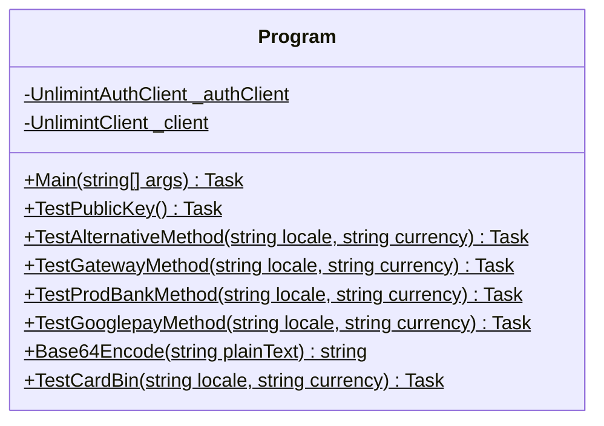

<div id="AuthToken-class-diagram"></div>

##### `AuthToken` class diagram

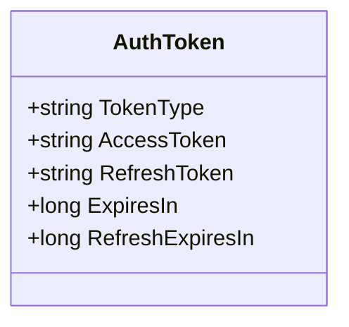

<div id="CreateAuthRequest-class-diagram"></div>

##### `CreateAuthRequest` class diagram

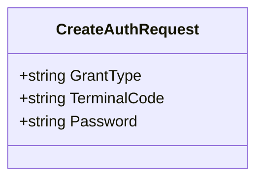

<div id="BaseConverter&lt;T&gt;-class-diagram"></div>

##### `BaseConverter<T>` class diagram

```mermaid
classDiagram
class BaseConverter<T>{
    -bool _quotes
    +List<KeyValuePair<T, string>> Mapping*
    +onverter(bool useQuotes) void
    +WriteJson(JsonWriter writer, object value, JsonSerializer serializer) void
    +ReadJson(JsonReader reader, Type objectType, object existingValue, JsonSerializer serializer) object
    +ReadString(string data) T
    +CanConvert(Type objectType) bool
    +GetValue(string value, out T result) bool
    +GetValue(T value) string
}

```

<div id="AcctTypeEnumConverter-class-diagram"></div>

##### `AcctTypeEnumConverter` class diagram

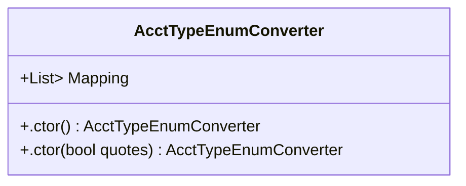

<div id="PaymentErrorCodeConverter-class-diagram"></div>

##### `PaymentErrorCodeConverter` class diagram

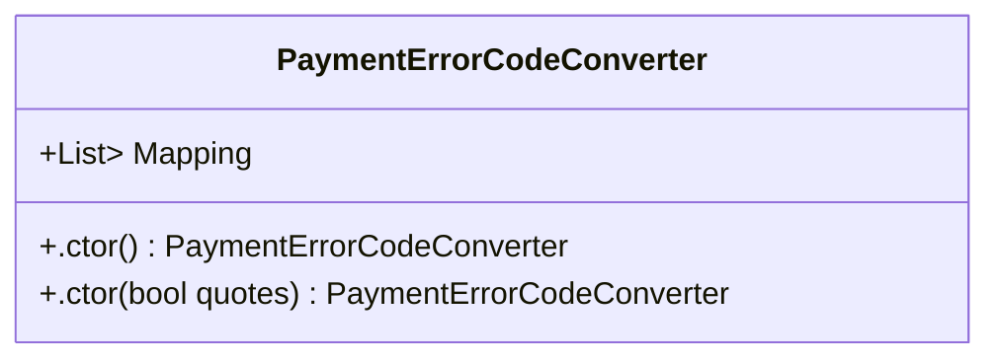

<div id="PaymentStatusConverter-class-diagram"></div>

##### `PaymentStatusConverter` class diagram

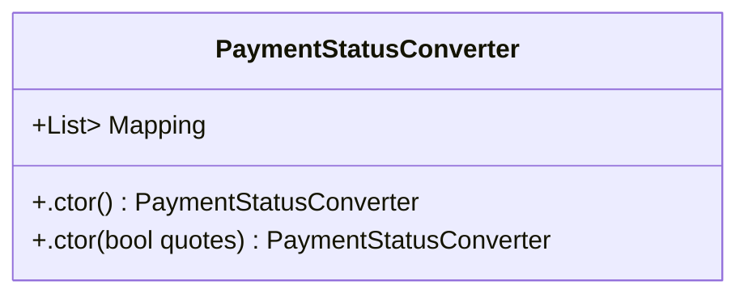

<div id="RiskEvaluationTypeConverter-class-diagram"></div>

##### `RiskEvaluationTypeConverter` class diagram

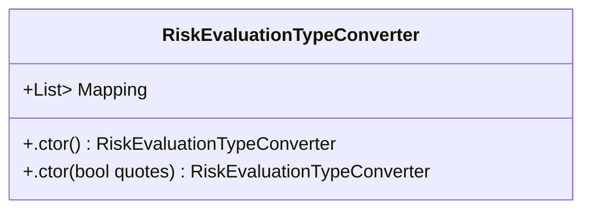

<div id="TransTypeEnumConverter-class-diagram"></div>

##### `TransTypeEnumConverter` class diagram

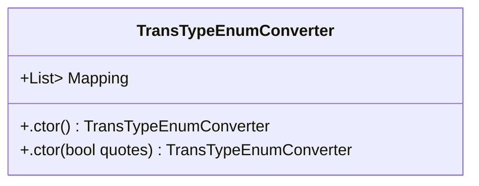

<div id="CallResult&lt;T&gt;-class-diagram"></div>

##### `CallResult<T>` class diagram

```mermaid
classDiagram
class CallResult<T>{
    +T Data
    +int Code
    +string Message
    +bool Success
    +esult(T data, int code, string message) void
}

```

<div id="Metadata-class-diagram"></div>

##### `Metadata` class diagram

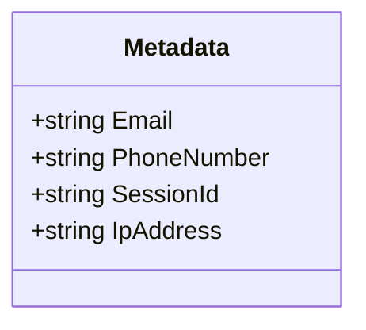

<div id="PaymentAlternativeType-class-diagram"></div>

##### `PaymentAlternativeType` class diagram

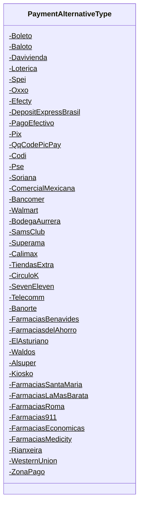

<div id="PublicKey-class-diagram"></div>

##### `PublicKey` class diagram

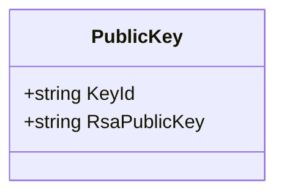

<div id="RiskEvaluation-class-diagram"></div>

##### `RiskEvaluation` class diagram

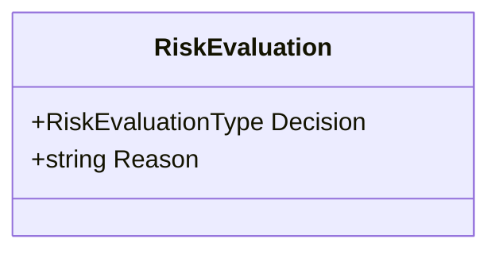

<div id="RiskEvaluationType-class-diagram"></div>

##### `RiskEvaluationType` class diagram

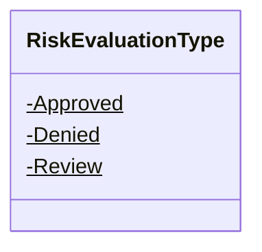

<div id="WebCallResult&lt;T&gt;-class-diagram"></div>

##### `WebCallResult<T>` class diagram

```mermaid
classDiagram
class WebCallResult<T>{
    +HttpStatusCode? ResponseStatusCode
    +Dictionary<string, string> ResponseHeaders
    +llResult(HttpResponseMessage response, T data, HttpStatusCode code, string message) void
    +llResult(HttpResponseMessage response, CallResult<T> result) void
    +CreateErrorResult(HttpStatusCode code, string message)$ WebCallResult<T>
    +CreateErrorResult(HttpResponseMessage response, HttpStatusCode code, string message)$ WebCallResult<T>
}

```

<div id="AcctTypeEnum-class-diagram"></div>

##### `AcctTypeEnum` class diagram

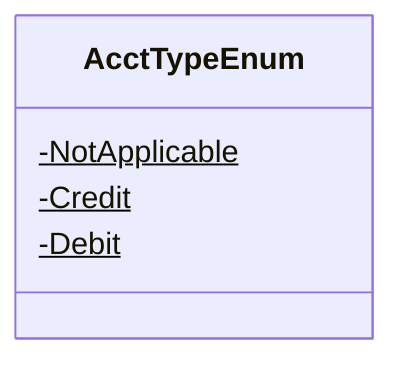

<div id="BillingAddress-class-diagram"></div>

##### `BillingAddress` class diagram

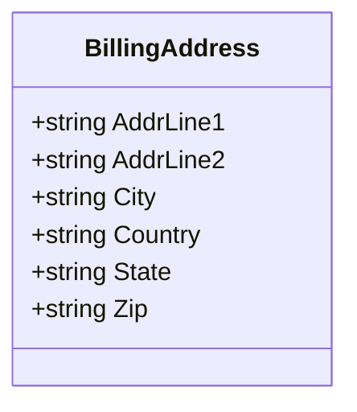

<div id="CardBinRequest-class-diagram"></div>

##### `CardBinRequest` class diagram

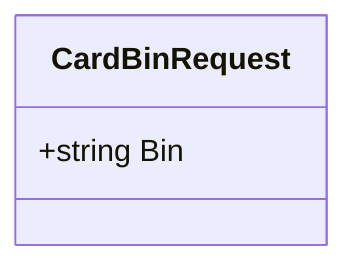

<div id="CardInfo-class-diagram"></div>

##### `CardInfo` class diagram

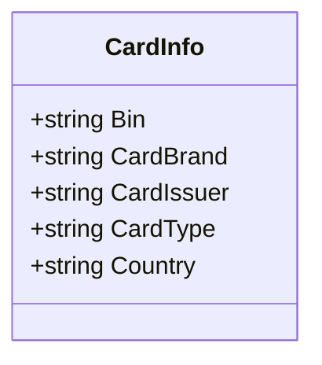

<div id="Flight-class-diagram"></div>

##### `Flight` class diagram

```mermaid
classDiagram
class Flight{
    +string CarrierCode
    +string DestinationCode
    +string FareBasisCode
    +int Index
    +string Number
    +int ServiceClassCode
    +string StopOverCode
}

```

<div id="Flights-class-diagram"></div>

##### `Flights` class diagram

```mermaid
classDiagram
class Flights{
    +string ComputerizedResSystem
    +string CreditReasonIndicator
    +string DepartureDate
    +List<Flight> Flight
    +Boolean IsRestricted
    +string OriginationCode
    +string PassengerName
    +string TicketChangeIndicator
    +string TicketNumber
    +string travelAgencyCode
    +string TravelAgencyName
}

```

<div id="Item-class-diagram"></div>

##### `Item` class diagram

```mermaid
classDiagram
class Item{
    +int Count
    +string Description
    +string Name
    +decimal Price
}

```

<div id="PaymentCallback-class-diagram"></div>

##### `PaymentCallback` class diagram

```mermaid
classDiagram
class PaymentCallback{
    +string CallbackTime
    +PaymentResponseCardAccount CardAccount
    +PaymentResponseCryptocurrencyAccount CryptocurrencyAccount
    +PaymentRequestCustomer Customer
    +TransactionResponseEWalletAccount EwalletAccount
    +TransactionResponseMerchantOrder MerchantOrder
    +PaymentResponsePaymentData PaymentData
    +string PaymentMethod
}

```

<div id="PaymentDataResponse-class-diagram"></div>

##### `PaymentDataResponse` class diagram

```mermaid
classDiagram
class PaymentDataResponse{
    +PaymentResponse[] Payments
}

```

<div id="PaymentErrorCode-class-diagram"></div>

##### `PaymentErrorCode` class diagram

```mermaid
classDiagram
class PaymentErrorCode{
    -Ok$
    -SystemMalfunction$
    -CancelledByCustomer$
    -DeclinedByAntifraud$
    -DeclinedBy3DSecure$
    -Only3DSecureTransactionsAllowed$
    -Availability3DSecureUnknown$
    -LimitReached$
    -RequestedOperationNotSupported$
    -DeclinedByBank$
    -CommonDeclineByBank$
    -SoftDecline$
    -InsufficientFunds$
    -CardLimitReached$
    -IncorrectCardData$
    -DeclinedByBankAntifraud$
    -BankMalfunction$
    -ConnectionProblem$
    -IncorrectPaymentData$
    -BitcoinNoPaymentReceived$
    -BitcoinWrongPaymentReceived$
    -BitcoinConfirmationsPaymentTimeout$
    -MaximumAmountLimitExceeded$
}

```

<div id="PaymentGatewayCreationResponse-class-diagram"></div>

##### `PaymentGatewayCreationResponse` class diagram

```mermaid
classDiagram
class PaymentGatewayCreationResponse{
    +string RedirectUrl
    +PaymentGatewayResponsePaymentData PaymentData
}

```

<div id="PaymentGatewayResponsePaymentData-class-diagram"></div>

##### `PaymentGatewayResponsePaymentData` class diagram

```mermaid
classDiagram
class PaymentGatewayResponsePaymentData{
    +string Id
    +bool SeparateAuth
}

```

<div id="PaymentRequest-class-diagram"></div>

##### `PaymentRequest` class diagram

```mermaid
classDiagram
class PaymentRequest{
    +Request Request
    +PaymentRequestCardAccount CardAccount
    +PaymentRequestCryptocurrencyAccount CryptocurrencyAccount
    +PaymentRequestCustomer Customer
    +PaymentRequestEWalletAccount EwalletAccount
    +PaymentRequestMerchantOrder MerchantOrder
    +PaymentRequestPaymentData PaymentData
    +string PaymentMethod
    +List<string> PaymentMethods
    +ReturnUrls ReturnUrls
}

```

<div id="PaymentRequestCard-class-diagram"></div>

##### `PaymentRequestCard` class diagram

```mermaid
classDiagram
class PaymentRequestCard{
    +AcctTypeEnum AcctType
    +string Expiration
    +string Holder
    +string Pan
    +string PinCode
    +string SecurityCode
    +.ctor() PaymentRequestCard
    +.ctor(PaymentRequestCard card) PaymentRequestCard
}

```

<div id="PaymentRequestCardAccount-class-diagram"></div>

##### `PaymentRequestCardAccount` class diagram

```mermaid
classDiagram
class PaymentRequestCardAccount{
    +BillingAddress BillingAddress
    +PaymentRequestCard Card
    +string EncryptedCardData
    +string Token
}

```

<div id="PaymentRequestCryptocurrencyAccount-class-diagram"></div>

##### `PaymentRequestCryptocurrencyAccount` class diagram

```mermaid
classDiagram
class PaymentRequestCryptocurrencyAccount{
    +string RollbackAddress
}

```

<div id="PaymentRequestCustomer-class-diagram"></div>

##### `PaymentRequestCustomer` class diagram

```mermaid
classDiagram
class PaymentRequestCustomer{
    +string BirthDate
    +string DocumentType
    +string Email
    +string FirstName
    +string FullName
    +string HomePhone
    +string Id
    +string Identity
    +string LastName
    +PaymentRequestLivingAddress LivingAddress
    +string Locale
    +string Phone
    +string WorkPhone
    +string Ip
}

```

<div id="PaymentRequestEWalletAccount-class-diagram"></div>

##### `PaymentRequestEWalletAccount` class diagram

```mermaid
classDiagram
class PaymentRequestEWalletAccount{
    +string BankCode
    +string CreationDate
    +string ExpirationDate
    +string Id
    +string VerificationCode
}

```

<div id="PaymentRequestLivingAddress-class-diagram"></div>

##### `PaymentRequestLivingAddress` class diagram

```mermaid
classDiagram
class PaymentRequestLivingAddress{
    +string Address
    +string City
    +string Country
    +string State
    +string Zip
}

```

<div id="PaymentRequestMerchantOrder-class-diagram"></div>

##### `PaymentRequestMerchantOrder` class diagram

```mermaid
classDiagram
class PaymentRequestMerchantOrder{
    +string Description
    +Flights Flights
    +string Id
    +List<Item> Items
    +ShippingAddress ShippingAddress
}

```

<div id="PaymentRequestPaymentData-class-diagram"></div>

##### `PaymentRequestPaymentData` class diagram

```mermaid
classDiagram
class PaymentRequestPaymentData{
    +string Amount
    +string Currency
    +string DynamicDescriptor
    +string EncryptedData
    +bool GenerateToken
    +string Note
    +string ThreeDsChallengeIndicator
    +TransTypeEnum? TransType
}

```

<div id="PaymentResponse-class-diagram"></div>

##### `PaymentResponse` class diagram

```mermaid
classDiagram
class PaymentResponse{
    +PaymentRequestCustomer Customer
    +string PaymentMethod
    +TransactionResponseMerchantOrder MerchantOrder
    +PaymentResponsePaymentData PaymentData
    +PaymentResponseCardAccount CardAccount
}

```

<div id="PaymentResponseCardAccount-class-diagram"></div>

##### `PaymentResponseCardAccount` class diagram

```mermaid
classDiagram
class PaymentResponseCardAccount{
    +AcctTypeEnum AcctType
    +string Expiration
    +string Holder
    +string IssuingCountryCode
    +string MaskedPan
    +string Token
}

```

<div id="PaymentResponseCryptocurrencyAccount-class-diagram"></div>

##### `PaymentResponseCryptocurrencyAccount` class diagram

```mermaid
classDiagram
class PaymentResponseCryptocurrencyAccount{
    +string CryptoAddress
    +string CryptoTransactionId
    +decimal PrcAmount
    +string PrcCurrency
}

```

<div id="PaymentResponsePaymentData-class-diagram"></div>

##### `PaymentResponsePaymentData` class diagram

```mermaid
classDiagram
class PaymentResponsePaymentData{
    +string ActionCode
    +decimal Amount
    +string Arn
    +string AuthCode
    +string Created
    +string Currency
    +PaymentErrorCode? DeclineCode
    +string DeclineReason
    +Dictionary<string, string> ExtendedData
    +string Id
    +string InstallmentType
    +string Installments
    +List<string> InvalidData
    +bool Is3d
    +string Note
    +string Rrn
    +PaymentStatus Status
}

```

<div id="PaymentStatus-class-diagram"></div>

##### `PaymentStatus` class diagram

```mermaid
classDiagram
class PaymentStatus{
    -New$
    -InProgress$
    -Declined$
    -Authorized$
    -Completed$
    -Cancelled$
    -Refunded$
    -Voided$
    -Terminated$
    -ChargedBack$
    -ChargedBackResolved$
}

```

<div id="Request-class-diagram"></div>

##### `Request` class diagram

```mermaid
classDiagram
class Request{
    +string Id
    +DateTime Time
}

```

<div id="RequiredAction-class-diagram"></div>

##### `RequiredAction` class diagram

```mermaid
classDiagram
class RequiredAction{
    +string Type
    +string RedirectUrl
}

```

<div id="ReturnUrls-class-diagram"></div>

##### `ReturnUrls` class diagram

```mermaid
classDiagram
class ReturnUrls{
    +string CancelUrl
    +string DeclineUrl
    +string InprocessUrl
    +string ReturnUrl
    +string SuccessUrl
}

```

<div id="ShippingAddress-class-diagram"></div>

##### `ShippingAddress` class diagram

```mermaid
classDiagram
class ShippingAddress{
    +string AddrLine1
    +string AddrLine2
    +string City
    +string Country
    +string Phone
    +string State
    +string Zip
}

```

<div id="TransactionResponseEWalletAccount-class-diagram"></div>

##### `TransactionResponseEWalletAccount` class diagram

```mermaid
classDiagram
class TransactionResponseEWalletAccount{
    +string Holder
    +string Id
}

```

<div id="TransactionResponseMerchantOrder-class-diagram"></div>

##### `TransactionResponseMerchantOrder` class diagram

```mermaid
classDiagram
class TransactionResponseMerchantOrder{
    +string Id
}

```

<div id="TransTypeEnum-class-diagram"></div>

##### `TransTypeEnum` class diagram

```mermaid
classDiagram
class TransTypeEnum{
    -_01$
    -_03$
    -_10$
    -_11$
    -_28$
}

```

<div id="Extensions-class-diagram"></div>

##### `Extensions` class diagram

```mermaid
classDiagram
class Extensions{
    +ConvertValueToString(object value)$ string
    +SecureStringToString(SecureString secureString)$ string
    +StringToSecureString(string str)$ SecureString
}

```

<div id="IUnlimintAuthClient-class-diagram"></div>

##### `IUnlimintAuthClient` class diagram

```mermaid
classDiagram
class IUnlimintAuthClient{
    +GetAuthorizationToken(CancellationToken cancellationToken = null)* WebCallResult<AuthToken>
    +GetAuthorizationTokenAsync(CancellationToken cancellationToken = null)* Task<WebCallResult<AuthToken>>
}

```

<div id="IUnlimintClient-class-diagram"></div>

##### `IUnlimintClient` class diagram

```mermaid
classDiagram
class IUnlimintClient{
    +CreatePayment(string merchantOrderId, string requestId, string email, string phoneNumber, string sessionId, string ipAddress, decimal amount, string currency, string sourceId, bool generateToken, bool threeDsChallengeIndicator, string description, string verificationUrlSuccess, string verificationUrlFailure, string verificationUrlCancel, string verificationUrlInProcess, string verificationUrlReturn, DateTime time, string paymentMethod, string clientId, CancellationToken cancellationToken = null)* WebCallResult<PaymentGatewayCreationResponse>
    +CreatePaymentAsync(string merchantOrderId, string requestId, string email, string phoneNumber, string sessionId, string ipAddress, decimal amount, string currency, string sourceId, bool generateToken, bool threeDsChallengeIndicator, string description, string verificationUrlSuccess, string verificationUrlFailure, string verificationUrlCancel, string verificationUrlInProcess, string verificationUrlReturn, DateTime time, string paymentMethod, string clientId, CancellationToken cancellationToken = null)* Task<WebCallResult<PaymentGatewayCreationResponse>>
    +CreatePaymentByCardToken(string merchantOrderId, string requestId, string email, string phoneNumber, string sessionId, string ipAddress, decimal amount, string currency, string sourceId, string cardToken, bool threeDsChallengeIndicator, string description, string verificationUrlSuccess, string verificationUrlFailure, string verificationUrlCancel, string verificationUrlInProcess, string verificationUrlReturn, DateTime time, string paymentMethod, string clientId, CancellationToken cancellationToken = null)* WebCallResult<PaymentGatewayCreationResponse>
    +CreatePaymentByCardTokenAsync(string merchantOrderId, string requestId, string email, string phoneNumber, string sessionId, string ipAddress, decimal amount, string currency, string sourceId, string cardToken, bool threeDsChallengeIndicator, string description, string verificationUrlSuccess, string verificationUrlFailure, string verificationUrlCancel, string verificationUrlInProcess, string verificationUrlReturn, DateTime time, string paymentMethod, string clientId, CancellationToken cancellationToken = null)* Task<WebCallResult<PaymentGatewayCreationResponse>>
    +CreateAlternativePayment(string mainPaymentMethod, List<string> alternativeMethods, string merchantOrderId, string requestId, decimal amount, string currency, bool useThreeDsChallengeIndicator, string description, string verificationUrlSuccess, string verificationUrlFailure, string verificationUrlCancel, string verificationUrlInProcess, string verificationUrlReturn, DateTime time, PaymentRequestCustomer customer, CancellationToken cancellationToken = null)* WebCallResult<PaymentGatewayCreationResponse>
    +CreateAlternativePaymentAsync(string mainPaymentMethod, List<string> alternativeMethods, string merchantOrderId, string requestId, decimal amount, string currency, bool useThreeDsChallengeIndicator, string description, string verificationUrlSuccess, string verificationUrlFailure, string verificationUrlCancel, string verificationUrlInProcess, string verificationUrlReturn, DateTime time, PaymentRequestCustomer customer, CancellationToken cancellationToken = null)* Task<WebCallResult<PaymentGatewayCreationResponse>>
    +CreateGatewayBankCardPayment(string merchantOrderId, string requestId, decimal amount, string currency, bool generateToken, bool useThreeDsChallengeIndicator, string description, string verificationUrlSuccess, string verificationUrlFailure, string verificationUrlCancel, string verificationUrlInProcess, string verificationUrlReturn, DateTime time, PaymentRequestCustomer customer, PaymentRequestCardAccount cardAccount, CancellationToken cancellationToken = null)* WebCallResult<PaymentGatewayCreationResponse>
    +CreateGatewayBankCardPaymentAsync(string merchantOrderId, string requestId, decimal amount, string currency, bool generateToken, bool useThreeDsChallengeIndicator, string description, string verificationUrlSuccess, string verificationUrlFailure, string verificationUrlCancel, string verificationUrlInProcess, string verificationUrlReturn, DateTime time, PaymentRequestCustomer customer, PaymentRequestCardAccount cardAccount, CancellationToken cancellationToken = null)* Task<WebCallResult<PaymentGatewayCreationResponse>>
    +CreateGatewayApplepayPayment(string merchantOrderId, string requestId, decimal amount, string currency, string description, string appleEncryptedData, string verificationUrlSuccess, string verificationUrlFailure, string verificationUrlCancel, string verificationUrlInProcess, string verificationUrlReturn, DateTime time, PaymentRequestCustomer customer, CancellationToken cancellationToken = null)* WebCallResult<PaymentGatewayCreationResponse>
    +CreateGatewayApplepayPaymentAsync(string merchantOrderId, string requestId, decimal amount, string currency, string description, string appleEncryptedData, string verificationUrlSuccess, string verificationUrlFailure, string verificationUrlCancel, string verificationUrlInProcess, string verificationUrlReturn, DateTime time, PaymentRequestCustomer customer, CancellationToken cancellationToken = null)* Task<WebCallResult<PaymentGatewayCreationResponse>>
    +CreateGatewayGooglepayPayment(string merchantOrderId, string requestId, decimal amount, string currency, string description, string googleEncryptedData, string verificationUrlSuccess, string verificationUrlFailure, string verificationUrlCancel, string verificationUrlInProcess, string verificationUrlReturn, DateTime time, PaymentRequestCustomer customer, CancellationToken cancellationToken = null)* WebCallResult<PaymentGatewayCreationResponse>
    +CreateGatewayGooglepayPaymentAsync(string merchantOrderId, string requestId, decimal amount, string currency, string description, string googleEncryptedData, string verificationUrlSuccess, string verificationUrlFailure, string verificationUrlCancel, string verificationUrlInProcess, string verificationUrlReturn, DateTime time, PaymentRequestCustomer customer, CancellationToken cancellationToken = null)* Task<WebCallResult<PaymentGatewayCreationResponse>>
    +GetPaymentById(string id, CancellationToken cancellationToken = null)* WebCallResult<PaymentResponse>
    +GetPaymentByIdAsync(string id, CancellationToken cancellationToken = null)* Task<WebCallResult<PaymentResponse>>
    +GetPaymentByMerchantOrderIdAsync(string merchantOrderId, string requestId, CancellationToken cancellationToken = null)* Task<WebCallResult<PaymentDataResponse>>
    +GetCardInfoAsync(CardBinRequest cardBinRequest, CancellationToken cancellationToken = null)* Task<WebCallResult<List<CardInfo>>>
}

```

<div id="UnlimintAuthClient-class-diagram"></div>

##### `UnlimintAuthClient` class diagram

```mermaid
classDiagram
IUnlimintAuthClient <|-- UnlimintAuthClient : implements
class UnlimintAuthClient{
    -string MainPublicApi$
    -string TestPublicApi$
    -HttpClient _httpClient
    -DateTime _lastHttpSetupTime
    -HttpClient _lastHttpClient
    -object _gate
    +bool PrintPostApiCalls$
    +bool PrintPutApiCalls$
    +string EndpointUrl
    +SecureString AccessToken
    +SecureString TerminalCode
    +SecureString Password
    +bool ThrowThenErrorResponse
    +.ctor(string terminalCode, string password, UnlimintNetwork network = UnlimintNetwork.Main) UnlimintAuthClient
    +SetPassword(string password) void
    +SetTerminalCode(string terminalCode) void
    +GetHttpClient() HttpClient
    +SetupHttpClient() void
    +PostAsync<T>(string url, List<KeyValuePair<string, string>> data, CancellationToken cancellationToken = null) Task<WebCallResult<T>>
    +EvaluateResponse<T>(HttpResponseMessage response, string content) WebCallResult<T>
    +ThrowErrorExceptionIfEnabled(HttpStatusCode code, string message) void
    +Dispose() void
    +GetAuthorizationToken(CancellationToken cancellationToken = null) WebCallResult<AuthToken>
    +GetAuthorizationTokenAsync(CancellationToken cancellationToken = null) Task<WebCallResult<AuthToken>>
}

```

<div id="UnlimintClient-class-diagram"></div>

##### `UnlimintClient` class diagram

```mermaid
classDiagram
IUnlimintClient <|-- UnlimintClient : implements
class UnlimintClient{
    -string MainPublicApi$
    -string TestPublicApi$
    -HttpClient _httpClient
    -DateTime _lastHttpSetupTime
    -HttpClient _lastHttpClient
    -object _gate
    -string PaymentAlternativeTypeBoleto$
    -string PaymentAlternativeTypeBaloto$
    -string PaymentAlternativeTypeDavivienda$
    -string PaymentAlternativeTypeLoterica$
    -string PaymentAlternativeTypeSpei$
    -string PaymentAlternativeTypeOxxo$
    -string PaymentAlternativeTypeEfecty$
    -string PaymentAlternativeTypeDepositExpressBrasil$
    -string PaymentAlternativeTypePagoEfectivo$
    -string PaymentAlternativeTypePix$
    -string PaymentAlternativeTypeQqCodePicPay$
    -string PaymentAlternativeTypeCodi$
    -string PaymentAlternativeTypePse$
    -string PaymentAlternativeTypeSoriana$
    -string PaymentAlternativeTypeComercialMexicana$
    -string PaymentAlternativeTypeBancomer$
    -string PaymentAlternativeTypeWalmart$
    -string PaymentAlternativeTypeBodegaAurrera$
    -string PaymentAlternativeTypeSamsClub$
    -string PaymentAlternativeTypeSuperama$
    -string PaymentAlternativeTypeCalimax$
    -string PaymentAlternativeTypeTiendasExtra$
    -string PaymentAlternativeTypeCirculoK$
    -string PaymentAlternativeTypeSevenEleven$
    -string PaymentAlternativeTypeTelecomm$
    -string PaymentAlternativeTypeBanorte$
    -string PaymentAlternativeTypeFarmaciasBenavides$
    -string PaymentAlternativeTypeFarmaciasdelAhorro$
    -string PaymentAlternativeTypeElAsturiano$
    -string PaymentAlternativeTypeWaldos$
    -string PaymentAlternativeTypeAlsuper$
    -string PaymentAlternativeTypeKiosko$
    -string PaymentAlternativeTypeFarmaciasSantaMaria$
    -string PaymentAlternativeTypeFarmaciasLaMasBarata$
    -string PaymentAlternativeTypeFarmaciasRoma$
    -string PaymentAlternativeTypeFarmacias911$
    -string PaymentAlternativeTypeFarmaciasEconomicas$
    -string PaymentAlternativeTypeFarmaciasMedicity$
    -string PaymentAlternativeTypeRianxeira$
    -string PaymentAlternativeTypeWesternUnion$
    -string PaymentAlternativeTypeZonaPago$
    +bool PrintPostApiCalls$
    +bool PrintPutApiCalls$
    +string EndpointUrl
    +SecureString AccessToken
    +bool ThrowThenErrorResponse
    +GetCardInfoAsync(CardBinRequest cardBinRequest, CancellationToken cancellationToken = null) Task<WebCallResult<List<CardInfo>>>
    +.ctor(string accessToken, UnlimintNetwork network = UnlimintNetwork.Main) UnlimintClient
    +.ctor(string accessToken, string apiRootUrl) UnlimintClient
    +SetAccessToken(string accessToken) void
    +GetHttpClient() HttpClient
    +SetupHttpClient() void
    +ConvertToQueryString(Dictionary<string, object> nvc) string
    +GetAsync<T>(string url, CancellationToken cancellationToken = null) Task<WebCallResult<T>>
    +PostAsync<T>(string url, object obj = null, CancellationToken cancellationToken = null) Task<WebCallResult<T>>
    +PutAsync<T>(string url, object obj = null, CancellationToken cancellationToken = null) Task<WebCallResult<T>>
    +DeleteAsync<T>(string url, object obj = null, CancellationToken cancellationToken = null) Task<WebCallResult<T>>
    +EvaluateResponse<T>(HttpResponseMessage response, string content) WebCallResult<T>
    +ThrowErrorExceptionIfEnabled(HttpStatusCode code, string message) void
    +Dispose() void
    +CreateAlternativePayment(string mainPaymentMethod, List<string> paymentAlternativeMethods, string merchantOrderId, string requestId, decimal amount, string currency, bool useThreeDsChallengeIndicator, string description, string verificationUrlSuccess, string verificationUrlFailure, string verificationUrlCancel, string verificationUrlInProcess, string verificationUrlReturn, DateTime time, PaymentRequestCustomer customer, CancellationToken cancellationToken = null) WebCallResult<PaymentGatewayCreationResponse>
    +CreateAlternativePaymentAsync(string mainMethod, List<string> extentionMethods, string merchantOrderId, string requestId, decimal amount, string currency, bool useThreeDsChallengeIndicator, string description, string verificationUrlSuccess, string verificationUrlFailure, string verificationUrlCancel, string verificationUrlInProcess, string verificationUrlReturn, DateTime time, PaymentRequestCustomer customer, CancellationToken cancellationToken = null) Task<WebCallResult<PaymentGatewayCreationResponse>>
    +CreateAlternativePaymentRequest(string mainMethod, List<string> paymentMethods, string merchantOrderId, string requestId, decimal amount, string currency, bool useThreeDsChallengeIndicator, string description, string verificationUrlSuccess, string verificationUrlFailure, string verificationUrlCancel, string verificationUrlInProcess, string verificationUrlReturn, DateTime time, PaymentRequestCustomer customer, CancellationToken cancellationToken = null) PaymentRequest
    +ToString(PaymentAlternativeType paymentAlternativeType)$ string
    +CreateGatewayApplepayPayment(string merchantOrderId, string requestId, decimal amount, string currency, string description, string appleEncryptedData, string verificationUrlSuccess, string verificationUrlFailure, string verificationUrlCancel, string verificationUrlInProcess, string verificationUrlReturn, DateTime time, PaymentRequestCustomer customer, CancellationToken cancellationToken = null) WebCallResult<PaymentGatewayCreationResponse>
    +CreateGatewayApplepayPaymentAsync(string merchantOrderId, string requestId, decimal amount, string currency, string description, string appleEncryptedData, string verificationUrlSuccess, string verificationUrlFailure, string verificationUrlCancel, string verificationUrlInProcess, string verificationUrlReturn, DateTime time, PaymentRequestCustomer customer, CancellationToken cancellationToken = null) Task<WebCallResult<PaymentGatewayCreationResponse>>
    +CreatePayment(string merchantOrderId, string requestId, string email, string phoneNumber, string sessionId, string ipAddress, decimal amount, string currency, string sourceId, bool generateToken, bool threeDsChallengeIndicator, string description, string verificationUrlSuccess, string verificationUrlFailure, string verificationUrlCancel, string verificationUrlInProcess, string verificationUrlReturn, DateTime time, string paymentMethod, string clientId, CancellationToken cancellationToken = null) WebCallResult<PaymentGatewayCreationResponse>
    +CreatePaymentAsync(string merchantOrderId, string requestId, string email, string phoneNumber, string sessionId, string ipAddress, decimal amount, string currency, string sourceId, bool generateToken, bool useThreeDsChallengeIndicator, string description, string verificationUrlSuccess, string verificationUrlFailure, string verificationUrlCancel, string verificationUrlInProcess, string verificationUrlReturn, DateTime time, string paymentMethod, string clientId, CancellationToken cancellationToken = null) Task<WebCallResult<PaymentGatewayCreationResponse>>
    +CreatePaymentByCardToken(string merchantOrderId, string requestId, string email, string phoneNumber, string sessionId, string ipAddress, decimal amount, string currency, string sourceId, string cardToken, bool threeDsChallengeIndicator, string description, string verificationUrlSuccess, string verificationUrlFailure, string verificationUrlCancel, string verificationUrlInProcess, string verificationUrlReturn, DateTime time, string paymentMethod, string clientId, CancellationToken cancellationToken = null) WebCallResult<PaymentGatewayCreationResponse>
    +CreatePaymentByCardTokenAsync(string merchantOrderId, string requestId, string email, string phoneNumber, string sessionId, string ipAddress, decimal amount, string currency, string sourceId, string cardToken, bool useThreeDsChallengeIndicator, string description, string verificationUrlSuccess, string verificationUrlFailure, string verificationUrlCancel, string verificationUrlInProcess, string verificationUrlReturn, DateTime time, string paymentMethod, string clientId, CancellationToken cancellationToken = null) Task<WebCallResult<PaymentGatewayCreationResponse>>
    +GetPaymentById(string paymentId, CancellationToken cancellationToken = null) WebCallResult<PaymentResponse>
    +GetPaymentByIdAsync(string paymentId, CancellationToken cancellationToken = null) Task<WebCallResult<PaymentResponse>>
    +GetPaymentByMerchantOrderIdAsync(string merchantOrderId, string requestId, CancellationToken cancellationToken = null) Task<WebCallResult<PaymentDataResponse>>
    +CreateGatewayBankCardPayment(string merchantOrderId, string requestId, decimal amount, string currency, bool generateToken, bool useThreeDsChallengeIndicator, string description, string verificationUrlSuccess, string verificationUrlFailure, string verificationUrlCancel, string verificationUrlInProcess, string verificationUrlReturn, DateTime time, PaymentRequestCustomer customer, PaymentRequestCardAccount cardAccount, CancellationToken cancellationToken = null) WebCallResult<PaymentGatewayCreationResponse>
    +CreateGatewayBankCardPaymentAsync(string merchantOrderId, string requestId, decimal amount, string currency, bool generateToken, bool useThreeDsChallengeIndicator, string description, string verificationUrlSuccess, string verificationUrlFailure, string verificationUrlCancel, string verificationUrlInProcess, string verificationUrlReturn, DateTime time, PaymentRequestCustomer customer, PaymentRequestCardAccount cardAccount, CancellationToken cancellationToken = null) Task<WebCallResult<PaymentGatewayCreationResponse>>
    +CreateGatewayGooglepayPayment(string merchantOrderId, string requestId, decimal amount, string currency, string description, string googleEncryptedData, string verificationUrlSuccess, string verificationUrlFailure, string verificationUrlCancel, string verificationUrlInProcess, string verificationUrlReturn, DateTime time, PaymentRequestCustomer customer, CancellationToken cancellationToken = null) WebCallResult<PaymentGatewayCreationResponse>
    +CreateGatewayGooglepayPaymentAsync(string merchantOrderId, string requestId, decimal amount, string currency, string description, string googleEncryptedData, string verificationUrlSuccess, string verificationUrlFailure, string verificationUrlCancel, string verificationUrlInProcess, string verificationUrlReturn, DateTime time, PaymentRequestCustomer customer, CancellationToken cancellationToken = null) Task<WebCallResult<PaymentGatewayCreationResponse>>
}

```

<div id="UnlimintException-class-diagram"></div>

##### `UnlimintException` class diagram

```mermaid
classDiagram
class UnlimintException{
    +HttpStatusCode Code
    +string ErrorMessage
    +.ctor(HttpStatusCode code, string errorMessage) UnlimintException
}

```

<div id="UnlimintNetwork-class-diagram"></div>

##### `UnlimintNetwork` class diagram

```mermaid
classDiagram
class UnlimintNetwork{
    -Main$
    -Test$
}

```

*This file is maintained by a bot.*

<!-- markdownlint-restore -->
